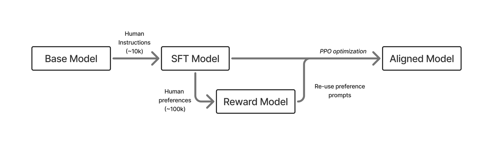

# 第 1 章　導論（Introduction）

> 譯自 Nathan Lambert, *Reinforcement Learning from Human Feedback*（rlhfbook.com），2026-07-01 版，原文第 7–17 頁。
> 原著內容依 CC BY-NC-SA 4.0 授權釋出；本翻譯為非商業性改作，依同一授權條款（CC BY-NC-SA 4.0）發布。

基於人類回饋的強化學習（Reinforcement Learning from Human Feedback, RLHF）是一種用來將人類資訊納入 AI 系統的技術。RLHF 的出現，主要是為了解決「難以明確定義」（hard-to-specify）的問題。對於那些設計來直接供人類使用的系統，由於個人偏好往往具有難以言喻的本質，這類問題無時無刻不在出現。這涵蓋了與數位系統互動的每一個內容領域。RLHF 的早期應用多半在控制問題，以及強化學習（Reinforcement Learning, RL）的其他傳統領域，其目標是最佳化特定行為以解決任務。開創 RLHF 這個領域的核心想法是：「我們能否只靠基本的偏好訊號來引導最佳化過程，就解決困難的問題？」RLHF 因 ChatGPT 的發布，以及隨後大型語言模型（Large Language Models, LLMs）與其他基礎模型（foundation models）的快速發展而廣為人知。

## 1.1 RLHF 三步驟（RLHF in Three Steps）

RLHF 的基本流程包含三個步驟。首先，必須訓練出一個能夠回應使用者問題的語言模型（見第 4 章）。其次，必須蒐集人類偏好資料，用來訓練一個刻畫人類偏好的獎勵模型（reward model）（見第 5 章）。最後，就可以用任選的 RL 最佳化器來最佳化這個語言模型：對模型取樣生成結果，並以獎勵模型對其評分（見第 3 章與第 6 章）。本書會詳細說明這個流程中每個步驟的關鍵決策與基本實作範例。

RLHF 已成功應用於許多領域，且隨著技術成熟，其複雜度也不斷提高。RLHF 早期的突破性實驗應用於深度強化學習 [1]、摘要 [2]、遵循指令 [3]、解析網頁資訊以回答問題 [4]，以及「對齊」（alignment）[5]。早期 RLHF 配方的摘要如下方圖 1 所示。

*圖 1：早期三階段 RLHF 流程的示意圖，依序為 SFT、獎勵模型，然後是最佳化。*

在現代語言模型訓練中，RLHF 是後訓練（post-training）的一個組成部分。後訓練是一套更完整的技術與最佳實務，用來讓語言模型在下游任務中更加實用 [6]。後訓練可以概括為一個使用三種最佳化方法的多階段訓練過程：

1. 指令微調／監督式微調（Instruction / Supervised Fine-tuning, IFT/SFT）：我們在此教導模型格式，並打下遵循指令能力的基礎。這主要是在學習語言中的*特徵*（features）。
2. 偏好微調（Preference Fine-tuning, PreFT）：我們透過 RLHF 及相關方法來對齊人類偏好（同時也能獲得較小幅度的能力提升）。這主要關乎語言的*風格*（style），以及那些難以量化的微妙人類偏好。
3. 基於可驗證獎勵的強化學習（Reinforcement Learning with Verifiable Rewards, RLVR）：最新型態的後訓練，透過更多 RL 訓練來提升模型在可驗證領域的表現。

RLHF 存在於第二個領域——**偏好微調**——之中並居於主導地位。偏好微調比指令微調更複雜，因為它經常涉及作為真實目標之代理（proxy）的獎勵模型，以及雜訊更多的資料。同時，相較於語言模型另一種流行的 RL 方法——基於可驗證獎勵的強化學習——RLHF 要成熟得多。因此，本書聚焦於偏好學習；但為了完整掌握 RLHF 的角色，就必須用到其他這些訓練階段，所以本書也會詳細解釋它們。

當我們審視這些方法的選項空間與關注焦點——這些方法被用來打造我們大量共同使用的模型——通俗地說，RLHF *就是*催生現代後訓練的源頭。RLHF 是促成 ChatGPT 發布大獲成功的技術，因此在 2023 年初，RLHF 幾乎涵蓋了整個後訓練領域的大部分關注。如今 RLHF 只是後訓練的一環，所以在本書中，我們會梳理為何 RLHF 早期受到如此多的關注，以及其他方法如何興起以與之互補。

訓練語言模型是一個非常複雜的過程，往往涉及數十到數百人的大型技術團隊，以及數百萬美元的資料與運算成本。本書有三個目的，讓讀者能掌握 RLHF 與相關模型如何被用來打造領先的模型。第一，本書將那些經常隱藏在大型科技公司內部的尖端研究，提煉成清晰的主題與取捨，讓讀者能理解模型是如何被打造出來的。第二，本書讓使用者能建立基本的程式碼範例，親自動手微調這些模型。最後，除了教授進行 RLHF 的技術之外，本書的設計也旨在提煉出「*為什麼* RLHF 對現代 AI 模型至關重要」的直覺。

由於 RLHF 的複雜性，加上最先進的技術往往複雜到無法單打獨鬥完成，本書著重於賦能讀者，讓他們擁有在此領域求職與展開研究專案所需的工具。其他讀者則能單純享受精確理解這項技術內部運作的樂趣——這項技術正是全球無數討論的焦點。要寫出一本針對特定需求列出精確 RLHF 配方的書是不可能的，這也是為什麼有一整個產業的公司以服務形式提供 RLHF 訓練與相關方法，產值高達數百萬美元。儘管如此，AI 系統的快速進展意味著，具備這些知識的讀者隨著時間推移，能夠自行完成愈來愈多的訓練工作。

## 1.2 RLHF 做了什麼？（What Does RLHF Do?）

圍繞 RLHF 最大、但至今仍難以回答的問題是：「RLHF 訓練為模型帶來了什麼？」近年來，語言模型已從基準測試（benchmarks）視野下研究的學術實驗，轉變為通用技術。RLHF 正是這場轉變的核心。

首先，讓我們看看一個剛完成自迴歸（autoregressive）預訓練的語言模型會如何回答查詢。一個強大的模型 Llama 3.1 405B Base，會從「The president of the united states in 2006 was」（2006 年的美國總統是）接續生成：

> **回應**：George W. Bush（喬治·W·布希），2006 年的佛羅里達州州長是 Jeb Bush（傑布·布希），而 John McCain（約翰·馬侃）在 2006 年是亞利桑那州參議員——他後來敗給了 obama（歐巴馬）。9 月 1 日——美國總統布希簽署一項行政命令，讓信仰型組織在提供由聯邦資金支付的社會服務時擁有更多選項。1 月 1 日——目前由美國國會在《非法網路賭博執法法》（Unlawful Internet Gambling Enforcement Act，又稱 UIGEA）中設定的期限。search：1961 年《保護植物新品種國際公約》的修正案要求植物育種者權利納入農民特權。2009 年是格里曆中以星期四開始的平年，是公元（Common Era, ce）與主曆（Anno Domini, ad）紀年的第 2009 年、第 3 個千禧年的第 9 年、21 世紀的第 9 年，以及 2000 年代的第 10 年、也是最後一年。

*（譯註：以上為基礎模型的原始輸出，內容本身即語無倫次，翻譯依原文照錄。）*

顯而易見，這個模型只是在補完句子，並添加其他常見的網路中繼資料（metadata）。

相較之下，經過 RLHF（及其他後訓練工具）訓練的模型會以截然不同的方式回答這個問題。對 Tülu 3 405B 問同樣的問題「The president of the united states in 2006 was」，它簡潔地回答：

> **回應**：George W. Bush（喬治·W·布希）是 2006 年的美國總統。他在任兩屆，任期自 2001 年 1 月 20 日至 2009 年 1 月 20 日。

這種風格上的轉變，正是本書所描述的後訓練方法帶來的結果。

關於 RLHF 如何運作，最有說服力的觀點是思考*風格*（style）如何體現在你與語言模型的互動中。所呈現資訊的風格（與語氣或格式密切相關）對於資訊如何被吸收至關重要。風格通常用來描述模型的表達方式。為了看出差異，請看以下問題的兩個回應範例：

> **使用者**：救命，我明天要上台簡報，我現在很恐慌。

一種直白、低同理心的風格：

> **回應**：你不會有事的。把投影片練個幾次、睡個好覺，別想太多了。把你知道的講出來，然後繼續往前走就好。

一種更溫暖、更具支持性的風格：

> **回應**：這聽起來真的很有壓力，而且這是很正常的反應。如果可以的話，現在就快速演練一次，挑出一兩個你最希望聽眾記住的重點，然後允許自己好好休息——明天的清晰與冷靜，比今晚的臨時抱佛腳更重要。

另一方面，格式（format）指的是答案的結構方式。現代模型以大量使用 Markdown 格式著稱，包含列表、換行與表情符號。請看以下問題兩個非常不同的答案：

> **使用者**：我要怎麼改善睡眠品質？

來自早期語言模型的簡單答案：

> **回應**：試著每天晚上在同一時間上床睡覺、避免在一天較晚的時段攝取咖啡因，並保持臥室安靜且黑暗。

或是一個複雜、更豐富的答案：

> **回應**：實務上的更好睡眠
>
> **目標**：讓你的作息可以預測，並讓你的環境無聊到大腦自動放棄掙扎。
>
> **今晚（速效做法）**：1. 睡前最後一小時調暗燈光。2. 午餐後不碰咖啡因；酒精盡量減少。3. 如果躺著睡不著，就起床做些安靜的事，直到再次想睡。
>
> **每日基本功（影響最大）**：－固定起床時間（週末也一樣）→ 錨定你的生理時鐘。－早晨曬 5–10 分鐘的光 → 幫助設定晝夜節律。－涼爽、黑暗的房間（電風扇／眼罩）→ 更容易維持睡眠。
>
> **如果你想要一條簡單的原則**：`固定起床時間 + 咖啡因截止時間 + 睡前放鬆流程`
>
> 如果睡眠問題持續存在或情況嚴重，值得找臨床醫師談談——許多問題都非常容易治療。

指令微調賦予模型以問答格式可靠回應的基本能力，而 RLHF 則是把這些答案雕琢成我們如今對語言模型所期待的那種可靠、溫暖且引人入勝的答案。

現代研究已確立 RLHF 作為一種通用方法，能將微妙的風格與相關行為特徵整合進模型。RLHF 效用的一個早期熱門例子是在安全性上的應用 [7] [5]：RLHF 讓模型能在各種資料集上同時做到有幫助（helpful）且無害（harmless）。與指令微調等其他後訓練技術相比，RLHF 在跨領域的泛化能力要好得多 [8] [9]——有助於打造有效的通用模型。

直覺上，這可以從最佳化技術的應用方式看出來。指令微調訓練模型在前文接近它看過的範例時，預測下一個詞元（token）。它是在最佳化模型，使其更規律地在文字中輸出特定特徵。這是一種逐詞元（per-token）的更新。

另一方面，RLHF 是在整體回應的層級上調整補全結果（completions），而不是特別聚焦於下一個詞元。此外，它是在告訴模型*更好的*回應長什麼樣子，而不是它應該學會的某個特定回應。RLHF 也會讓模型知道它應該避免哪些類型的回應，也就是負向回饋。實現這一點的訓練通常稱為*對比式*（contrastive）損失函數（其損失是從兩個以上範例之間的比較計算而來，而非從每個範例獨立計算），本書全書都會提及這個概念。

儘管這種彈性是 RLHF 的一大優勢，它也伴隨著實作上的挑戰。這些挑戰主要集中在*如何控制最佳化過程*。正如本書將介紹的，實作 RLHF 通常需要訓練一個獎勵模型，但相關的最佳實務尚未牢固確立，且取決於應用領域。因此，最佳化本身容易發生*過度最佳化*（over-optimization），因為我們的獎勵訊號充其量只是一個代理目標，需要正則化（regularization）。在這些限制之下，有效的 RLHF 需要一個強大的起點，所以 RLHF 無法單獨成為所有問題的解方，而需要透過更寬廣的後訓練視角來看待。

由於這種複雜性，實作 RLHF 的成本遠高於單純的指令微調，並可能伴隨長度偏差（length bias）等意料之外的挑戰 [10] [11]。對於絕對效能至關重要的模型訓練工作而言，RLHF 已被確立為取得強大微調模型的關鍵，但它在運算、資料成本與時間上都更加昂貴。在 ChatGPT 之後的 RLHF 早期歷史中，有許多研究論文展示了透過有限的指令微調來近似 RLHF 的解法，但隨著文獻日趨成熟，一再得到驗證的是：RLHF 與相關方法是模型效能的核心階段，無法輕易省略。

## 1.3 一份 RLHF 配方的逐步解說（Walkthrough of an RLHF Recipe）

為了替本書鋪陳背景，重要的是先透過一個最小範例理解「做 RLHF」可能是什麼樣子，而不使用那些在基本直覺尚未鞏固前難以掌握的技術術語。本節依循所謂的經典三階段 RLHF 配方，也就是 OpenAI 在 2022 年以 InstructGPT 模型所確立的做法 [3]。

這個流程的第一步，是將模型從一個補全文字的基礎模型（base model），轉變為能以問答格式運作的指令遵循模型。做法是使用同樣的下一詞元預測（next-token prediction）損失函數，在一組精心打造的資料點上訓練，其中模型*只*會看到問答格式的資料。在模型看過這些高品質回應之後，就能以特定的詞元序列來提示模型，讓它知道應該以一個更明確的助理人格（assistant persona）來回答任何查詢。

有了這個關於*模型應如何回答的樣貌*的基礎後，接下來的兩個步驟便共同運作，以提升答案的整體品質。這兩個步驟的作用是建構出一個問題設定，讓我們能使用強化學習來更新模型、使其更有幫助。

這兩個步驟中的第一步，是訓練一個捕捉人類偏好的獎勵模型。要將強化學習應用於一個問題，你需要一個能指示品質的獎勵函數。獎勵模型的目標是產生一個純量（scalar）訊號，之後可以用 RL 對其進行最佳化。實務上，這是對一個語言模型（通常就是上一步得到的同一個指令微調模型），在一個由文字片段之間偏好關係構成的資料集上進行微調。這個資料集橫跨各式各樣的提示詞（prompts）、模型補全結果與標註者蒐集而成，試圖捕捉「語言模型怎樣的回答比較好」的穩健訊號。獎勵模型會學到文字中哪些特徵比其他特徵更好，因此在推論階段使用時（以及在 RL 期間作為獎勵訊號時），它能為任何一段輸入文字評分其好壞。

有了這兩個組件——一個問答模型與一個獎勵模型——我們就擁有了把所有部件組裝起來、真正執行基於人類回饋的強化學習（RLHF）所需的一切。實際的 RLHF 階段的進行方式是：取一批能代表模型應擅長之任務的提示詞，生成一堆補全結果，讓獎勵模型為它們排序，然後用 RL 找出該如何改變模型、使其變得更好。其基本原理是：強化學習會收到「哪些動作是好的」的訊號——其形式是語言模型生成的詞元——並推導出更新規則，將不同的動作歸因到模型中不同的參數。最後的 RLHF 階段會調整參數，讓好的詞元更有可能出現，並以迭代方式進行，以維持初始模型的一般能力。

一旦 RL 完成且效能達到飽和，這通常就是提供給使用者的最終模型。

在本書中，我們會介紹許多執行 RLHF 的配方，以及構成更廣泛後訓練體系的更多相關最佳化方法。這些方法的出現，都是為了解決語言模型面臨的更具挑戰性的問題，並讓原始 RLHF 方法的優勢更加強大。

## 1.4 後訓練的直覺（An Intuition for Post-Training）

我們已經確立了 RLHF（具體而言）與後訓練（廣義而言）對最新模型的效能至關重要，也說明了它們如何改變模型的輸出，但還沒有解釋 RLHF 為什麼有效。以下用一個簡單的類比，說明為什麼能在任何基礎模型之上，於基準測試取得如此多的進步。

我一直以來描述後訓練潛力的方式，稱為後訓練的引出詮釋（elicitation interpretation）：我們所做的一切，不過是透過放大基礎模型中有價值的行為，來提取其潛力。

為了讓這個例子更容易領會，我們把基礎模型——也就是經過大規模下一詞元預測預訓練後產出的語言模型——類比為建構複雜系統時的其他基礎元件。我們以汽車的底盤（chassis）為例，它界定了一輛車能被打造的空間。想想一級方程式賽車（Formula 1, F1）：多數車隊每年都以新的底盤與引擎展開賽季。接著，他們花上一整年進行空氣動力學與系統上的調整（當然，這是稍微簡化的說法），就能大幅提升賽車的效能。最強的 F1 車隊在單一賽季中的進步幅度，遠大於底盤換代之間的進步。

後訓練也是同樣的道理：隨著人們愈來愈了解一個靜態基礎模型的特性與傾向，就能從中榨取大量效能。最強的後訓練團隊能在極短的時間內榨取大量效能。這套技術涵蓋預訓練尾聲前後的一切：像是退火（annealing）／在預訓練尾聲使用高品質網頁資料之類的「中期訓練」（mid-training）、指令微調、RLVR、偏好微調等等。一個好例子是 Allen Institute for AI 完全開放的小型專家混合（Mixture-of-Experts, MoE）模型 OLMoE Instruct 從第一版到第二版的變化。第一版模型於 2024 年秋季發布 [12]，而第二版大幅更新了後訓練，在幾乎不改變大部分預訓練的情況下，熱門基準測試的評估平均分數從 35 提升到 48 [13]。

其核心想法是：基礎模型內部蘊藏著大量的智慧與能力，但因為它們只能以下一詞元預測的方式回答、而非問答格式，所以需要透過後訓練在其周圍投入大量的建構工作，才能造就出色的最終模型。

接著，當你看到像 OpenAI 於 2025 年 2 月發布的 GPT-4.5 這樣的模型——它作為消費性產品大致上是失敗的，因為基礎模型太大，難以服務數百萬使用者——你可以把它視為 OpenAI 可以在其上進行建構的一個更具動能且令人興奮的基礎。依照這個直覺，基礎模型決定了最終模型絕大部分的潛力，而後訓練的工作就是把這些潛力全部培育出來。

我把這種直覺稱為「後訓練的引出理論」（Elicitation Theory of Post-training）。這個理論與「使用者看到的多數增益都來自後訓練」這一現實相吻合，因為它意味著：在網際網路上預訓練的模型中，潛藏的潛力遠多於我們能單純「教」給模型的東西——例如在早期型態的後訓練（也就是只有指令微調）中反覆餵入某些狹窄的樣本。後訓練的挑戰在於，將模型從下一詞元預測重塑為對話式問答，同時把預訓練中的所有知識與智慧提取出來。

與這個理論相關的一個想法是「表層對齊假說」（Superficial Alignment Hypothesis），這個詞出自論文《LIMA: Less is More for Alignment》[14]。這篇論文抓對了一些重要的直覺，但就整體格局而言，其理由是錯的。作者們表示：

> 模型的知識與能力幾乎完全是在預訓練期間學到的，而對齊則是教它在與使用者互動時，應該使用格式的哪一個子分布。如果這個假說是正確的，且對齊主要是在學習風格，那麼表層對齊假說的一個推論是：只需相當少量的範例，就足以微調一個預訓練語言模型。

深度學習的所有成功經驗都應該讓你明白：擴大資料規模對效能很重要。這裡的主要差異在於，作者們討論的是對齊與風格——也就是當時學術界後訓練的重點。用幾千筆指令微調樣本，你確實可以大幅改變一個模型，並提升一小組評估的表現，例如 AlpacaEval、MT Bench、Arena（前身為 ChatBotArena，一個讓使用者對匿名模型回應進行一對一比較的平台）等等。這些並不總是能轉化為更具挑戰性的能力，這也是為什麼 Meta 不會只用這個資料集來訓練其 Llama Chat 模型。學術成果有其啟示，但如果你想理解技術發展弧線的全貌，就必須謹慎詮釋。

這篇論文所展示的是：用少量樣本就能大幅改變模型。這一點我們早就知道，而且它對新模型的短期調適很重要，但他們關於效能的論證，會讓不求甚解的讀者學到錯誤的教訓。

如果我們改變資料，對模型效能與行為的影響可能會高得多，但這絕非「表層的」。今天的基礎語言模型（未經任何後訓練）可以在一些數學問題上用強化學習訓練，學會輸出完整的思維鏈（chain-of-thought）推理，然後在一整套推理評估——如 BigBenchHard、Zebra Logic、AIME 等——中取得更高的分數。

表層對齊假說之所以錯誤，其原因與那些認為 RLHF 和後訓練只是為了「感覺好」（vibes）的人至今依然錯誤的原因相同。這是我們在 2023 年必須克服的全領域教訓（儘管許多 AI 觀察者至今仍固守這種信念）。後訓練早已遠遠超越了那個階段，而我們也逐漸看到，模型的風格是建立在行為之上運作的——例如如今流行的長思維鏈。

隨著 AI 社群將後訓練進一步推向代理式（agentic）與推理模型的時代，表層對齊假說更加站不住腳。RL 方法在訓練前沿語言模型所需運算量中的占比正日益增加。自從我們在 2024 年秋季的 Tülu 3 工作中創造出「基於可驗證獎勵的強化學習」（RLVR）這個詞 [6] 以來的短短時間內，後訓練所使用的運算規模已急遽成長。以推廣 RLVR 聞名的 DeepSeek R1，其後訓練僅使用了整體運算量的約 5%——R1 的 RL 訓練用了 14.7 萬 H800 GPU 小時 [15]，相較之下，其底層的 DeepSeek V3 基礎模型預訓練用了 280 萬 GPU 小時 [16]。

截至 2026 年，研究擴展 RL 核心方法的科學顯示，單次消融實驗（ablation run）就可能耗費 1 萬到 10 萬 GPU 小時 [17]，相當於 Olmo 3.1 Think 32B（2025 年 11 月發布）RL 階段所使用的運算量——該模型在 200 張 GPU 上訓練了 4 週 [18]。截至 2026 年，規模化後訓練的科學仍處於非常早期的階段，正從語言模型預訓練借用想法與方法，並將其應用到這個新領域，因此實際使用的 GPU 小時數還會改變，但後訓練運算量增加的趨勢將會持續。總的來說，相對於運算密集的前沿模型，後訓練的引出理論很可能只有在採用較輕量的後訓練配方時——也就是用於將模型特化的情境——才會成為正確的觀點。

## 1.5 我們如何走到今天（How We Got Here）

為什麼這本書此刻問世是合理的？未來又會有多少改變？

後訓練——從原始預訓練語言模型中引出強大行為的技藝——自從 ChatGPT 的發布重新點燃人們對 RLHF 的興趣以來，已經歷了許多季節與情緒的更迭。在 Alpaca [19]、Vicuna [20]、Koala [21] 與 Dolly [22] 的時代，人們使用數量有限的人類資料點，加上以 Self-Instruct 風格擴充的合成資料，來微調最初的 LLaMA，以獲得類似 ChatGPT 的行為。這些早期模型的評判標準完全是「感覺」（vibes）（以及人工評估），因為這些小模型竟能在各領域展現如此令人驚豔的行為，讓我們所有人都為之著迷。這樣的興奮是有道理的。

開放的後訓練當時進展更快、發布更多模型，也比封閉陣營製造出更大的聲量。各家公司則亂了陣腳——例如 DeepMind 與 Google 合併、或有新公司成立——並需要時間來跟進。開放配方存在著先激增、後落後的階段循環。

繼 Alpaca 等模型之後的時代——開放配方的第一次落後期——其特徵是對基於人類回饋的強化學習（RLHF）的懷疑與質疑，而 RLHF 正是 OpenAI 強調對第一版 ChatGPT 的成功至關重要的技術。許多公司懷疑自己是否需要做 RLHF。一句常見的話——「指令微調就足以實現對齊」（instruction tuning is enough for alignment）——在當時如此流行，以至於儘管有明顯的反面證據，它至今仍具有影響力。

這種對 RLHF 的懷疑持續了一段時間，尤其是在無法負擔 10 萬至 100 萬美元等級資料預算的開放社群中。早早擁抱 RLHF 的公司最終勝出。Anthropic 在整個 2022 年發表了大量 RLHF 研究，如今可說擁有最好的後訓練 [23] [5] [24]。開放團體（連基本的封閉技術都難以重現、甚至難以得知）與領先封閉模型之間的落差，是一個常見的主題。

開放對齊方法與後訓練的第一次轉變，是直接偏好最佳化（Direct Preference Optimization, DPO）[25] 的故事。DPO 顯示，你可以直接在成對偏好資料上進行梯度更新，用更少的環節解決與 RLHF 相同的最佳化問題。DPO 論文於 2023 年 5 月發表，但直到 2023 年秋季之前，都沒有任何用它訓練出的、具有明顯影響力的模型。這隨著幾個突破性 DPO 模型的發布而改變——而這一切都取決於找到一個更好、更低的學習率。Zephyr-Beta [26]、Tülu 2 [27] 以及許多其他模型表明，後訓練的 DPO 時代已然開始。Chris Manning 甚至親自感謝我「拯救了 DPO」。

自 2023 年底以來，偏好微調成為發布一個好模型所必須達到的基本門檻。DPO 時代以演算法無止盡變體的形式延續到 2024 年，但我們已深陷開放配方的另一次低潮。開放的後訓練配方已經把可得的知識與資源利用到極限。
在 Zephyr 與 Tülu 2 之後一年，同一個突破性資料集 UltraFeedback，在開放配方的偏好微調中可以說仍是最先進的 [28]。

與此同時，Llama 3.1 [29] 與 Nemotron 4 340B [30] 的技術報告給了我們實質的提示：大規模後訓練要複雜得多、影響也大得多。封閉實驗室做的是完整的後訓練——一個包含指令微調、RLHF、提示詞設計等的大型多階段流程——而學術論文只是觸及皮毛。Tülu 3 代表了一項全面性的開放努力，旨在為未來學術界的後訓練研究奠定基礎 [6]。

後訓練是一個複雜的過程，涉及以各種順序應用上述訓練目標，以鎖定特定能力。本書旨在提供一個理解所有這些技術的平台，而隨著這個領域日益成熟，如何交錯運用這些技術的最佳實務也將浮現。

後訓練目前主要的創新領域在於基於可驗證獎勵的強化學習（RLVR）、廣義的推理訓練，以及相關想法。這些較新的方法大量建立在 RLHF 的基礎設施與想法之上，但演進速度快得多。撰寫本書的目的，是在 RLHF 最初的快速變動期之後，記錄下它的第一批穩定文獻。

## 1.6 本書範疇（Scope of This Book）

本書希望觸及執行經典 RLHF 實作的每一個核心步驟。它不會涵蓋各組件的完整歷史，也不會涵蓋最新的研究方法，只涵蓋那些已被證明會一再出現的技術、問題與取捨。

### 1.6.1 各章摘要（Chapter Summaries）

本書包含以下章節：

#### 1.6.1.1 導論部分（Introductions）

全書通用的參考素材與背景脈絡。

1. 導論：RLHF 概觀，以及本書提供的內容。
2. RLHF 簡史：RLHF 技術歷史上的關鍵模型與論文。
3. 訓練概觀：RLHF 的訓練目標如何設計，以及理解它的基礎知識。

#### 1.6.1.2 核心訓練流程（Core Training Pipeline）

用來最佳化語言模型、使其對齊人類偏好的一整套技術。

4. 指令微調：讓語言模型適應問答格式。
5. 獎勵模型建構：從偏好資料訓練獎勵模型，作為 RL 訓練的最佳化目標（或用於資料過濾）。
6. 強化學習：在整個 RLHF 中，用來最佳化獎勵模型（及其他訊號）的核心 RL 技術。
7. 推理與推論階段擴展：新的 RL 訓練方法在推論階段擴展（inference-time scaling）上，相對於後訓練與 RLHF 所扮演的角色。
8. 直接對齊演算法：直接從成對偏好資料最佳化 RLHF 目標、而不先學習獎勵模型的演算法。
9. 拒絕採樣：一種將獎勵模型與指令微調搭配使用、以對齊模型的基本技術。

#### 1.6.1.3 資料與偏好（Data & Preferences）

驅動 RLHF 的資料背景脈絡，及其試圖解決的大格局問題。

10. 偏好的本質：為什麼需要人類偏好資料來驅動並理解 RLHF。
11. 偏好資料：RLHF 的偏好資料是如何蒐集的。
12. 合成資料：從人類資料轉向合成資料的趨勢、AI 回饋如何運作，以及如何運用從其他模型的蒸餾。
13. 工具使用與函式呼叫：訓練模型在輸出中呼叫函式或工具的基礎知識。

#### 1.6.1.4 實務考量（Practical Considerations）

實作與評估 RLHF 的根本問題與相關討論。

14. 過度最佳化：關於 RLHF 為何出錯的定性觀察，以及為何在獎勵模型這種軟性最佳化目標下，過度最佳化無可避免。
15. 正則化：將這些最佳化工具約束在參數空間有效區域內的工具。
16. 評估：評估（與提示詞技巧）在語言模型中不斷演變的角色。
17. 打造模型性格與產品：隨著主要 AI 實驗室利用 RLHF 讓模型細膩地貼合其產品，RLHF 的適用性正在如何轉變。

#### 1.6.1.5 附錄（Appendices）

定義與延伸討論的參考素材。

- 附錄 A－定義：本書所運用的 RL、語言建模與其他 ML 技術的數學定義。
- 附錄 B－不只是「風格而已」：由於風格在資訊傳遞中扮演關鍵角色，RLHF 在改善模型使用者體驗上的作用經常被低估。

### 1.6.2 目標讀者（Target Audience）

本書的目標讀者是對語言建模、強化學習與一般機器學習具有入門程度經驗的讀者。本書不會為所有技術提供鉅細靡遺的文件，只涵蓋理解 RLHF 所必需的關鍵技術。

### 1.6.3 如何使用本書（How to Use This Book）

本書之所以誕生，很大程度上是因為 RLHF 工作流程中的重要主題缺乏經典的參考文獻。考量到 LLM 整體的進展速度，加上蒐集與使用人類資料的複雜性質，RLHF 是一個異常學術化的領域：已發表的結果往往充滿雜訊，且難以在多種設定下重現。為了建立紮實的直覺，我們鼓勵讀者針對每個主題閱讀多篇論文，而不是把任何單一結果視為定論。為了便於這麼做，本書納入了大量學術風格的引用，指向每項主張的經典參考文獻。

本書的貢獻，是要提供你嘗試玩具實作（toy implementation）或深入文獻所需的最低限度知識。這*不是*一本包羅萬象的教科書，而是一本用於提醒重點與快速上手的小書。

本書於 2026 年 4 月定稿，屆時將進入印刷出版流程。作為一本以網頁為優先的書，這些內容將持續演進，所以如果你發現錯字或重要的疏漏，請到 GitHub 上貢獻修正或建議。

### 1.6.4 關於作者（About the Author）

Nathan Lambert 博士是一位專注於建立語言模型開放科學的研究者與作家。他經由機器人學博士學位的養成，並在 ChatGPT 發布後不久組建了一支 RLHF 團隊，一路走到今天。在 Allen Institute for AI（Ai2）與 HuggingFace 任職期間，他發布了許多以 RLHF 訓練的模型、其後續的資料集，以及訓練程式碼庫。例子包括 Zephyr-Beta、Tülu 2、OLMo、TRL、Open Instruct 等等。他撰寫了大量關於 RLHF 的文章，包括許多部落格文章與學術論文。

## 1.7 RLHF 的未來（Future of RLHF）

隨著語言建模領域的投資湧入，傳統 RLHF 方法出現了許多變體。通俗地說，RLHF 已成為多種相互重疊之方法的同義詞。RLHF 是偏好微調（PreFT）技術的一個子集，這些技術還包括直接對齊演算法（Direct Alignment Algorithms，見第 8 章）——即 DPO 之後衍生的一類方法，它們直接在偏好資料上進行梯度更新來解決偏好學習問題，而不學習中介的獎勵模型。RLHF 是與語言模型「後訓練」快速進展最緊密相關的工具，而後訓練涵蓋了在以網頁資料為主的大規模自迴歸訓練之後的所有訓練。本教科書是對 RLHF 及其直接相鄰方法的廣泛概觀，例如指令微調，以及為 RLHF 訓練準備模型所需的其他實作細節。

隨著以 RL 微調語言模型的成功案例愈來愈多——例如 OpenAI 的 o1 推理模型——RLHF 將被視為一座橋樑，促成了對以 RL 方法微調大型基礎模型的進一步投資。同時，儘管在不久的將來，聚光燈可能會更強烈地投向 RLHF 中的 RL 部分——作為在有價值任務上最大化效能的手段——RLHF 的核心在於：它是一面透鏡，用來研究現代 AI 形式所面臨的重大問題。我們要如何將人類價值觀與目標的複雜性，映射到我們日常使用的系統之中？本書希望成為未來數十年針對這些問題之研究與經驗教訓的基礎。
