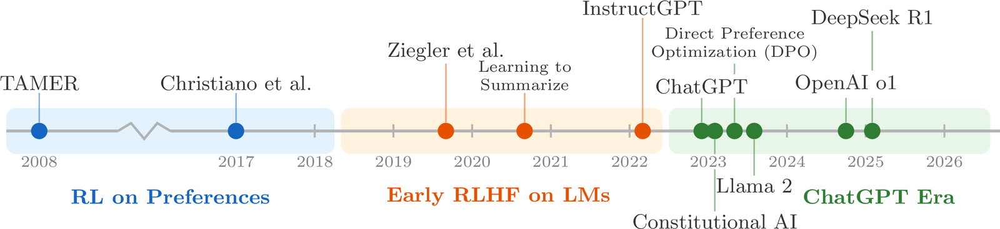
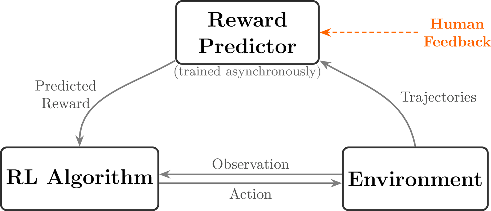

# 第 2 章　RLHF 簡史（A Tiny History of RLHF）

> 譯自 Nathan Lambert, *Reinforcement Learning from Human Feedback*（rlhfbook.com），2026-07-01 版，原文第 18–20 頁。

RLHF 及其相關方法都非常新。我們回顧這段歷史，是為了呈現這些流程正式確立的時間有多晚近，以及這些文獻紀錄有多少存在於學術文獻之中。藉此，我們想強調 RLHF 正在快速演進，因此本章為全書鋪陳背景：本書將對某些方法表達不確定性，並預期部分細節可能會圍繞少數核心實務發生變化。此外，此處列出的論文與方法也展示了 RLHF 流程中各個組成部分的由來——因為其中一些開創性論文，原本是為了與現代語言模型截然不同的應用而寫的。

在本章中，我們詳述讓 RLHF 領域走到今日面貌的關鍵論文與專案。本章並非要對 RLHF 及相關領域做全面性的回顧，而是作為一個起點，重新講述我們如何走到今天。本章刻意聚焦於促成 ChatGPT 的近期研究。在強化學習（Reinforcement Learning, RL）文獻中，關於從偏好中學習還有大量後續研究 [31]。若需要更詳盡的清單，你應該參考正式的綜述論文 [32], [33]。

*圖 2：本章所討論的 RLHF 關鍵發展時間軸，從早期基於偏好的 RL 研究，一路到 RLHF 在大型語言模型中的採用。*

## 2.1 起源至 2018：基於偏好的 RL（Origins to 2018: RL on Preferences）

這個領域近年隨著深度強化學習（Deep Reinforcement Learning）的興起而普及，並發展成許多大型科技公司對 LLM 應用的更廣泛研究。儘管如此，今日使用的許多技術，仍與早期「從偏好中進行 RL」文獻中的核心技術有著深刻的關聯。

最早採用與現代 RLHF 相似方法的論文之一是 *TAMER*。*TAMER: Training an Agent Manually via Evaluative Reinforcement* 提出了一種方法：由人類反覆為代理人（agent）的行動評分，以學習一個獎勵模型（reward model），再用該模型來學習行動策略（action policy）[34]。另有與其同期或稍晚的研究提出了一種演員-評論家（actor-critic）演算法 COACH，利用人類回饋（包含正向與負向）來調整優勢函數（advantage function）[35]。

最主要的參考文獻 Christiano et al. 2017，則是將 RLHF 應用於 Atari 遊戲中代理人軌跡（trajectories）之間偏好的研究 [1]。這項引入 RLHF 的工作，緊接在 DeepMind 關於深度 Q 網路（Deep Q-Networks, DQN）強化學習的開創性研究之後——後者展示了 RL 代理人可以從零開始學會玩熱門電子遊戲。該研究顯示，在某些領域中，讓人類在軌跡之間做選擇，可能比直接與環境互動更有效。這其中用到了一些巧妙的設定條件，但成果依然令人印象深刻。

*圖 3：Christiano et al.（2017）的 RLHF 核心迴圈：獎勵預測器（reward predictor）以非同步方式從軌跡片段的比較中訓練，而代理人則最大化預測出的獎勵。*

這個方法後來被更直接的獎勵建模（reward modeling）研究所擴展 [36]；而深度學習在早期 RLHF 研究中的採用，則以僅僅一年後將 TAMER 擴展至神經網路模型的研究畫下高峰 [37]。

這個時代開始出現轉變：獎勵模型作為一種一般性概念，被提出作為研究對齊（alignment）的方法，而不再只是解決 RL 問題的工具 [38]。

## 2.2 2019 至 2022：語言模型上的人類偏好強化學習（2019 to 2022: RL from Human Preferences on Language Models）

基於人類回饋的強化學習（reinforcement learning from human feedback）——在早期也經常被稱為基於人類偏好的強化學習（reinforcement learning from human preferences）——很快就被日益轉向擴展大型語言模型規模的 AI 實驗室所採用。這類研究有很大一部分始於 2019 年的 GPT-2 與 2020 年的 GPT-3 之間。最早的研究是 2019 年的 *Fine-Tuning Language Models from Human Preferences*，它與現代的 RLHF 研究以及本書將涵蓋的內容有許多驚人的相似之處 [39]。許多經典的概念，例如學習獎勵模型、KL 距離（KL distances）、回饋流程圖等，都是在這篇論文中正式確立的——儘管其最終模型的評估任務與能力，和今日人們所做的已有所不同。從這裡開始，RLHF 被應用到各式各樣的任務上。重要的例子包括：一般摘要（general summarization）[2]、書籍的遞迴式摘要（recursive summarization of books）[40]、指令遵循（instruction following）（InstructGPT）[3]、瀏覽器輔助問答（browser-assisted question-answering）（WebGPT）[4]、支援附引用來源的回答（GopherCite）[41]，以及一般對話（general dialogue）（Sparrow）[42]。

除了應用之外，還有多篇開創性論文為 RLHF 的未來定義了幾個關鍵領域，包括：

1. 獎勵模型過度最佳化（reward model over-optimization）[43]：RL 最佳化器對以偏好資料訓練的模型產生過度擬合（over-fit）的能力；
2. 將語言模型作為對齊研究的一般性研究領域 [23]；以及
3. 紅隊測試（red teaming）[44]——評估語言模型安全性的流程。

將 RLHF 精煉並應用於聊天模型的工作持續進行。Anthropic 在 Claude 的早期版本中持續大量使用它 [5]，早期的 RLHF 開源工具也隨之出現 [45], [46], [47]。

## 2.3 2023 至今：ChatGPT 時代（2023 to the Present: The ChatGPT Era）

ChatGPT 發布時的公告，非常明確地說明了 RLHF 在其訓練中扮演的角色 [48]：

> 我們使用基於人類回饋的強化學習（RLHF）訓練這個模型，採用與 InstructGPT 相同的方法，但在資料蒐集的設定上略有差異。

自那之後，RLHF 已被廣泛用於各個領先的語言模型。眾所周知，它被用於 Anthropic 為 Claude 打造的憲法式 AI（Constitutional AI）[24]、Meta 的 Llama 2 [49] 與 Llama 3 [29]、Nvidia 的 Nemotron [30]、Ai2 的 Tülu 3 [6] 等等。

如今，RLHF 正在成長為一個更廣泛的偏好微調（preference fine-tuning, PreFT）領域，包括一些新的應用，例如：針對中間推理步驟的過程獎勵（process rewards）[50]，於第 5 章介紹；受直接偏好最佳化（Direct Preference Optimization, DPO）[25] 啟發的直接對齊演算法（direct alignment algorithms），於第 8 章介紹；從程式碼或數學的執行回饋中學習 [51], [52]，以及其他受 OpenAI 的 o1 [53] 啟發的線上推理方法，於第 7 章介紹。
