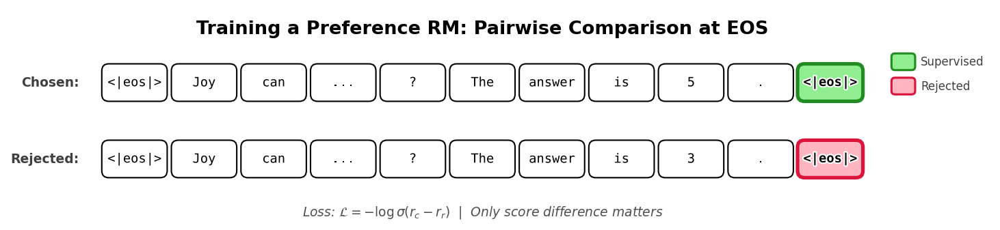
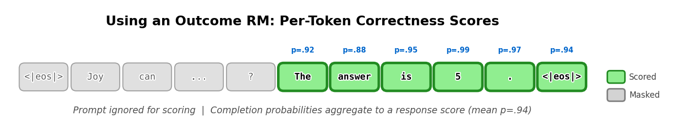
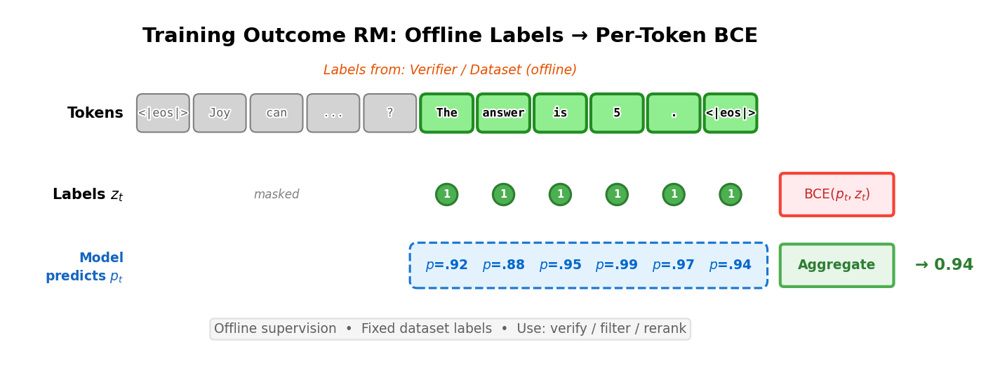
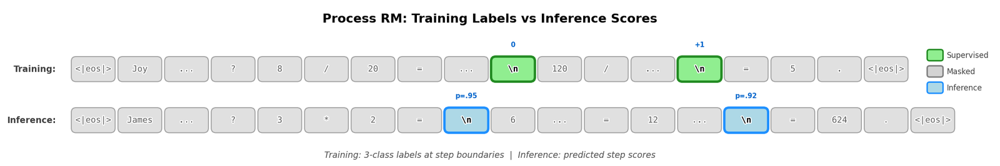

# 第 5 章　獎勵模型（Reward Modeling）

> 譯自 Nathan Lambert, *Reinforcement Learning from Human Feedback*（rlhfbook.com），2026-07-01 版，原文第 37–52 頁。

獎勵模型（reward model）是現代 RLHF 方法的核心，因為複雜的人類偏好正是在這裡被學習的。它們讓我們的模型得以從難以明確定義的訊號中學習。它們把資料中的複雜特徵壓縮成一種可供下游訓練使用的表示——這是一種再次展現現代深度學習強大能力的魔法。這些模型在後續章節所研究的核心最佳化中扮演代理目標（proxy objectives）的角色。如圖 11 所示，獎勵模型扮演著類似標準 RL 環境的角色，為代理人（agent）提供學習訊號；但與固定不變的環境不同，我們得以從人類偏好中學習它。

獎勵模型在強化學習研究中歷來被廣泛用作環境獎勵的代理 [54]。其現代形式的獎勵模型，最初是作為研究價值對齊問題（value alignment problem）的工具而被提出 [38]。這類模型通常接收某種形式的輸入，並輸出單一純量的獎勵值。這個獎勵可以有多種形式——在傳統 RL 問題中，它試圖逼近該問題的精確環境獎勵；但我們將在 RLHF 中看到，獎勵模型實際上輸出的是某個輸入「品質很高」的機率（亦即在成對偏好關係中被選擇的答案）。RLHF 的獎勵建模實務與逆向強化學習（inverse reinforcement learning）密切相關——後者的問題是在給定行為軌跡的情況下逼近代理人的獎勵函數 [71]——也與深度強化學習的其他領域相關。兩者高層次的問題陳述相同，但實作方式與研究重點完全不同，因此通常被視為完全獨立的研究領域。

最常見的獎勵模型通常稱為 Bradley-Terry 獎勵模型，也是本章的主要焦點；它預測的是一段文字相對於訓練比較資料中的另一段文字「較受偏好」的機率。本章稍後我們也會將它與結果獎勵模型（Outcome Reward Models, ORMs）、過程獎勵模型（Process Reward Models, PRMs）以及其他類型的獎勵模型進行比較。

*在本章中，我們用 $x$ 表示提示（prompt）、$y$ 表示補全（completion）。這種記號在語言模型文獻中很常見，因為這些方法是在完整的提示—補全對上運作，而不是在個別 token 上。*

## 5.1 訓練 Bradley-Terry 獎勵模型（Training a Bradley-Terry Reward Model）

獎勵模型的標準實作源自 Bradley-Terry 偏好模型 [72]。訓練 RLHF 標準獎勵模型有兩種常見的表達方式——它們在數學上是等價的。首先，Bradley-Terry 偏好模型定義了在兩個項目 $i$ 與 $j$ 的成對比較中，評審偏好 $i$ 勝過 $j$ 的機率：

$$P(i > j) = \frac{p_i}{p_i + p_j}. \tag{12}$$


*圖 11：RLHF 中的獎勵模型扮演標準 RL 中回傳獎勵的環境元件角色。關鍵差異在於：在 RLHF 中，我們得以控制這個獎勵函數，並從人類偏好中學習它，而不是由環境固定給定。*

Bradley-Terry 模型假設每個項目都有一個潛在強度（latent strength）$p_i > 0$，而觀察到的偏好是這些底層強度帶有雜訊的反映。常見做法是以無界分數重新參數化 Bradley-Terry 模型，令 $p_i = e^{r_i}$，得到以下形式：

$$P(i > j) = \frac{e^{r_i}}{e^{r_i} + e^{r_j}} = \sigma(r_i - r_j). \tag{13}$$

其中 $\sigma(z) = \frac{1}{1+e^{-z}}$ 是邏輯斯函數（logistic function，即 sigmoid 函數），因此偏好機率只取決於分數差 $r_i - r_j$。只有分數之間的差異才重要：對每個 $r_k$ 加上相同的常數 $c$，$P(i > j)$ 保持不變。這些形式是人類偏好的一種有用近似，在 RLHF 中通常效果很好。

要訓練獎勵模型，我們必須構造一個滿足上述關係的損失函數。實務上，這是透過將語言模型轉換為輸出純量分數的模型來完成，通常是加上一個小的線性頭（linear head），從模型的最終隱藏狀態（hidden state）產生單一獎勵值。給定提示 $x$ 與兩個取樣得到的補全 $y_1$ 與 $y_2$，我們用獎勵模型 $r_\theta$ 為兩者評分，並將條件分數寫作 $r_\theta(y_i \mid x)$。

獎勵模型認為 $y_1$ 比 $y_2$ 更受偏好的機率變為：

$$P(y_1 > y_2 \mid x) = \frac{\exp\left(r_\theta(y_1 \mid x)\right)}{\exp\left(r_\theta(y_1 \mid x)\right) + \exp\left(r_\theta(y_2 \mid x)\right)}. \tag{14}$$

我們將較受偏好的補全記為 $y_c$（chosen，被選擇），將被拒絕的補全記為 $y_r$（rejected，被拒絕）。

由此得到的損失會鼓勵獎勵模型給人類偏好的補全比被拒絕的補全更高的分數，並利用 sigmoid 將分數差轉換為機率。式 (14) 中的偏好似然是出發點。我們先把該似然改寫成 sigmoid 形式，方法是將分子與分母同除以 $\exp\left(r_\theta(y_c \mid x)\right)$：

$$
\begin{aligned}
P(y_c > y_r \mid x) &= \frac{\exp\left(r_\theta(y_c \mid x)\right)}{\exp\left(r_\theta(y_c \mid x)\right) + \exp\left(r_\theta(y_r \mid x)\right)} \\
&= \frac{\exp\left(r_\theta(y_c \mid x)\right)}{\exp\left(r_\theta(y_c \mid x)\right)\left(1 + \frac{\exp(r_\theta(y_r \mid x))}{\exp(r_\theta(y_c \mid x))}\right)} \\
&= \frac{1}{1 + \frac{\exp(r_\theta(y_r \mid x))}{\exp(r_\theta(y_c \mid x))}} \\
&= \frac{1}{1 + \exp\left(-(r_\theta(y_c \mid x) - r_\theta(y_r \mid x))\right)} \\
&= \sigma\left(r_\theta(y_c \mid x) - r_\theta(y_r \mid x)\right).
\end{aligned} \tag{15}
$$

接著，獎勵模型是以最大似然（maximum likelihood）在偏好資料集 $D$ 上擬合的，即最大化觀察到的偏好之期望對數似然。由於對數是單調函數，這等價於最小化期望負對數似然（negative log-likelihood）：

$$
\begin{aligned}
\theta^* &= \arg\max_\theta \mathbb{E}_{(x, y_c, y_r) \sim D}\left[\log P(y_c > y_r \mid x)\right] \\
&= \arg\min_\theta \mathbb{E}_{(x, y_c, y_r) \sim D}\left[-\log \sigma\left(r_\theta(y_c \mid x) - r_\theta(y_r \mid x)\right)\right].
\end{aligned} \tag{16}
$$

在對資料集取平均*之前*先取對數，正是負對數似然損失成為正確目標的關鍵：最大化期望機率 $\mathbb{E}[P]$ 與最大化期望對數機率 $\mathbb{E}[\log P]$ 並不相同。

每筆樣本的損失就是上述期望值內的 log-sigmoid 表達式，如 [3] 與其他工作所示：

$$\mathcal{L}(\theta) = -\log\left(\sigma\left(r_\theta(y_c \mid x) - r_\theta(y_r \mid x)\right)\right) \tag{17}$$

第二種是數學上等價的形式，以 softplus 函數 $\log(1 + e^{x})$ 表達，如 [23] 與其他工作所示：

$$\mathcal{L}(\theta) = \log\left(1 + e^{r_\theta(y_r \mid x) - r_\theta(y_c \mid x)}\right) \tag{18}$$

兩者的等價性可透過令 $\Delta = r_\theta(y_c \mid x) - r_\theta(y_r \mid x)$ 並利用 $\sigma(\Delta) = \frac{1}{1+e^{-\Delta}}$ 得出，這意味著 $-\log \sigma(\Delta) = \log(1 + e^{-\Delta}) = \log\left(1 + e^{r_\theta(y_r \mid x) - r_\theta(y_c \mid x)}\right)$。這兩種形式都出現在 RLHF 文獻中。


*圖 12：訓練偏好獎勵模型需要成對的被選擇與被拒絕補全。模型從序列層級的表示（通常是序列結束（end-of-sequence, EOS）token 的隱藏狀態）為每個補全計算一個純量分數，而對比損失只取決於兩者分數之差。*

## 5.2 預設的獎勵模型架構（The Default Reward Model Architecture）

獎勵模型最常見的實作方式，是透過類似 Transformers 函式庫 `AutoModelForSequenceClassification` 的抽象——它在語言模型上附加一個小的線性頭，於訓練或推論時為提示—補全對產生一個純量獎勵分數。在推論時，模型以模型輸出的單一 logit 表示*該段文字被選擇的相對可能性*。

也存在其他實作選項，例如直接從最終嵌入（embeddings）接一個線性層，但這些在開源工具中較不常見。

## 5.3 實作範例（Implementation Example）

實作獎勵建模損失相當簡單。實作上的挑戰更多在於建立獨立的資料載入器（data loader）與推論管線。給定正確的資料載入器（含分詞後的被選擇與被拒絕的提示與補全），損失的實作如下：

```python
import torch.nn as nn
# inputs_chosen / inputs_rejected 包含提示 token x 以及各自的
# 補全 token（y_c 或 y_r），獎勵模型會對兩者一併評分。
rewards_chosen = model(**inputs_chosen)
rewards_rejected = model(**inputs_rejected)
loss = -nn.functional.logsigmoid(rewards_chosen - rewards_rejected).mean()
```

就更大的圖景而言，這通常位於一個因果語言模型（causal language model，即由左至右生成 token、以所有先前 token 為條件預測每個 token 的模型）之內，該模型加上（並以上述損失學習）一個額外的頭，將最終隱藏狀態轉換為輸入的分數。程式碼接收標準的 transformer 輸入——`input_ids`（分詞後的文字）與 `attention_mask`（標記哪些是真實 token、哪些是填充 token）——並在最後一個真實 token 處擷取隱藏狀態（模型對輸入的內部表示），再通過一個線性層產生純量獎勵。這個模型的結構如下：

```python
import torch
import torch.nn as nn
import torch.nn.functional as F

class BradleyTerryRewardModel(nn.Module):
    """
    用於 Bradley-Terry 偏好學習的標準純量獎勵模型。

    用法（成對 BT 損失）：
        rewards_chosen = model(**inputs_chosen)    # (batch,)
        rewards_rejected = model(**inputs_rejected)  # (batch,)
        loss = -F.logsigmoid(rewards_chosen - rewards_rejected).mean()
    """
    def __init__(self, base_lm):
        super().__init__()
        self.lm = base_lm  # 例如 AutoModelForCausalLM
        self.head = nn.Linear(self.lm.config.hidden_size, 1)

    def _sequence_rep(self, hidden, attention_mask):
        """
        為每個序列取得一個用於評分的向量。
        預設：最後一個非填充 token（EOS token）；若無遮罩，則取最後一個 token。
        hidden: (batch, seq_len, hidden_size)
        attention_mask: (batch, seq_len)
        """

        # 每個序列中最後一個非填充 token 的索引
        # attention_mask 對真實 token 為 1，對填充為 0
        lengths = attention_mask.sum(dim=1) - 1  # (batch,)
        batch_idx = torch.arange(hidden.size(0), device=hidden.device)
        return hidden[batch_idx, lengths]  # (batch, hidden_size)

    def forward(self, input_ids, attention_mask):
        """
        此前向傳遞旨在展示標準獎勵模型的推論結構。
        若要訓練，需修改此函式以同時計算被選擇與被拒絕輸入的獎勵，
        並套用上述損失。
        """
        outputs = self.lm(
            input_ids=input_ids,
            attention_mask=attention_mask,
            output_hidden_states=True,
            return_dict=True,
        )
        # 最終隱藏狀態：(batch, seq_len, hidden_size)
        hidden = outputs.hidden_states[-1]

        # 每個序列一個純量獎勵：(batch,)
        seq_repr = self._sequence_rep(hidden, attention_mask)
        rewards = self.head(seq_repr).squeeze(-1)

        return rewards
```

在本節以及後續內容中，獎勵模型（乃至大部分後訓練）的實作複雜度多半集中在正確建構資料載入器與分散式學習系統。注意，訓練獎勵模型時，最常見的做法是只訓練 1 個 epoch，以避免過度擬合（overfitting）。

## 5.4 獎勵模型變體（Reward Model Variants）

獎勵建模在 RLHF 中是一個相對較少被探索的領域。傳統的獎勵建模損失在許多知名工作中被修改過，但這些修改尚未凝聚為單一的最佳實務。

### 5.4.1 偏好邊際損失（Preference Margin Loss）

當標註者提供的是李克特量表（Likert Scale，一種具有順序類別、能表示偏好強度的評分量表，例如 1–5）上的分數或排名時，這些相對量的大小可以用於訓練。最常見的做法是沿著偏好方向將資料二值化，把相對評分或排名強度的混合資訊化約為只有被選擇與被拒絕的補全。額外的資訊——例如偏好的強度——曾被用來改進模型訓練，但尚未成為標準做法。Llama 2 提出使用兩個資料點之間的邊際（margin）$m(y_c, y_r)$ 來區分偏好的強度：

$$\mathcal{L}(\theta) = -\log\left(\sigma\left(r_\theta(y_c \mid x) - r_\theta(y_r \mid x) - m(y_c, y_r)\right)\right) \tag{19}$$

舉例來說，每個補全通常會依品質得到 1 到 5 的排名。若被選擇的樣本得分為 5、被拒絕的樣本得分為 2，則邊際 $m(y_c, y_r) = 5 - 2 = 3$。也可以探索其他計算邊際的函數。

注意，在 Llama 3 中這個邊際項被移除了，因為團隊觀察到在規模擴大後改進遞減。

### 5.4.2 平衡每個提示的多重比較（Balancing Multiple Comparisons Per Prompt）

InstructGPT 研究了對每個提示使用 $K = 4$ 到 9 個補全進行排名的影響，從每個提示產生 $\binom{K}{2}$ 個成對比較 [3]。由於這些比較高度相關（它們共享相同的提示），天真地將它們洗牌混入資料集會使獎勵模型過度擬合。為了解決這個問題，他們對每個提示的每個比較加權其損失更新——若不重新加權，補全較多的提示只因產生更多配對就會貢獻更多總損失。實務上，來自單一提示的所有 $\binom{K}{2}$ 個比較通常會被放進同一個訓練批次並一起平均，如此每個提示貢獻一次分組更新，而不是分散在許多獨立批次中。這減少了對個別提示的過度擬合，並防止取樣補全較多的提示主導損失。損失函數變為：

$$\mathcal{L}(\theta) = -\frac{1}{\binom{K}{2}} \mathbb{E}_{(x, y_c, y_r) \sim D} \log\left(\sigma\left(r_\theta(y_c \mid x) - r_\theta(y_r \mid x)\right)\right) \tag{20}$$

### 5.4.3 K-wise 損失函數（K-Wise Loss Function）

還有許多其他公式可以建立適用於 RLHF 的人類偏好模型。其中一個例子是基於 Plackett-Luce 模型 [74] 的 K-wise 損失函數，曾被用於知名的早期 RLHF 模型 Starling 7B 與 34B [73]。

Zhu et al. 2023 [75] 將該設定形式化如下。給定一個提示（或狀態）$s^i$，從 $P(a_0, \cdots, a_{K-1} \mid s^i)$ 取樣 $K$ 個動作 $(a_0^i, a_1^i, \cdots, a_{K-1}^i)$。接著，標註者依偏好對這 $K$ 個動作排序，產生一個排列 $\sigma^i : [K] \mapsto [K]$，其中 $\sigma^i(0)$ 是最受偏好的動作。這產生了對所有 $K$ 個項目完整排名的 Plackett-Luce 機率：

$$P(\sigma^i \mid s^i, a_0^i, a_1^i, \ldots, a_{K-1}^i) = \prod_{k=0}^{K-1} \frac{\exp\left(r_{\theta\star}(s^i, a_{\sigma^i(k)}^i)\right)}{\sum_{j=k}^{K-1} \exp\left(r_{\theta\star}(s^i, a_{\sigma^i(j)}^i)\right)} \tag{21}$$

當 $K = 2$ 時，這退化為用於成對比較的 Bradley-Terry（BT）模型。無論如何，一旦訓練完成，這些模型在 RLHF 訓練期間的使用方式與其他獎勵模型類似。

## 5.5 結果獎勵模型（Outcome Reward Models）

語言模型與其他 AI 系統的大部分*偏好微調*（preference tuning）都是以上面討論的 Bradley-Terry 模型完成的。對於重推理的任務，可以使用結果獎勵模型（Outcome Reward Model, ORM）。ORM 的訓練資料以類似標準偏好微調的方式建構。這裡我們有一個問題陳述或提示 $x$，以及兩個補全 $y_1$ 與 $y_2$。此處使用的歸納偏置（inductive bias）是：其中一個補全應為該問題的正確解，另一個為錯誤解，形成 $(y_c, y_{ic})$。

所使用的模型架構與標準獎勵模型非常相似，都是在能輸出單一 logit 的模型上附加一個線性層（就 RM 而言）——而在 ORM 中，後續的訓練目標略有不同 [76]：

> [我們]以聯合目標訓練驗證器（verifier），模型除了原本的語言建模目標之外，還要學習將模型補全標記為正確或錯誤。在架構上，這意味著我們的驗證器是語言模型，加上一個小的純量頭，以逐 token 的方式輸出預測。我們將這個純量頭實作為單一偏置參數與單一增益參數，作用於語言模型最終反嵌入層（unembedding layer）輸出的 logits 上。

換句話說，這被實作為一個語言建模頭，能對每個 token 預測兩個類別（1 為正確、0 為錯誤），而不是傳統 RM 那種對整個序列輸出一個 logit 的分類頭。形式上，依循 [77]，這是一個逐 token 的二元交叉熵（binary cross-entropy）損失：

$$\mathcal{L}_{\text{CE}}(\theta) = -\mathbb{E}_{(s, r) \sim \mathcal{D}}\left[r \log p_\theta(s) + (1 - r)\log\left(1 - p_\theta(s)\right)\right] \tag{22}$$

其中 $r \in \{0, 1\}$ 是二元標籤，1 對應給定提示的正確答案、0 對應錯誤答案，而 $p_\theta(s)$ 是與被訓練模型所預測的正確機率成比例的純量。在程式碼中，這個結果標籤會被複製到每個補全 token 上，而提示 token 以 `-100` 遮罩，因此不會對損失有所貢獻。

實作結果獎勵模型（以及其他類型，如我們稍後在過程獎勵模型中會看到的）需要根據補全是否為正確樣本，以逐 token 的方式套用交叉熵損失。這遠比較接近語言建模損失——它不需要標準 Bradley-Terry 獎勵模型那種結構化的 chosen-rejected 性質。在下面簡化的 ORM 訓練設定中，我們不會取樣新的 token，也不會以下一個 token 預測來訓練 LLM；我們將固定的提示—補全序列餵入骨幹網路（backbone），並訓練 ORM 頭來預測正確性標籤。

模型結構可以如下：

```python
import torch.nn as nn
import torch.nn.functional as F

class OutcomeRewardModel(nn.Module):
    def __init__(self, base_lm):
        super().__init__()
        self.lm = base_lm  # 例如 AutoModelForCausalLM
        self.head = nn.Linear(self.lm.config.hidden_size, 1)

    def forward(self, input_ids, attention_mask=None, labels=None):
        """
        input_ids 包含完整的提示+補全序列。
        labels 與 token 對齊：提示 token 為 -100，且每個補全
         token 重複整個序列的結果標籤（1=正確，0=錯誤）。
        若 labels=None，這是僅推論的前向傳遞，損失以 None
         回傳。
        """
        outputs = self.lm(
            input_ids=input_ids,
            attention_mask=attention_mask,
            output_hidden_states=True,
            return_dict=True,
        )
        # 最終隱藏狀態：(batch, seq_len, hidden_size)
        hidden = outputs.hidden_states[-1]
        # 每個 token 一個純量 logit：(batch, seq_len)
        logits = self.head(hidden).squeeze(-1)

        # 僅推論的前向傳遞：不計算損失。
        if labels is None:
            return None, logits
        # 只在補全 token（標籤為 0 或 1）上計算損失
        # 提示 token 的標籤為 -100
        mask = labels != -100
        loss = None
        if mask.any():
            loss = F.binary_cross_entropy_with_logits(
                logits[mask], labels[mask].float()
            )
        else:
            loss = logits.sum() * 0
        return loss, logits
```

損失的簡化版本如下：

```python
# 將完整的提示+補全序列一次餵入；此處不進行任何 token 取樣。
# 假設模型已具備：model.lm（骨幹網路）+ model.head
hidden = model.lm(**inputs, output_hidden_states=True).hidden_states[-1]
logits_per_token = model.head(hidden).squeeze(-1)  # (batch, seq_len)
# 在其他實作中，這有時會被壓縮為 model.forward()

# 二元標籤：1=正確，0=錯誤（提示 token 以 -100 遮罩）
mask = labels != -100
loss = F.binary_cross_entropy_with_logits(
    logits_per_token[mask], labels[mask].float()
)
```

這裡的重要直覺是：ORM 會在序列的每個 token 上輸出一個正確性機率（僅以最終答案來評判——推理錯誤不會在 ORM 的訓練過程中被捕捉到）。這可能是一個帶雜訊的過程，因為更新與損失會依結果與注意力映射（attention mappings）逐 token 傳播。


*圖 13：推論時，結果獎勵模型會對補全 token 輸出逐 token 的正確性機率。提示 token 不參與評分，而補全機率可以彙總為回應層級的分數，用於驗證、過濾或重新排序。*

這些模型持續被使用，但在開源 RLHF 工具中的支援較少。舉例來說，開創性工作 *Let's Verify Step by Step* [50] 使用了同類型的 ORM，但去掉了損失中的語言建模預測部分。此時最終損失是對每個 token 的交叉熵損失，預測最終答案是否正確。

由於缺乏支援，結果獎勵模型（ORM）一詞被以多種方式使用。有些文獻（例如 [77]）繼續沿用 Cobbe et al. 2021 的原始定義；其他人則更廣義地用它來指任何被訓練來預測補全是否正確的驗證器。

## 5.6 過程獎勵模型（Process Reward Models）

過程獎勵模型（Process Reward Models, PRMs），最初稱為過程監督獎勵模型（process-supervised reward models），是被訓練來在思維鏈（chain-of-thought）推理過程的每個*步驟*輸出分數的獎勵模型。這與只在 EOS token 輸出分數的標準 RM、或在每個 token 輸出分數的 ORM 不同。過程獎勵模型需要在每個推理步驟結尾提供監督，然後以類似方式訓練，其中步驟內的 token 會被訓練到其相關目標——PRM 的目標是該步驟，而 ORM 的目標是整個回應。


*圖 14：訓練結果獎勵模型使用來自驗證器或資料集的離線標籤（例如正確補全全為 1）。每個補全 token 以二元交叉熵針對結果標籤進行訓練，逐 token 機率再彙總為最終分數，用於驗證、過濾或重新排序。*

依循 [50]，二元標籤的 PRM 通常以逐步驟的交叉熵損失最佳化：

$$\mathcal{L}_{\text{PRM}}(\theta) = -\mathbb{E}_{(x, s) \sim \mathcal{D}}\left[\sum_{i=1}^{K} y_{s_i} \log r_\theta(s_i \mid x, s_{<i}) + (1 - y_{s_i})\log\left(1 - r_\theta(s_i \mid x, s_{<i})\right)\right] \tag{23}$$

其中 $s$ 是含有 $K$ 個標註步驟的取樣思維鏈，$y_{s_i} \in \{0, 1\}$ 表示第 $i$ 個步驟是否正確，而 $r_\theta(s_i \mid x, s_{<i})$ 是 PRM 在給定原始提示 $x$ 與所有先前步驟 $s_{<i}$ 的條件下，預測步驟 $s_i$ 有效的機率。

以下是這種逐步驟標籤如何在訓練器中封裝的範例，來自 HuggingFace 的 TRL（Transformer Reinforcement Learning）[47]：

```python
# 取得分隔 token 的 ID 並將其加到補全的尾端
separator_ids = tokenizer.encode(step_separator, add_special_tokens=False)
completions_ids = [completion + separator_ids for completion in completions_ids]

# 建立標籤
labels = [[-100] * (len(completion) - 1) + [label] for completion, label in
zip(completions_ids, labels)]
```

傳統上，PRM 以語言建模頭訓練，只在推理步驟結尾的 token 產生輸出，例如對應雙換行或其他特殊 token 的位置。這些預測通常是 -1 代表錯誤、0 代表中性、1 代表正確。這些標籤不必然對應模型是否走在正確的路徑上，而是該步驟本身是否正確。

下面展示 PRM 的一個建構範例。


*圖 15：過程獎勵模型僅在步驟邊界（例如換行 token）提供監督。每個步驟會得到一個三類標籤：正確（+1）、中性（0）或錯誤（-1）。訓練期間，其他所有 token 都會被遮罩。*

```python
import torch.nn as nn
import torch.nn.functional as F

class ProcessRewardModel(nn.Module):
    def __init__(self, base_lm, num_classes=3):
        super().__init__()
        self.lm = base_lm  # 例如 AutoModelForCausalLM
        self.head = nn.Linear(self.lm.config.hidden_size, num_classes)

    def forward(self, input_ids, attention_mask=None, labels=None):
        """
        輸入是分詞後的提示與補全，其中「推理步驟」的結尾
         由指定的分隔 token 標示，例如換行或其他特殊標記，
         而非批次填充。
        labels 是一組標籤：True、False 與 Neutral（3 種標籤），
         由模型進行預測。
        若 labels=None，這是僅推論的前向傳遞，損失以 None
         回傳。
        """
        outputs = self.lm(
            input_ids=input_ids,
            attention_mask=attention_mask,
            output_hidden_states=True,
            return_dict=True,
        )
        # 最終隱藏狀態：(batch, seq_len, hidden_size)
        hidden = outputs.hidden_states[-1]
        # 每個 token 一個 logit 向量：(batch, seq_len, num_classes)
        logits = self.head(hidden)

        # 僅推論的前向傳遞：不計算損失。
        if labels is None:
            return None, logits
        # 只在步驟邊界（labels != -100 之處）計算損失
        # 標籤映射：-1 -> 0，0 -> 1，1 -> 2（類別索引）
        mask = labels != -100
        loss = None
        if mask.any():
            loss = F.cross_entropy(
                logits[mask], labels[mask]
            )
        else:
            loss = logits.sum() * 0
        return loss, logits
```

其核心損失函數看起來與結果獎勵模型非常相似，只是標籤套用的間隔不同。

```python
# 假設模型對每個 token 輸出三類 logits
hidden = model.lm(**inputs, output_hidden_states=True).hidden_states[-1]
logits = model.head(hidden)  # (batch, seq_len, 3)

# 僅在步驟邊界處的三類標籤：0=-1、1=0、2=1（其餘以 -100 遮罩）
mask = labels != -100
loss = F.cross_entropy(logits[mask], labels[mask])
```

## 5.7 各類獎勵模型（與價值函數）之比較（Comparing Reward Model Types (and Value Functions)）

前面涵蓋的各類獎勵模型，展示了 RLHF 與其他後訓練方法中「品質」可以被衡量的方式光譜。下面是這些模型預測什麼以及如何訓練的摘要。

表 2：各類獎勵模型之比較。

| 模型類別 | 預測什麼 | 如何訓練 | LM 結構 |
|---|---|---|---|
| **獎勵模型** | 序列層級的品質分數 $r_\theta(x, y)$ | 補全之間成對（或 N-wise）比較的對比損失 | 在 EOS／最後 token 隱藏狀態上的線性頭 |
| **結果獎勵模型** | 答案正確的逐 token 機率 | 帶標籤的結果對（例如可驗證領域上的成功／失敗） | 逐 token 二元交叉熵頭；標籤重複結果標籤 |
| **過程獎勵模型** | 推理步驟結尾處對中間步驟的獎勵或分數 | 使用中間回饋或逐步標註訓練（對推理步驟中的每個 token 訓練） | 預測步驟正確性（-1、0、1）的逐 token 頭 |
| **價值函數** | 給定當前狀態的期望回報 | 透過對序列中每個點的回歸訓練 | 具逐 token 輸出的純量回歸頭 |

關於此表中區分方式的幾點注意事項，因為各模型類型之間的界線並不總是涇渭分明：

- 無論在偏好微調或推理訓練中，價值函數通常使用折扣因子（discount factor）1，這使得價值函數更接近結果獎勵模型，但訓練損失不同。
- 過程獎勵模型可以透過從某個中間狀態進行推演（rollout）並收集結果資料來提供監督。這混合了多種想法，但只要*損失*使用逐推理步驟的標籤，最好仍稱之為 PRM。

**如果你用正確／錯誤配對來訓練 Bradley-Terry 成對模型會怎樣？** 關於結果獎勵模型的許多混淆，來自一小部分在源自答案正確性的成對資料上訓練獎勵模型的文獻。在這種情境下，你把被選擇的回應設為某問題的正確答案，把被拒絕的回應設為*同一問題*的錯誤答案。這在技術上不是 ORM，且仍然直接以對比式、序列層級的損失訓練。這在技術上仍是 Bradley-Terry 模型，會落在我們涵蓋的第一類模型中。

**ORM vs. 價值函數。** ORM 與價值函數可能看起來相似，因為兩者都以相同的頭架構產生逐 token 輸出，但它們在*預測什麼*與*目標從何而來*上有所不同：

- **ORM** 預測即時的、token 局部的量：$p(\text{correct}_t)$ 或 $r_t$。目標來自*離線標籤*（將 token／序列標記為正確或錯誤的驗證器或資料集）。
- **價值函數**預測期望的*剩餘*回報：$V(s_t) = \mathbb{E}\left[\sum_{k \geq t} \gamma^{k-t} r_k \mid s_t\right]$。目標通常是*從當前策略 $\pi_\theta$ 的 on-policy 推演計算而來*，並隨策略改變而變化（技術上，價值函數也可以是 off-policy 的，但這在語言建模的工作中尚未確立）。

如果你定義密集的 token 獎勵 $r_t = \mathbb{1}[\text{token 正確}]$ 並使用 $\gamma = 1$，那麼 ORM 學習的是 $r_t$（或 $p(r_t = 1)$），而價值頭學習的是剩餘總和 $\sum_{k \geq t} r_k$。它們可以共享相同的基礎模型與頭的維度，但*語意與監督管線*不同：ORM 是從固定標籤離線訓練的，而價值函數是 on-policy 訓練的，並用於計算策略梯度（policy gradients）的優勢 $A_t = \hat{R}_t - V_t$。

### 5.7.1 各類獎勵模型的推論方式（Inference Across Reward Model Types）

這些模型在推論時（即訓練完成後）處理資料的方式不同，以應對 RM 所服務的一系列任務。

**Bradley-Terry RM（偏好模型）：**

- *輸入：* 提示 $x$ + 候選補全 $y$
- *輸出：* 透過線性層從 EOS／最後 token 隱藏狀態得到的單一純量 $r_\theta(x, y)$
- *用途：* 對 $k$ 個補全重新排序、選出第一名（best-of-N 取樣）；或為 RLHF 提供終端獎勵
- *彙總方式：* 純量輸出不需要彙總

**結果 RM（Outcome RM）：**

- *輸入：* 提示 $x$ + 補全 $y$
- *輸出：* 補全 token 上的逐 token 機率 $p_t \approx P(\text{在 token } t \text{ 處正確})$
- *用途：* 為完成的候選答案評分；透過平均、最小值（尾部風險）或乘積 $\prod_t p_t$（等價地，對數機率總和 $\sum_t \log p_t$）進行彙總
- *彙總選項：* 平均正確性、最小 $p_t$、對最後 $m$ 個 token 取平均，或當任一 $p_t < \tau$ 時觸發門檻標記

**過程 RM（Process RM）：**

- *輸入：* 提示 $x$ + 帶有步驟邊界的推理軌跡
- *輸出：* 步驟邊界處的分數（例如正確／中性／錯誤的類別 logits）
- *用途：* 為完成的思維鏈評分；或透過修剪低分分支來引導搜尋／解碼
- *彙總方式：* 在步驟層級（而非 token 層級）——平均步驟分數、最小值（快速失敗），或偏重後段步驟的加權總和

**價值函數（Value Function）：**

- *輸入：* 提示 $x$ + 當前前綴 $y_{\leq t}$（一個狀態）
- *輸出：* 補全中每個 token 位置的 $V_t$（從狀態 $t$ 起的期望剩餘回報）
- *用途：* 在 RL 訓練期間計算逐 token 優勢 $A_t = \hat{R}_t - V_t$；每一步的價值作為基線（baseline）
- *彙總方式：* 通常取最後生成 token 處的 $V$；其詮釋與「正確機率」不同

總結來說，理解這些不同模型的方式是：

- **RM：**「這整個答案有多好？」→ 純量值
- **ORM：**「哪些部分看起來正確？」→ 逐 token 正確性
- **PRM：**「推理步驟是否合理？」→ 逐步驟分數
- **價值函數：**「從這裡開始還剩多少獎勵？」→ RL 優勢的基線

## 5.8 生成式獎勵建模（Generative Reward Modeling，又稱 LLM-as-a-judge）

由於偏好資料的成本高昂，一個龐大的研究領域應運而生：使用現有語言模型作為人類偏好的評審，或用於其他評估情境 [78]。其核心想法是以「如何評判」的說明、一個提示以及兩個補全來提示語言模型（就像人類標註者的做法一樣）。以下是一個範例提示，來自此領域的開創性工作之一——聊天評估 MT-Bench [78]：

```
[System]
Please act as an impartial judge and evaluate the quality of the responses provided by
two AI assistants to the user question displayed below.
You should choose the assistant that follows the user's instructions and answers the
user's question better.
Your evaluation should consider factors such as the helpfulness, relevance, accuracy,
depth, creativity, and level of detail of their responses.
Begin your evaluation by comparing the two responses and provide a short explanation.
Avoid any position biases and ensure that the order in which the responses were
presented does not influence your decision.
Do not allow the length of the responses to influence your evaluation.
Do not favor certain names of the assistants.
Be as objective as possible.
After providing your explanation, output your final verdict by strictly following this
format: "[[A]]" if assistant A is better, "[[B]]" if assistant B is better, and "[[C]]"
for a tie.
[User Question]
{question}
[The Start of Assistant A's Answer]
{answer_a}
[The End of Assistant A's Answer]
[The Start of Assistant B's Answer]
{answer_b}
[The End of Assistant B's Answer]
```

鑑於 LLM-as-a-judge 在評估上的效力——它催生了許多其他評估，例如 AlpacaEval [79]、Arena-Hard [80] 與 WildBench [81]——許多人開始使用 LLM-as-a-judge 而非獎勵模型來建立與使用偏好資料。

一整個研究領域圍繞著如何使用所謂的「生成式獎勵模型」（Generative Reward Models）而興起 [82] [83] [84]（包括*專門*被訓練成有效評審的模型 [85]），但在 RM 評估上，它們往往落後於現有的獎勵模型，這顯示獎勵建模對當前的 RLHF 而言仍是一項重要技術。

提升 LLM-as-a-judge 工作流程穩健性的一個常見技巧，是使用取樣溫度 0 來降低評分的變異。

## 5.9 延伸閱讀（Further Reading）

獎勵建模的學術文獻在 2024 年確立。早期進展大多集中在建立基準測試（benchmarks）與辨識行為模式。第一個 RM 基準測試 RewardBench 為測試獎勵模型提供了共通的基礎設施 [86]。自那以後，RM 評估已擴展到與一般後訓練模型可用的評估類型相似的範疇，其中一些評估測試在已知真實答案的領域上的預測準確度 [86]，另一些則更接近以 LLM-as-a-judge 進行的「感覺」（vibes）式評估或與其他基準測試的相關性 [87]。

新基準測試的例子包括：

- **純文字（一般聊天／偏好）：** RMB [88]、RewardBench2 [89]、Preference Proxy Evaluations [90]，或 RM-Bench [91]。
- **專門的純文字（數學等）：** 多語言獎勵基準（M-RewardBench）[92]、針對檢索增強生成（retrieval augmented generation, RAG）的 RAG-RewardBench [93]、針對錯字的 ReWordBench [94]、RewardMATH [95]，或 AceMath-RewardBench [96]。
- **過程 RM：** PRM Bench [97] 或 ProcessBench [98]，以及視覺基準 VisualProcessBench [99] 或 ViLBench [100]。
- **代理型 RM：** Agent-RewardBench [101] 或 CUARewardBench [102]。
- **多模態：** MJ-Bench [103]、Multimodal RewardBench [104]、VL RewardBench [105]，或 VLRMBench [106]。

要了解*訓練*獎勵模型的進展，可以參考新的獎勵模型訓練方法，包括面向條件化模型（aspect-conditioned models）[107]、高品質人類資料集 [108] [109]、擴展性實驗 [30]、大規模實驗 [49]，或資料去偏（debiasing data）[110]。

## 5.10 建議實驗（Suggested Experiments）

配套程式碼儲存庫的 `code/reward_models/` 中包含小型獎勵模型訓練腳本。這些是作為學習練習之用，而非調校完善的參考配方。請從乾淨的 `code/` 環境以 `uv sync` 開始，然後一次執行一個實驗。

1. **在 UltraFeedback 上訓練 Bradley-Terry 偏好獎勵模型。** 執行：

   ```bash
   cd code/
   uv run python -m reward_models.train_preference_rm --samples 2000 --epochs 1
   ```

   觀察示範輸出與 W&B 記錄中，被選擇與被拒絕回應之間的獎勵邊際是否增長。接著改變 `--samples`、`--lr` 與 `--model-id`，觀察訊號何時變得嘈雜或不穩定。

2. **比較結果監督與過程監督。** 執行 GSM8K 結果獎勵模型與 PRM800K 過程獎勵模型：

   ```bash
   cd code/
   uv run python -m reward_models.train_orm --samples 400 --epochs 2
   uv run python -m reward_models.train_prm --samples 500 --epochs 2
   ```

   比較訓練後每個模型能評分的對象：ORM 應能區分正確與錯誤的最終答案，而 PRM 應能對中間推理步驟給出分數。這是序列層級、結果層級與過程層級監督之間區別的實務版本。

3. **加入一個小型保留（held-out）獎勵模型評估。** 一項有用的貢獻是為 `reward_models/` 建立 50 到 200 筆樣本的評估，回報準確度或偏好對排序，而不需要完整的訓練流程。讓評估保持足夠小，以便在調整超參數時使用。
