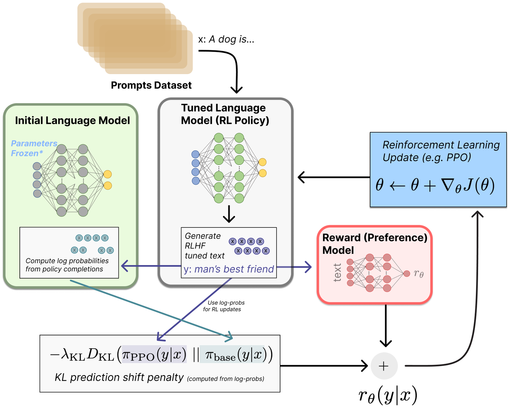
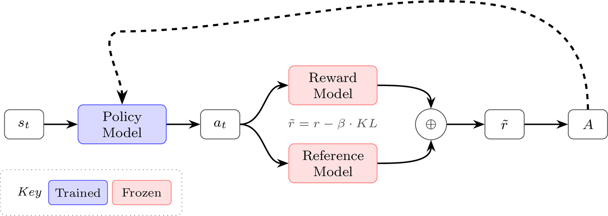
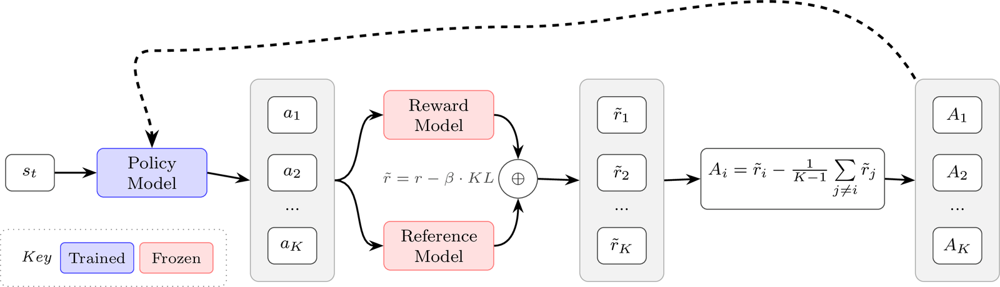
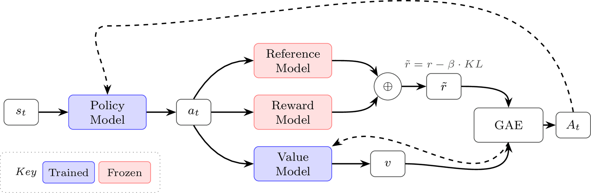
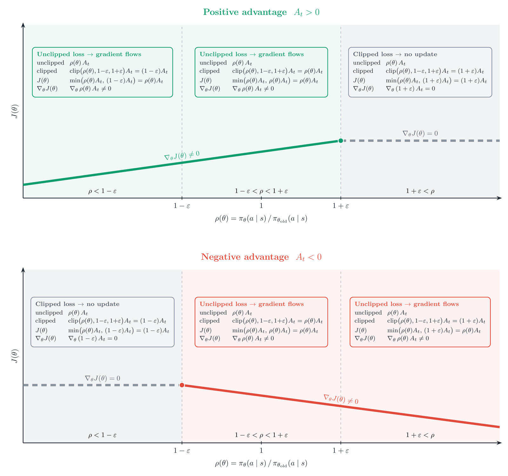
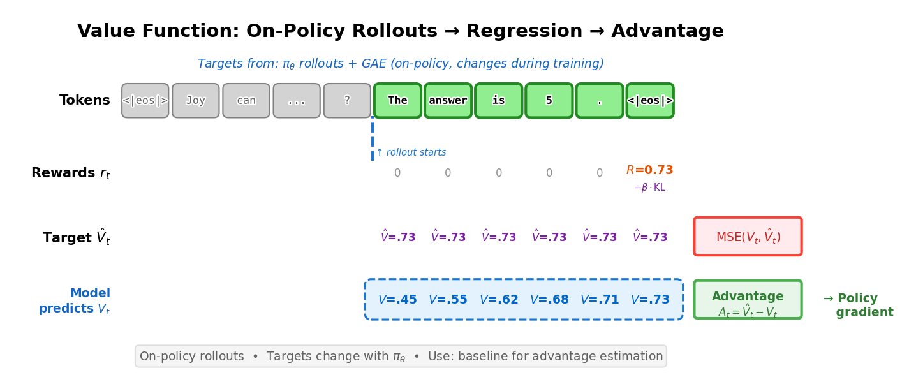
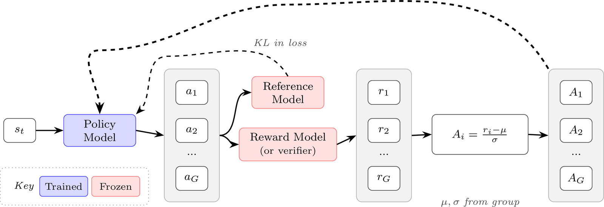

# 第 6 章　強化學習（Reinforcement Learning）

> 譯自 Nathan Lambert, *Reinforcement Learning from Human Feedback*（rlhfbook.com），2026-07-01 版，原文第 53–93 頁。本檔為前半（6.1–6.2）。

在 RLHF 流程中，強化學習演算法會根據獎勵模型（reward model）的回饋，緩慢地更新模型的權重。策略（policy）——也就是正在被訓練的模型——會針對訓練集中的提示詞（prompt）生成補全（completion），接著由獎勵模型為其評分，然後強化學習最佳化器再依據這些資訊執行梯度更新（整體概覽見圖 16）。本章將說明各種演算法的數學原理與取捨，這些演算法用來從獎勵模型對 on-policy 資料所給出的訊號中學習。這些演算法會執行許多個 epoch，通常是在較大的提示詞集合上跑過數千甚至數百萬個批次（batch），並在每個批次之間進行梯度更新。

## 6.1 強化學習在 RLHF 中的角色

讓 RLHF 在語言模型上聲名大噪的演算法，正是策略梯度（policy gradient）類的強化學習演算法。這些演算法——例如近端策略最佳化（Proximal Policy Optimization, PPO）、群組相對策略最佳化（Group Relative Policy Optimization, GRPO）與 REINFORCE——使用最近生成的樣本來更新模型（而不是像 Deep Q-Networks（DQN）那類演算法把分數存進重播緩衝區（replay buffer），DQN 曾被用於 AlphaGo 等知名專案）。在本節中，我們將介紹策略梯度演算法的基礎，以及它們如何被運用在現代 RLHF 框架之中。

從機器學習的層面來看，本節是整個 RLHF 流程中複雜度最高的主題。不過，正如大多數現代 AI 模型一樣，決定其成敗的最大因素仍然是作為流程輸入的資料。

當 RLHF 隨著 ChatGPT 進入大眾視野時，外界大致已知他們使用的是 PPO 的某種變體，許多早期的嘗試也都以此為基礎。隨著時間推移，多個研究專案展示了 REINFORCE 式演算法的潛力 [111] [109]，其賣點是比 PPO 更簡單：不需要獨立的價值模型（節省記憶體，因此減少所需的 GPU 數量），並且採用更簡單的優勢估計（不需要廣義優勢估計（Generalized Advantage Estimation, GAE）——GAE 是一種用來計算優勢的方法，用於降低策略梯度演算法的變異數）。後來又出現了更多演算法，包括在推理任務上特別流行的群組相對策略最佳化（GRPO），但一般而言，這些演算法多半都可以針對特定任務進行調校。在本章中，我們會介紹核心的策略梯度框架，以及上述三種演算法——因為它們在建立 RLHF 經典文獻體系中扮演了核心角色。

最簡單的情況下，RLHF 的 RL 階段需要兩個模型：一個策略（正在被訓練的模型），以及一個為其輸出評分的獎勵模型（如前一章所述）。RL 之前的策略副本會作為參考模型（reference model），用來計算 KL 懲罰（這個模型是凍結的，也就是說它不會被自動微分引擎的梯度更新）。本章涵蓋的最複雜演算法 PPO 還會加入第四個模型——一個學習而來的價值函數（value function），用來估計動作中每個 token 的好壞，它同樣是一個在訓練過程中被更新的大型語言模型。本章的演算法之間的差異，主要在於它們如何估計一個稱為「優勢（advantage）」的量——衡量模型當前動作（補全）相對於平均水準有多好——以及它們如何約束策略更新，讓最佳化過程在數值上保持穩定。這個 RLHF 流程（不含價值模型）的視覺化概覽如圖 16 所示。

符號定義請參見問題設定（Problem Setup）章節。


*圖 16：RLHF 訓練迴圈概覽。資料集中的提示詞被送入微調中的策略，由其生成一個補全。獎勵模型為這個補全評分，同時凍結的初始模型（通常是 RL 之前的指令微調模型）對同一段文字計算對數機率，用來計算防止過度漂移的 KL 懲罰。合併後的獎勵訊號接著驅動強化學習更新策略參數。*

> *本章使用強化學習文獻中的 $(s, a)$ 記號，其中 $s$ 代表狀態（state）、$a$ 代表動作（action）。在語言模型的情境下，你常會看到改用 $(x, y)$，其中 $x$ 是提示詞、$y$ 是補全。$(s, a)$ 的框架更為一般化——這些演算法原本是為「每個時間步都要採取動作」的序列決策問題所設計。然而，許多 RLHF 實作將整個補全視為單一動作，因此 $(x, y)$ 記號同樣成立。*
>
> **RL 速查表（RL Cheatsheet）：** *本章所有核心 RL 損失函數的單頁參考資料，可在 rlhfbook.com/rl-cheatsheet 取得。*

## 6.2 策略梯度演算法（Policy Gradient Algorithms）

本章的核心，就是理解以下這種形式的方程式。這個方程式計算的是我們正在訓練的語言模型 $\pi_\theta$ 的梯度 $\Delta\theta$：

$$
\Delta \theta \propto \Psi_t \, \nabla_\theta \log \pi_\theta(a_t \mid s_t) \tag{24}
$$

這裡，方程式由兩個關鍵部分組成：1. $\nabla_\theta \log \pi_\theta(a_t \mid s_t)$——參數空間中哪個方向會讓動作 $a_t$ 更有可能出現。2. $\Psi_t$——這個動作有多好？一個為結果打分的純量。

把兩者放在一起，沒錯，將這兩個量相乘，就得到了策略梯度更新。有些性質很直觀，例如 $\Psi_t > 0$ 時參數更新會讓 $a_t$ 更有可能出現，$\Psi_t < 0$ 時更新則會讓它更不可能出現。策略梯度計算的是哪些參數對某個動作有貢獻，以及我們是否應該讓這個動作在未來更常或更少發生。本章接下來會深入探討做到這件事的各種方式，以及讓它在 LLM 上行得通的具體技巧。

現在，讓我們把這件事再形式化一點。強化學習演算法的設計目標，是最大化由狀態 $s \in \mathcal{S}$ 和動作 $a \in \mathcal{A}$ 構成的軌跡（trajectory）上未來的折扣獎勵（更多符號請見附錄 A「定義」）。代理人（agent）的目標通常稱為回報（return），是從給定時間 $t$ 開始的折扣獎勵總和（其中 $\gamma \in [0,1]$ 是一個優先考慮近期獎勵的因子）：

$$
G_t = r_t + \gamma r_{t+1} + \cdots = \sum_{k=0}^{\infty} \gamma^k r_{t+k}. \tag{25}
$$

回報的定義也可以寫成遞迴形式：

$$
G_t = r_t + \gamma G_{t+1}. \tag{26}
$$

這個回報是學習價值函數 $V(s)$ 的基礎——價值函數是在給定當前狀態下，對未來回報的估計：

$$
V(s) = \mathbb{E}\left[G_t \mid S_t = s\right]. \tag{27}
$$

所有策略梯度演算法都在最佳化一個策略 $\pi_\theta(a \mid s)$ 以最大化期望回報；這個目標可以用其誘導出的價值函數 $V^{\pi_\theta}(s)$ 來表達。

令 $d_0(s)$ 為初始狀態分布。我們要最大化的回合式（episodic）目標可以寫成：

$$
J(\theta) \;=\; \sum_s d_0(s) V^{\pi_\theta}(s), \tag{28}
$$

在有限 MDP 中，這是對所有可能起始狀態的加總，但實務上我們從不精確計算它。取而代之的是，我們透過從當前策略取樣 rollout（推演樣本）來以資料估計它。在 RLHF 中，這通常意味著從資料集中取樣提示詞 $x_i$，並生成補全 $y_i \sim \pi_\theta(\cdot \mid x_i)$。令 $R(x_i, y_i)$ 表示指派給該提示詞–補全對的純量序列層級獎勵；若 $\tau_i$ 是對應的回合，這就是軌跡獎勵 $R(\tau_i)$。接著我們取經驗平均，例如：

$$
\hat{J}(\theta) = \frac{1}{B}\sum_{i=1}^{B} R(x_i, y_i), \tag{29}
$$

或者，在具有每步獎勵的 MDP 觀點下：

$$
\hat{J}(\theta) = \frac{1}{B}\sum_{i=1}^{B}\sum_{t=0}^{T_i} \gamma^t r_{i,t}. \tag{30}
$$

實務上，語言模型的 RLHF 會設定 $\gamma = 1$（不做折扣），因為最佳化的單位是整體的補全，而非個別 token——這個選擇會在本章稍後的「MDP 與 Bandit」一節進一步討論。

策略梯度演算法的核心，是計算相對於當前策略的有限時間期望回報的梯度。有了這個期望回報 $J$，參數更新可以如下計算，其中 $\alpha$ 是學習率：

$$
\theta \leftarrow \theta + \alpha \nabla_\theta J(\theta) \tag{31}
$$

核心的實作細節就在於如何計算這個梯度。

### 6.2.1 推導策略梯度

令 $p_\theta(\tau)$ 表示由初始狀態分布 $d_0$、策略 $\pi_\theta$ 以及環境轉移動態所誘導出的軌跡分布（在下方式 34 中展開）。RL 目標的另一種寫法如下：

$$
J(\theta) = \mathbb{E}_{\tau \sim p_\theta}\left[R(\tau)\right], \tag{32}
$$

其中 $\tau = (s_0, a_0, s_1, a_1, \ldots)$ 是一條軌跡，而 $R(\tau) = \sum_{t=0}^{\infty} r_t$ 是該軌跡的總獎勵。或者，我們也可以把期望值寫成對所有可能軌跡的積分：

$$
J(\theta) = \int_\tau p_\theta(\tau) R(\tau) d\tau \tag{33}
$$

注意到軌跡機率可以表示如下，其中 $\pi_\theta(a_t|s_t)p(s_{t+1}|s_t, a_t)$ 將策略機率與環境轉移機率結合起來，描述從一個狀態–動作對走到下一個狀態的過程：

$$
p_\theta(\tau) = d_0(s_0) \prod_{t=0}^{\infty} \pi_\theta(a_t|s_t) p(s_{t+1}|s_t, a_t), \tag{34}
$$

若我們對目標（式 32）取相對於策略參數 $\theta$ 的梯度：

$$
\nabla_\theta J(\theta) = \int_\tau \nabla_\theta p_\theta(\tau) R(\tau) d\tau \tag{35}
$$

注意到我們可以使用對數導數技巧（log-derivative trick），把這個積分的梯度改寫為期望值：

$$
\begin{aligned}
\nabla_\theta \log p_\theta(\tau) &= \frac{\nabla_\theta p_\theta(\tau)}{p_\theta(\tau)} && \text{（由連鎖律）}\\[4pt]
\implies \nabla_\theta p_\theta(\tau) &= p_\theta(\tau)\,\nabla_\theta \log p_\theta(\tau) && \text{（移項整理）}
\end{aligned} \tag{36}
$$

運用這個對數導數技巧：

$$
\begin{aligned}
\nabla_\theta J(\theta) &= \int_\tau \nabla_\theta p_\theta(\tau) R(\tau) d\tau \\
&= \int_\tau p_\theta(\tau) R(\tau) \nabla_\theta \log p_\theta(\tau) d\tau \\
&= \mathbb{E}_{\tau \sim p_\theta}\left[R(\tau) \nabla_\theta \log p_\theta(\tau)\right]
\end{aligned} \tag{37}
$$

其中最後一步使用了軌跡分布 $p_\theta(\tau)$ 下期望值的定義：對任意函數 $f$，$\mathbb{E}_{\tau \sim p_\theta}[f(\tau)] = \int_\tau f(\tau)\, p_\theta(\tau)\, d\tau$（在離散情形則為加總）。把它寫成期望值之所以有用，是因為我們可以用蒙地卡羅（Monte Carlo）rollout 來近似它，例如對由當前策略誘導出的軌跡 $\tau_i \sim p_\theta$ 計算 $\frac{1}{B}\sum_{i=1}^{B} f(\tau_i)$。

回到推導，展開軌跡的對數機率：

$$
\log p_\theta(\tau) = \log d_0(s_0) + \sum_{t=0}^{\infty} \log \pi_\theta(a_t|s_t) + \sum_{t=0}^{\infty} \log p(s_{t+1}|s_t, a_t) \tag{38}
$$

現在，若對上式取梯度，我們得到：

- $\nabla_\theta \log d_0(s_0) = 0$（初始狀態分布與 $\theta$ 無關）
- $\nabla_\theta \log p(s_{t+1}|s_t, a_t) = 0$（環境轉移動態與 $\theta$ 無關）
- 只有 $\nabla_\theta \log \pi_\theta(a_t|s_t)$ 存留下來

因此，軌跡對數機率的梯度簡化為：

$$
\nabla_\theta \log p_\theta(\tau) = \sum_{t=0}^{\infty} \nabla_\theta \log \pi_\theta(a_t|s_t) \tag{39}
$$

得到這個方程式是實作上的一個關鍵節點。到這裡，我們已經走得夠遠，可以看出軌跡分布的梯度化簡為語言模型策略機率（也就是我們正在訓練的模型所給出的 token 機率）的梯度總和。實務上，這產生了策略梯度方程式的一種常見形式：損失最終看起來像一串對數機率的總和，然後我們透過自動微分（autodiff）計算梯度。你會一再看到的一小段程式碼大致如下：

```python
seq_log_probs = (token_log_probs * completion_mask).sum(dim=-1)
loss = -(seq_log_probs * advantages).mean()
loss.backward()
```

你會在本章中反覆看到這個模式。現在，回到正式的策略梯度數學。

把這個結果代回式 37，我們得到：

$$
\nabla_\theta J(\theta) = \mathbb{E}_{\tau \sim p_\theta}\left[\sum_{t=0}^{\infty} R(\tau) \nabla_\theta \log \pi_\theta(a_t|s_t)\right] \tag{40}
$$

人們相當常使用策略梯度的一個更一般化的表述：

$$
g = \nabla_\theta J(\theta) = \mathbb{E}_{\tau \sim p_\theta}\left[\sum_{t=0}^{\infty} \Psi_t \nabla_\theta \log \pi_\theta(a_t|s_t)\right] \tag{41}
$$

其中 $\Psi_t$ 可以是以下幾種（其中的獎勵也常會用 $\gamma$ 做折扣），這個分類法取自 Schulman et al. 2015 [112]：

1. $R(\tau) = \sum_{t=0}^{\infty} r_t$：軌跡的總獎勵。
2. $\sum_{t'=t}^{\infty} r_{t'}$：動作 $a_t$ 之後的獎勵，也就是從時間 $t$ 起算的回報 $G_t$。
3. $\sum_{t'=t}^{\infty} r_{t'} - b(s_t)$：前述形式加上基準線（baselined）的版本。
4. $Q^\pi(s_t, a_t)$：狀態–動作價值函數（state-action value function）。
5. $A^\pi(s_t, a_t)$：優勢函數（advantage function），若能被準確計算，它具有理論上最低的變異數。
6. $r_t + \gamma V^\pi(s_{t+1}) - V^\pi(s_t)$：時序差分（Temporal Difference, TD）殘差。

其中基準線（baseline）是一個用來降低策略更新變異數的值（下文會有更多說明）。

對語言模型而言，其中一些概念的意義就沒那麼大了。舉例來說，對一個確定性策略 $\pi$，狀態價值為 $V^\pi(s_t) = Q^\pi(s_t, \pi(s_t))$（而對最佳價值函數則有 $V^*(s_t) = \max_{a_t} Q^*(s_t, a_t)$）。對隨機性策略，對應的恆等式為 $V^\pi(s_t) = \mathbb{E}_{a_t \sim \pi(\cdot|s_t)}[Q^\pi(s_t, a_t)]$。貝爾曼方程式（Bellman equation）將 Q 與 V 聯繫起來：一般情況下 $Q^\pi(s_t, a_t) = \mathbb{E}[r_t + \gamma V^\pi(s_{t+1}) \mid s_t, a_t]$，但對狀態轉移為確定性的語言模型，這簡化為 $Q(s_t, a_t) = r_t + \gamma V(s_{t+1})$。優勢函數衡量的是動作 $a_t$ 相對於平均水準好多少：

$$
A(s_t, a_t) = Q(s_t, a_t) - V(s_t) = r_t + \gamma V(s_{t+1}) - V(s_t) \tag{42}
$$

這個最終形式正是時序差分（TD）殘差（即上面的第 6 項）——RL 中的一個基本量，它衡量價值函數的預測與實際發生結果之間的落差，驅動價值函數朝更準確的估計更新。實務上，會使用一個學習而來的價值函數 $\hat{V}$ 透過這個 TD 誤差來估計優勢。

### 6.2.2 基礎策略梯度（Vanilla Policy Gradient）

基礎策略梯度的實作，是透過對策略參數微分來最佳化上述的 $J(\theta)$ 表達式。一個以時間 $t$ 回報表示的簡單版本為：

$$
\nabla_\theta J(\theta) = \mathbb{E}_{\tau \sim p_\theta}\left[\sum_{t=0}^{T} G_t \nabla_\theta \log \pi_\theta(a_t|s_t)\right] \tag{43}
$$

基礎策略梯度演算法的一個常見問題是梯度更新的變異數很高，這可以透過多種方式緩解。高變異數的來源在於：梯度更新是透過從環境中通常為數不多的 rollout 來估計回報 $G$ 的，而這些 rollout 容易受到雜訊影響（例如以 temperature > 0 從語言模型生成時的隨機性）。在獎勵稀疏的領域中，回報估計之間的變異數更高，因為更多樣本的值是 0 或 1，而非緊密聚集。為了緩解這個問題，人們使用各種技巧來正規化價值估計，稱為基準線（baselines）。基準線以多種方式達成這個目的，實際效果是以「狀態相對於下游動作的價值」來做正規化（例如優勢的情況，它就是 Q 值與價值之間的差）。最簡單的基準線是對批次內獎勵取平均，或使用移動平均。即使是這些與動作無關的基準線，也能在不改變期望梯度的前提下降低變異數——因為對任何只依賴狀態的 $b(s)$，都有 $\mathbb{E}_{a \sim \pi(a|s)}[b(s)\nabla_\theta \log \pi_\theta(a|s)] = 0$——從而大幅改善學習訊號。

本章討論的許多策略梯度演算法，都建立在策略梯度的優勢表述之上：

$$
\nabla_\theta J(\theta) = \mathbb{E}_{\tau \sim p_\theta}\left[\sum_{t=0}^{T} A^{\pi_\theta}(s_t, a_t) \nabla_\theta \log \pi_\theta(a_t|s_t)\right] \tag{44}
$$

### 6.2.3 REINFORCE

REINFORCE 這個演算法名稱很可能是一個反向縮寫（backronym），但它所代表的演算法組成元素，與現代強化學習演算法高度相關。它定義於開創性論文 *Simple statistical gradient-following algorithms for connectionist reinforcement learning* [113]：

> 這個名稱是「REward Increment = Nonnegative Factor X Offset Reinforcement X Characteristic Eligibility」（獎勵增量 = 非負因子 × 偏移強化 × 特徵資格）的縮寫。

這三個組成元素說明了如何進行「獎勵增量」，亦即策略梯度步驟。更新規則有三個部分：

1. 非負因子（Nonnegative factor）：這是學習率（步長），必須是正數，例如下方的 $\alpha$。
2. 偏移強化（Offset Reinforcement）：這是基準線 $b$ 或其他對獎勵做正規化的因子，用以提升穩定性。
3. 特徵資格（Characteristic Eligibility）：這將純量獎勵訊號歸因到產生該動作的參數上。Williams 將這個資格項記為 $e$（不是指數函數）。在現代策略梯度記號中，它對應到 $\nabla_\theta \log \pi_\theta(a_t \mid s_t)$。

因此，其形式看起來相當眼熟：

$$
\Delta_\theta = \alpha (r - b) e \tag{45}
$$

用更現代的記號與一般化的回報 $G$ 表示，REINFORCE 運算子形如：

$$
\nabla_\theta J(\theta) \;=\; \mathbb{E}_{\tau \sim p_\theta}\left[\sum_{t=0}^{T} \left(G_t - b(s_t)\right) \nabla_\theta \log \pi_\theta(a_t \mid s_t)\right], \tag{46}
$$

這裡的 $G_t - b(s_t)$ 這個值，就是策略在當前狀態的優勢（advantage），所以我們可以把策略梯度改寫成後面會繼續沿用的優勢形式，記為 $A$：

$$
\nabla_\theta J(\theta) \;=\; \mathbb{E}_{\tau \sim p_\theta}\left[\sum_{t=0}^{T} A_t \, \nabla_\theta \log \pi_\theta(a_t \mid s_t)\right], \tag{47}
$$

REINFORCE 是基礎策略梯度的一種特定實作，使用蒙地卡羅估計式來估計梯度。


*圖 17：語言模型的基本 REINFORCE 架構。塑形後的獎勵（shaped reward）結合了獎勵模型分數與來自參考模型的 KL 懲罰。本章後續都建立在這個結構之上。*

### 6.2.4 REINFORCE 留一法（REINFORCE Leave One Out, RLOO）

REINFORCE Leave One Out 相對於標準 REINFORCE 的核心實作差異在於：它取批次中「其他」樣本的平均獎勵來計算基準線——而不是對批次內所有獎勵取平均 [114], [111], [115]。由於把當前樣本自身的獎勵排除在它的基準線之外，RLOO 的基準線與正在被評估的動作互相獨立，這讓梯度估計式保持完全無偏（unbiased）。

關鍵在於，這只有在每個狀態（提示詞）生成多條軌跡（補全）時才行得通——而這在多個以 RL 微調語言模型的領域中已是常見做法。

具體來說，對 REINFORCE Leave-One-Out（RLOO）基準線，給定針對某個提示詞 $s$ 取樣的 $K$ 條軌跡（在提示詞條件下採取的動作）$a_1, \ldots, a_K$，我們把基準線明確定義為以下「逐提示詞（per-prompt）」的形式：

$$
b(s, a_k) = \frac{1}{K-1} \sum_{i=1, i \neq k}^{K} R(s, a_i), \tag{48}
$$

由此得到優勢：

$$
A(s, a_k) = R(s, a_k) - b(s, a_k). \tag{49}
$$

等價地，這也可以表示為：

$$
A(s, a_k) = \frac{K}{K-1}\left(R(s, a_k) - \frac{1}{K}\sum_{i=1}^{K} R(s, a_i)\right). \tag{50}
$$

這是一個簡單、低變異數的「逐提示詞」優勢估計，與群組相對策略最佳化（GRPO，稍後在 PPO 之後討論）中使用的群組相對優勢密切相關。實務上，GRPO 式的訓練主要差別在於它如何施加 KL 正則項（作為顯式的損失項，還是折入獎勵之中），以及是否使用 PPO 式的比值裁剪（ratio clipping）。具體來說，GRPO 的標準實作在損失層級施加 KL 懲罰，而 RLOO 或傳統策略梯度的推導則把 KL 懲罰施加在獎勵本身上。隨著從 RLHF 過渡到推理與可驗證獎勵的強化學習（reinforcement learning with verifiable rewards, RLVR），KL 懲罰的使用整體上已經減少，許多針對推理改編的 RLHF 程式碼甚至完全關閉了它。儘管如此，RLOO 的優勢估計仍可以與 PPO 的裁剪結合使用，這顯示了這些演算法之間有多麼相似。

RLOO 以及其他不使用價值網路的演算法——價值網路是一個額外的模型副本（即評論者，critic），為每個 token 預測一個純量價值 $V(s_t)$——在計算損失時，會把同一個序列層級的優勢（或獎勵）指派給每一個 token。使用學習價值網路的演算法（例如 PPO）則會為每個 token 個別指派不同的價值，從 EOS token 處取得的最終獎勵向前折扣。在使用 KL 距離懲罰時，RLOO 會把補全中逐 token 的 KL 彙總起來，將這個純量折入序列獎勵中，因此得到的優勢會廣播到所有 token 上。PPO 則是在計算 $A_t$ 之前，從逐 token 獎勵中減去逐 token 的 KL，從而得到 token 層級的功勞分配（credit assignment）。GRPO 通常保留序列層級的優勢，但在損失中另外加上一個獨立的逐 token 項，而不是從獎勵中扣除。這些細節與取捨會在本章稍後討論。


*圖 18：REINFORCE Leave-One-Out（RLOO）架構。每個提示詞對應多個補全，提供留一法基準線來做優勢估計，無需學習價值函數。*

### 6.2.5 近端策略最佳化（Proximal Policy Optimization, PPO）

近端策略最佳化（PPO）[116] 是深度強化學習諸多成功案例背後的奠基演算法之一（例如稱霸 Dota 2 的 OpenAI Five [117]，以及大量研究工作）。PPO 相對於優勢與策略機率所最大化的目標如下：

$$
J(\theta) = \min\left(\frac{\pi_\theta(a|s)}{\pi_{\theta_\text{old}}(a|s)} A, \; \text{clip}\left(\frac{\pi_\theta(a|s)}{\pi_{\theta_\text{old}}(a|s)}, 1-\varepsilon, 1+\varepsilon\right) A\right). \tag{51}
$$

這裡，$\pi_\theta(a|s)$ 是正在被最佳化的當前策略，而 $\pi_{\theta_\text{old}}(a|s)$ 是先前用來收集訓練資料的策略（也就是上一輪迭代的策略）。這兩個策略之間的比值源自重要性抽樣（importance sampling），它讓我們得以重複使用舊策略收集的資料，來估計新策略的梯度。

回想策略梯度的優勢表述（式 44），我們有：

$$
\nabla_\theta J(\theta) = \mathbb{E}_{\tau \sim p_\theta}\left[\sum_{t=0}^{T} A^{\pi_\theta}(s_t, a_t) \nabla_\theta \log \pi_\theta(a_t|s_t)\right]. \tag{52}
$$

這個期望值是對由 $\pi_\theta$ 誘導的軌跡分布所取樣的軌跡取的，但實務上我們希望在一批由固定策略 $\pi_{\theta_\text{old}}$ 收集的資料上執行多次梯度步。為了修正這個分布不匹配，我們乘上重要性權重 $\frac{\pi_\theta(a|s)}{\pi_{\theta_\text{old}}(a|s)}$，它重新加權樣本，以反映樣本在當前策略下相較於資料收集策略下的可能性高低。若不加任何約束，當這個比值遠離 1 時，最佳化這個重要性加權目標可能導致破壞性的巨大策略更新。PPO 透過把比值裁剪到 $[1-\varepsilon, 1+\varepsilon]$ 區間來解決這個問題，確保策略不會在單次更新中變化過於劇烈。

注意，當我們進入 PPO 及其同類演算法後，我們通常直接處理「目標函數（objective）」而非顯式的梯度。這是因為一旦納入 min 與裁剪運算，PPO 目標就「沒有」容易解讀的解析梯度（依寫法不同，梯度大約有 4 個項，對應圖 20 中的各個區域）；直接寫出目標函數是傳達這些演算法更清楚的方式。

為完整起見，PPO 通常寫成對時間步取期望的裁剪替代目標（clipped surrogate objective）：

$$
J(\theta) = \mathbb{E}_t\left[\min\left(\rho_t(\theta) A_t, \; \text{clip}(\rho_t(\theta), 1-\varepsilon, 1+\varepsilon) A_t\right)\right], \qquad \rho_t(\theta) = \frac{\pi_\theta(a_t \mid s_t)}{\pi_{\theta_\text{old}}(a_t \mid s_t)}. \tag{53}
$$

這個目標常被直接加上負號轉換成損失函數，讓最佳化器盡可能將其推向最負的值。

對語言模型而言，這個目標（或損失）是逐 token 計算的。直覺上，這可以從「如何計算整條自迴歸預測序列的機率」來理解——即透過機率的連乘。在此基礎上，常見的實作採用對數機率（log-probabilities），使得計算在現代語言建模框架中更容易執行。實務上，我們計算 token 對數機率的差，再取指數以還原策略比值 $\rho_t$。

$$
J(\theta) = \frac{1}{|a|} \sum_{t=0}^{|a|} \min\left(\frac{\pi_\theta(a_t|s_t)}{\pi_{\theta_\text{old}}(a_t|s_t)} A_t, \; \text{clip}\left(\frac{\pi_\theta(a_t|s_t)}{\pi_{\theta_\text{old}}(a_t|s_t)}, 1-\varepsilon, 1+\varepsilon\right) A_t\right). \tag{54}
$$

這是 PPO 的逐 token 版本，它同樣適用於其他策略梯度方法，本章的實作章節會進一步探討。這裡以動作的 token 數做平均的項 $\frac{1}{|a|}$ 源於常見的實作慣例，但並不在損失的正式推導之中（見 [118]）。


*圖 19：PPO 框架。學習而來的價值函數使廣義優勢估計（GAE）得以計算逐 token 優勢，並與裁剪替代目標一起使用。*

接下來我們將說明在不同的優勢與策略比值組合下，這個損失函數會觸發哪些不同情況。在實作層面，PPO 的內部計算涉及兩個主要項：1）帶有學習優勢的標準策略梯度，以及 2）基於最大步長的裁剪策略梯度。

為了理解不同情境如何出現，我們可以把策略比值定義為：

$$
\rho(\theta) = \frac{\pi_\theta(a|s)}{\pi_{\theta_\text{old}}(a|s)} \tag{55}
$$

策略比值是 PPO 及相關演算法的核心。它源自對策略計算梯度的過程，並以非常直觀的方式控制參數更新。對任何一批資料，在該批次的第一個梯度步時策略比值從 1 開始，因為此時 $\pi_\theta$ 與 $\pi_{\theta_\text{old}}$ 相同。接著，在下一個梯度步中，如果上一步提高了某些具有正優勢的 token 的可能性，策略比值就會大於 1；反之則小於 1。常見做法是在更新 $\pi_{\theta_\text{old}}$ 之前，用策略梯度演算法對每個批次執行 1 到 4 個梯度步。

### 6.2.6 理解 PPO 目標函數

整體而言，PPO 目標可以用「目標值對策略比值」圖中的兩條線來視覺化，如圖 20 所示。PPO 目標的最大化是透過改變被取樣動作的機率來達成的。在數值上，這個目標透過巧妙運用最小值運算，同時控制正優勢與負優勢兩種情況，使得更新至多把策略比值推離 1 一個 epsilon 的距離。

在信賴區域（trust region）內，PPO 的運作方式與其他策略梯度演算法完全相同。這是刻意設計的！信賴區域這個概念用來限制 PPO 及其同類演算法的最大步長，以維持更新的穩定性。PPO 演算法的核心——clip 與 min/max 函數——定義了這個區域。在區域之外，目標函數變為平坦。

「信賴區域」的概念來自數值最佳化文獻 [119]，但在深度強化學習中因信賴區域策略最佳化（Trust Region Policy Optimization, TRPO）演算法而普及，TRPO 被公認為 PPO 的前身 [120]。信賴區域是完整策略梯度步得以施行的區域，因為在這裡更新不會被 PPO 目標的 max/min 運算「裁剪」掉。

策略比值與優勢合起來可以出現在幾種不同的組態中，圖 20 依優勢 $A_t$ 的正負號，以及策略比值 $\rho(\theta)$ 落入三個區域中的哪一個來一一列舉。每個區域的結果由兩個事實決定：優勢的正負號決定我們想讓該動作變得更可能還是更不可能，而 min 運算則在未裁剪項 $\rho(\theta)A_t$ 與其裁剪版本之間做選擇。

裁剪只會在「策略已經把被取樣的動作朝期望方向移動、超出信賴區域邊緣」的兩個區域中把梯度歸零：

- **正優勢且 $\rho(\theta) > 1+\varepsilon$**：該動作在 $\pi_\theta$ 下已經比在 $\pi_{\theta_\text{old}}$ 下明顯更有可能。目標在 $(1+\varepsilon)A_t$ 處飽和，其梯度為零，因此不做任何更新——我們避免過度強化一個已經被充分表達的動作。
- **負優勢且 $\rho(\theta) < 1-\varepsilon$**：該動作在 $\pi_\theta$ 下已經明顯更不可能。目標在 $(1-\varepsilon)A_t$ 處飽和，梯度同樣為零，不做任何更新——我們避免過度壓制一個已經被抑制的動作。

在其他所有地方，未裁剪項 $\rho(\theta)A_t$ 都是有效的，PPO 執行標準的策略梯度步：當 $A_t > 0$ 時提高動作機率，當 $A_t < 0$ 時降低它。我們可以從圖 20 讀出每個區域對更新後策略 $\pi_\theta$ 的要求：

- 正優勢下有斜率、未被裁剪的區域（綠色）**提高**被取樣動作的機率；
- 負優勢下有斜率、未被裁剪的區域（紅色）**降低**它；
- 平坦、被裁剪的區域（灰色）讓策略**保持不變**，因為其梯度為零。


*圖 20：PPO 目標 $J(\theta)$ 作為策略比值 $\rho(\theta)$ 之函數的視覺化，分別呈現正優勢與負優勢兩種情況。每個面板中，三個比值區域都標注了其未裁剪項、裁剪項、最終目標值與梯度。*

以下把同樣的區域逐項寫出：

#### 6.2.6.1 正優勢（$A_t > 0$）

這表示根據價值函數，所採取的動作是有益的，我們希望提高未來採取該動作的可能性。現在來看策略比值 $\rho(\theta)$ 的不同情況：

1. $\rho(\theta) < 1-\varepsilon$：
   - **解讀**：該動作在新策略下比在舊策略下更不可能出現
   - **未裁剪項**：$\rho(\theta)A_t$
   - **裁剪項**：$(1-\varepsilon)A_t$
   - **目標值**：$\rho(\theta)A_t$
   - **梯度**：$\nabla_\theta \rho(\theta)A_t \neq 0$
   - **結果**：一般的策略梯度更新——提高該動作的可能性

2. $1-\varepsilon \leq \rho(\theta) \leq 1+\varepsilon$：
   - **解讀**：該動作在新策略與舊策略下的可能性大致相同
   - **未裁剪項**：$\rho(\theta)A_t$
   - **裁剪項**：$\rho(\theta)A_t$
   - **目標值**：$\rho(\theta)A_t$
   - **梯度**：$\nabla_\theta \rho(\theta)A_t \neq 0$
   - **結果**：一般的策略梯度更新——提高該動作的可能性

3. $1+\varepsilon < \rho(\theta)$：
   - **解讀**：該動作在新策略下比在舊策略下更有可能出現
   - **未裁剪項**：$\rho(\theta)A_t$
   - **裁剪項**：$(1+\varepsilon)A_t$
   - **目標值**：$(1+\varepsilon)A_t$
   - **梯度**：$\nabla_\theta (1+\varepsilon)A_t = 0$
   - **結果**：不做更新——該動作在新策略下已經更有可能出現

總結來說，當優勢為正（$A_t > 0$）時，我們想提高該動作的機率。因此：

- 只有在 $\pi_\text{new}(a) \leq (1+\varepsilon)\pi_\text{old}(a)$ 的情況下我們才執行梯度步。直覺上，由於優勢為正，我們想提高該動作的機率，但又不想把它提得太高、以致其可能性大幅膨脹。
- 關鍵在於，當 $\pi_\text{new}(a) > (1+\varepsilon)\pi_\text{old}(a)$ 時，我們不做任何更新，且裁剪後目標的梯度為 0。直覺上，該動作在新策略下已經被更充分地表達了，所以我們不想過度強化它。

#### 6.2.6.2 負優勢（$A_t < 0$）

這表示根據價值函數，所採取的動作是有害的，我們希望降低未來採取該動作的可能性。現在來看策略比值 $\rho(\theta)$ 的不同情況：

1. $\rho(\theta) < 1-\varepsilon$：
   - **解讀**：該動作在新策略下比在舊策略下更不可能出現
   - **未裁剪項**：$\rho(\theta)A_t$
   - **裁剪項**：$(1-\varepsilon)A_t$
   - **目標值**：$(1-\varepsilon)A_t$
   - **梯度**：$\nabla_\theta (1-\varepsilon)A_t = 0$
   - **結果**：不做更新——該動作在新策略下已經更不可能出現

2. $1-\varepsilon \leq \rho(\theta) \leq 1+\varepsilon$：
   - **解讀**：該動作在新策略與舊策略下的可能性大致相同
   - **未裁剪項**：$\rho(\theta)A_t$
   - **裁剪項**：$\rho(\theta)A_t$
   - **目標值**：$\rho(\theta)A_t$
   - **梯度**：$\nabla_\theta \rho(\theta)A_t \neq 0$
   - **結果**：一般的策略梯度更新——降低該動作的可能性

3. $1+\varepsilon < \rho(\theta)$：
   - **解讀**：該動作在新策略下比在舊策略下更有可能出現
   - **未裁剪項**：$\rho(\theta)A_t$
   - **裁剪項**：$(1+\varepsilon)A_t$
   - **目標值**：$\rho(\theta)A_t$
   - **梯度**：$\nabla_\theta \rho(\theta)A_t \neq 0$
   - **結果**：一般的策略梯度更新——降低該動作的可能性

總結來說，當優勢為負（$A_t < 0$）時，我們想降低該動作的機率。因此：

- 只有在 $\pi_\text{new}(a) \geq (1-\varepsilon)\pi_\text{old}(a)$ 的情況下我們才執行梯度步。直覺上，由於優勢為負，我們想降低該動作的機率，且降低的幅度與優勢成比例。
- 關鍵在於，當 $\pi_\text{new}(a) < (1-\varepsilon)\pi_\text{old}(a)$ 時，我們不做任何更新，且裁剪後目標的梯度為 0。直覺上，該動作在新策略下已經更不可能出現，所以我們不想過度壓制它。

務必記住一個重點：在信賴區域內，PPO 與標準形式的策略梯度大致相同。

### 6.2.7 價值函數與 PPO

PPO 中的價值函數是模型的一個額外副本，用來預測每個 token 的價值。在傳統 RL 中，一個 token（或狀態）的價值是對從該時刻起未來回報的預測，通常帶有折扣。在 PPO 中，這個價值被用作學習而來的基準線，可以視為 REINFORCE 所用的簡單蒙地卡羅版本（不需要學習價值網路）的演化。這凸顯了 PPO 在多個層面上——包括最佳化形式、基準線等等——都是 REINFORCE 與基礎策略梯度的演化版本。實務上，在 PPO 及其他用於語言模型的演算法中，價值函數預測的是每個 token 在扣除 KL 懲罰之後的回報（如前所述，傳統上逐 token 的損失會把 KL 折入獎勵之中）。

學習價值函數有幾種不同的方法（或目標）。廣義優勢估計（Generalized Advantage Estimation, GAE）被視為現代系統中最先進、最標準的實作，但它需要跨多個步驟計算價值預測誤差，因而帶來更多複雜度——請見本章稍後關於 GAE 的小節。價值函數也可以用蒙地卡羅估計來學習，這些估計來自用於更新策略的那些 rollout。PPO 有兩個損失——一個用來學習價值函數，另一個則利用該價值函數來更新策略。


*圖 21：價值函數的訓練使用 on-policy rollout 來計算目標。模型在每個 token 處預測 $V_t$，並以 MSE 對目標回報 $\hat{V}_t$ 進行訓練。優勢 $A_t = \hat{V}_t - V_t$ 隨後為策略梯度更新加權。*

價值網路損失的一個簡單範例實作如下所示。

```python
# Basic PPO critic targets & loss (no GAE)
#
# B: Batch Size
# L: Completion Length
# Inputs:
#   rewards: (B, L) post-KL per-token rewards; EOS row includes outcome
#   done_mask: (B, L) 1.0 at terminal token (EOS or truncation if penalized), else 0.0
#   completion_mask: (B, L) 1.0 on response tokens to supervise (ignore the prompt)
#   values: (B, L) current critic predictions V_theta(s_t)
#       because a value network is a running update
#   old_values: (B, L) critic predictions at rollout time V_{theta_old}(s_t)
#   gamma: discount factor, float (often 1.0 for LM RLHF)
#   epsilon_v: float value clip range (e.g., 0.2), similar to PPO Loss Update itself,
# optional
#
# Returns:
#   value_loss: scalar; advantages: (B, L) detached (for policy loss)

B, L = rewards.shape

# 1) Monte Carlo returns per token (reset at terminals)
# Apply discounting, if enabled
returns = torch.zeros_like(rewards)
running = torch.zeros(B, device=rewards.device, dtype=rewards.dtype)
for t in reversed(range(L)):
    running = rewards[:, t] + gamma * (1.0 - done_mask[:, t]) * running
    returns[:, t] = running

targets = returns  # y_t = G_t (post-KL)

# 2) PPO-style value clipping (optional)
v_pred = values
v_old  = old_values
v_clip = torch.clamp(v_pred, v_old - epsilon_v, v_old + epsilon_v)

vf_unclipped = 0.5 * (v_pred - targets) ** 2
vf_clipped   = 0.5 * (v_clip - targets) ** 2
vf_loss_tok  = torch.max(vf_unclipped, vf_clipped)

# 3) Mask to response tokens and aggregate
denom = completion_mask.sum(dim=1).clamp_min(1)
value_loss = ((vf_loss_tok * completion_mask).sum(dim=1) / denom).mean()

# 4) Advantages for policy loss (no GAE): A_t = G_t - V(s_t)
advantages = (targets - v_pred).detach()

# The value loss is applied later, often with the PG loss, e.g.
# total_loss = policy_loss + vf_coef * value_loss
```

### 6.2.8 群組相對策略最佳化（Group Relative Policy Optimization, GRPO）

群組相對策略最佳化（GRPO）在 DeepSeekMath [121] 中被提出，並在 DeepSeek 的其他工作中使用，例如 DeepSeek-V3 [16] 與 DeepSeek-R1 [15]。GRPO 可以視為受 PPO 啟發的演算法，具有非常相似的替代損失，但它避免了學習一個價值函數——後者需要原始策略語言模型的另一個副本（或另一個 checkpoint 作為初始化）。這帶來兩個被主張的好處：

1. 避開了在語言模型骨幹上學習價值函數的難題——這方面的研究至今尚未建立最佳實務。
2. 節省記憶體，因為不需要在記憶體中保留額外一組模型權重（從需要當前策略、參考策略與價值函數三者，減少到只需要前兩者）。

GRPO 做到這一點的方式，是簡化價值估計，並將同一個價值指派給回合中的每一個 token（也就是說，對某個提示詞的補全裡，每個 token 都被指派同一個價值，而非標準價值函數中的折扣式獎勵）——其優勢或基準線的估計方式，是從同一個初始狀態／提示詞 $s$ 收集多個補全（$a_i$）與獎勵（$r_i$），也就是蒙地卡羅估計。

正式地說，GRPO 的目標與上面的 PPO 目標非常相似。GRPO 的目標（或損失）是在針對給定提示詞 $s$ 的一組補全 $\{a_1, a_2, ..., a_G\}$ 上累積的。以下是 GRPO 的目標：

$$
J(\theta) = \frac{1}{G}\sum_{i=1}^{G}\left(\min\left(\frac{\pi_\theta(a_i|s)}{\pi_{\theta_\text{old}}(a_i|s)} A_i, \; \text{clip}\left(\frac{\pi_\theta(a_i|s)}{\pi_{\theta_\text{old}}(a_i|s)}, 1-\varepsilon, 1+\varepsilon\right) A_i\right) - \beta \mathcal{D}_\text{KL}(\pi_\theta || \pi_\text{ref})\right). \tag{56}
$$

注意，相對於 PPO，GRPO 的標準實作把 KL 距離包含在損失之中。與前面一樣，我們可以把它展開為逐 token 的計算：

$$
\begin{aligned}
J(\theta) = \frac{1}{G}\sum_{i=1}^{G}\frac{1}{|a_i|}\sum_{t=1}^{|a_i|}\Bigg(&\min\left(\frac{\pi_\theta(a_{i,t}|s_i)}{\pi_{\theta_\text{old}}(a_{i,t}|s_i)} A_{i,t}, \; \text{clip}\left(\frac{\pi_\theta(a_{i,t}|s_i)}{\pi_{\theta_\text{old}}(a_{i,t}|s_i)}, 1-\varepsilon, 1+\varepsilon\right) A_{i,t}\right) \\
&- \beta \mathcal{D}_\text{KL}\left(\pi_\theta(\cdot|s_i) \,\|\, \pi_\text{ref}(\cdot|s_i)\right)\Bigg)
\end{aligned} \tag{57}
$$

其中補全索引 $i$ 的優勢計算為：

$$
A_i = \frac{r_i - \text{mean}(r_1, r_2, \cdots, r_G)}{\text{std}(r_1, r_2, \cdots, r_G)}. \tag{58}
$$


*圖 22：GRPO 架構。優勢是相對於群組平均值與標準差正規化的。KL 懲罰直接施加在損失上，而非用於塑形獎勵。*

直覺上，GRPO 的更新是在一個批次內比較「同一個問題的多個答案」。模型學著變得更像被標記為正確的答案，而更不像其他答案。這是一種非常簡單的優勢計算方式——優勢衡量的是特定動作在給定狀態下比平均好多少。相對於 PPO、REINFORCE，以及廣義而言以獎勵模型評分執行的 RLHF（相對於輸出獎勵），GRPO 通常以每個提示詞高得多的樣本數來運行，因為優勢完全取決於一個補全相對於同提示詞其他補全的相對價值。在這裡，當前策略會對給定提示詞生成多個回應，而群組式的 GRPO 優勢估計便獲得了寶貴的脈絡。PPO 與基礎策略梯度演算法的設計初衷是準確估計每一個補全的獎勵（事實上，在某些情況下更多補全對改善價值估計幫助不大）。GRPO 及其變體特別適合現代語言模型工具——對同一個提示詞取得多個補全是非常自然的事（相較之下，例如在機器人任務中從同一個環境狀態取得多個動作就沒那麼自然）。

GRPO 的優勢計算在偏差上有其取捨。以標準差做正規化，會獎勵批次中答案正確率變異低的問題。對於答案幾乎全對或全錯的問題，標準差會較低，優勢因而較高。Liu et al. 2025 [118] 基於這個偏差提出移除標準差項，但這麼做的代價是調降了「全錯之中只有少數正確答案」的問題的權重——而這些可能正是對模型而言寶貴的學習訊號。這些高變異數的提示詞恰恰可能是最困難的案例：只有少數取樣的補全找到了正確答案，從而提供強力的訓練訊號。

式 58 是在結果監督（outcome supervision，無論是標準獎勵模型還是單一可驗證獎勵）下運作時 GRPO 的實作方式；在過程監督（process supervision）下則需要不同的實作。在後者的情況中，GRPO 把優勢計算為後續推理步驟的正規化獎勵總和。

最後，GRPO 的優勢估計也可以在不使用 PPO 裁剪的情況下，套用到更基礎的策略梯度版本上（例如 REINFORCE），但這不是其標準形式。作為這些演算法彼此交織的一個例子，我們可以證明 GRPO 的一個變體 Dr. GRPO（GRPO Done Right）[118] 中的優勢估計，與 RLOO 估計（以其他樣本的平均獎勵作為基準線）在只差一個常數縮放因子的意義下等價（這個因子通常無關緊要，因為實作上會對優勢做正規化）。Dr. GRPO 從式 58 中移除了標準差正規化項——注意這同時也把優勢「放大」了，等價於對答案分數有變異的樣本提高 GRPO 的學習率。這解決了偏向低獎勵變異數問題（即答案幾乎全對或全錯）的偏差，但若「從只有一個樣本答對的問題中學習」很重要，則可能付出代價。群組大小為 $G$ 時，補全 $i$ 的 Dr. GRPO 優勢定義為：

$$
\tilde{A}_i = r_i - \text{mean}(r_1, r_2, \cdots, r_G) = r_i - \frac{1}{G}\sum_{j=1}^{G} r_j \tag{59}
$$

在相同記號下，回顧 RLOO 的優勢估計為：

$$
A_i^\text{RLOO} = r_i - \frac{1}{G-1}\sum_{j=1, j\neq i}^{G} r_j \tag{60}
$$

因此，若我們把 Dr. GRPO 的優勢定義乘上 $\frac{G}{G-1}$，就能看到一個縮放後的等價關係：

$$
\begin{aligned}
\frac{G}{G-1}\tilde{A}_i &= \frac{G}{G-1}\left(r_i - \frac{1}{G}\sum_{j=1}^{G} r_j\right) \\
&= \frac{G}{G-1} r_i - \frac{1}{G-1}\sum_{j=1}^{G} r_j \\
&= \frac{G}{G-1} r_i - \frac{1}{G-1}\sum_{j=1, j\neq i}^{G} r_j - \frac{1}{G-1} r_i \\
&= r_i\left(\frac{G}{G-1} - \frac{1}{G-1}\right) - \frac{1}{G-1}\sum_{j=1, j\neq i}^{G} r_j \\
&= r_i - \frac{1}{G-1}\sum_{j=1, j\neq i}^{G} r_j \\
&= A_i^\text{RLOO}
\end{aligned} \tag{61}
$$

### 6.2.9 群組序列策略最佳化（Group Sequence Policy Optimization, GSPO）

當我們對「由先前策略收集的一批資料」執行多個梯度步時，需要用重要性抽樣來修正資料收集策略與當前被最佳化策略之間的分布不匹配。標準的重要性抽樣恆等式讓我們能用來自另一個分布的樣本，估計某個分布下的期望值：

$$
\mathbb{E}_p[f(x)] = \mathbb{E}_q\left[f(x)\frac{p(x)}{q(x)}\right], \tag{62}
$$

其中 $p$ 是目標分布，$q$ 是抽樣分布，而 $\frac{p(x)}{q(x)}$ 就是重要性權重。在策略梯度方法中，$p = \pi_\theta$ 是我們想要最佳化的當前策略，$q = \pi_{\theta_\text{old}}$ 是產生訓練資料的策略。這讓我們得以重新加權在 $\pi_{\theta_\text{old}}$ 下收集的樣本，來估計 $\pi_\theta$ 的梯度，從而使每批 rollout 能執行多個梯度步。

這種分布不匹配出現在兩種常見情境中：（1）在單一批次上執行多個梯度步，此時 $\pi_\theta$ 在每次更新後都會偏離 $\pi_{\theta_\text{old}}$；（2）在非同步訓練系統中，推論後端（例如 vLLM）與訓練後端（例如 FSDP）可能因同步延遲而擁有不同的模型權重（見本章稍後的「非同步性（Asynchronicity）」一節——這個問題隨著可驗證獎勵 RL 的興起而特別受到關注，但在 RLHF 的設定中同樣存在）。

PPO 與 GRPO 在 token 層級施加重要性抽樣，並透過裁剪「替代目標（surrogate objective）」來穩定學習。然而，這種做法有一個微妙的失效模式：當某個 token 的重要性比值移出裁剪範圍 $[1-\varepsilon, 1+\varepsilon]$ 時，該 token 得到的梯度為零。對於罕見但重要的 token——例如模型一開始賦予低機率的關鍵推理步驟——這種「token 丟棄（token dropping）」可能使模型無法學會更可靠地產生它們。

群組序列策略最佳化（GSPO）[122] 擴展了 GRPO，將重要性比值改在序列層級計算，而非 token 層級。這個演算法——以及它的同類 CISPO（修改策略梯度演算法中重要性抽樣的計算方式，稍後討論）——在實務上的動機是：逐 token 的重要性抽樣比值在數值上經常不穩定。概念上的動機則是：當獎勵是指派在序列層級時（如同大多數 RLHF 與 RLVR 的設定），重要性抽樣的修正也應該匹配這個粒度。

對於長序列以及／或大型稀疏模型（例如現代的專家混合（Mixture-of-Experts, MoE）模型），token 層級的比值可能表現得很不穩定：單一具有巨大比值的 token 可能主導整次策略更新，或者同一個回應內的許多 token 各自獨立地被裁剪，使學習訊號在單一回應中支離破碎。GSPO 的解法是為每個回應計算單一一個重要性權重。

回想完整回應的機率是以自迴歸方式因式分解的：

$$
\pi_\theta(a \mid s) = \prod_{t=1}^{|a|} \pi_\theta(a_t \mid s, a_{<t}). \tag{63}
$$

注意，為了簡潔，我們常把條件策略 $\pi_\theta(a_t \mid s, a_{<t})$ 簡寫為 $\pi_\theta(a_t \mid s)$，其中隱含地包含了補全中先前的動作（token）。GSPO 使用幾何平均（為避免長序列的數值問題）定義一個長度正規化的序列層級重要性比值：

$$
\rho_i(\theta) = \left(\frac{\pi_\theta(a_i \mid s)}{\pi_{\theta_\text{old}}(a_i \mid s)}\right)^{\frac{1}{|a_i|}} = \exp\left(\frac{1}{|a_i|}\sum_{t=1}^{|a_i|}\log\frac{\pi_\theta(a_{i,t} \mid s, a_{i,<t})}{\pi_{\theta_\text{old}}(a_{i,t} \mid s, a_{i,<t})}\right). \tag{64}
$$

GSPO 的目標函數與 GRPO 如出一轍，但使用這個序列層級的比值：

$$
J_\text{GSPO}(\theta) = \mathbb{E}_{s\sim\mathcal{D},\,\{a_i\}_{i=1}^{G}\sim\pi_{\theta_\text{old}}(\cdot|s)}\left[\frac{1}{G}\sum_{i=1}^{G}\min\left(\rho_i(\theta)A_i, \; \text{clip}(\rho_i(\theta), 1-\varepsilon, 1+\varepsilon)A_i\right)\right]. \tag{65}
$$

由於比值經過長度正規化，裁剪範圍 $\varepsilon$ 是在「逐 token 平均」的尺度上運作的，使得有效約束在不同長度的回應之間具有可比性。在實作上，序列層級的權重 $\rho_i$ 會統一施加於回應 $a_i$ 中的所有 token，這簡化了梯度計算，同時保持序列層級的重要性抽樣（IS）修正。

優勢的計算與 GRPO 相同（式 58），使用群組相對的平均值與標準差正規化——這部分也可以像 GRPO 的其他衍生研究那樣加以修改。GSPO 可以概括為「使用序列層級重要性比值的 GRPO」——IS 修正的粒度與獎勵的粒度相匹配。

### 6.2.10 裁剪重要性抽樣策略最佳化（Clipped Importance Sampling Policy Optimization, CISPO）

裁剪重要性抽樣策略最佳化（CISPO）[123] 採取了不同的路線：它不是裁剪替代目標，而是直接裁剪重要性權重本身，同時保留所有 token 的梯度。這個目標在被裁剪的重要性權重上使用梯度停止（stop-gradient），回歸到 REINFORCE 式的表述，而非 PPO 式的雙邊裁剪：

$$
J_\text{CISPO}(\theta) = \mathbb{E}_{s\sim\mathcal{D},\,\{a_i\}_{i=1}^{K}\sim\pi_{\theta_\text{old}}(\cdot|s)}\left[\frac{1}{\sum_{i=1}^{K}|a_i|}\sum_{i=1}^{K}\sum_{t=1}^{|a_i|}\text{sg}\left(\hat{\rho}_{i,t}(\theta)\right) A_{i,t} \log \pi_\theta(a_{i,t} \mid s, a_{i,<t})\right], \tag{66}
$$

其中 $\text{sg}(\cdot)$ 表示梯度停止（權重會被使用，但不會被微分穿透），而被裁剪的重要性比值為：

$$
\hat{\rho}_{i,t}(\theta) = \text{clip}\left(\rho_{i,t}(\theta), \; 1-\varepsilon_\text{low}, \; 1+\varepsilon_\text{high}\right), \quad \rho_{i,t}(\theta) = \frac{\pi_\theta(a_{i,t} \mid s, a_{i,<t})}{\pi_{\theta_\text{old}}(a_{i,t} \mid s, a_{i,<t})}. \tag{67}
$$

與 PPO/GRPO 的關鍵差異微妙但重要：裁剪的是「權重」（而非目標函數），意味著每個 token 仍會收到與其優勢成比例的梯度訊號——權重只是限制了這個訊號被重要性比值放大或抑制的幅度。這是一種偏差–變異數的取捨：裁剪權重引入偏差但控制了變異數，而且關鍵在於，它避免了 token 的梯度被整個丟棄。

CISPO 與 GSPO 都是由那些將 RL 推向大規模 MoE 模型極限的組織所開發的，而 MoE 模型以數值問題聞名。這些論文強調了逐 token 重要性抽樣比值有多不穩定、會為梯度帶來多大的變異數而妨礙學習。這使得這些演算法在大規模模型上可能特別有影響力，但在較小規模的學術實驗中，其效益的研究還較少。

CISPO 也允許不對稱的裁剪邊界（$\varepsilon_\text{low} \neq \varepsilon_\text{high}$），類似本章稍後討論的 DAPO「clip-higher」修改——允許模型想要上調權重的 token 有更大的更新幅度，從而鼓勵探索。相關工作還包括 Tapered Off-Policy REINFORCE（TOPR）[124]，它同樣直接裁剪 IS 權重（像 CISPO）而非在目標函數內裁剪（像 PPO/GRPO），但它在序列層級運作（像 GSPO），並依據獎勵的正負號使用不對稱裁剪——對正獎勵不施加 IS 修正，而對負獎勵把比值裁剪到 $[0, 1]$——從而實現穩定的 off-policy 學習。

### 6.2.11 演算法比較

本章的每個演算法都共享相同的核心梯度形式（式 24），差別在於它如何估計優勢以及如何控制最佳化過程：

- **REINFORCE**：最簡單的策略梯度實作，使用獎勵的蒙地卡羅估計，並以基於狀態的基準線來降低變異數。
- **RLOO**：每個提示詞取多個樣本的 REINFORCE，每個樣本的基準線是其餘樣本的平均獎勵（留一法），以降低梯度變異數。
- **PPO**：加入學習而來的價值函數與裁剪的策略比值，以獲得更準確、更穩定的梯度更新。
- **GRPO**：PPO 的簡化變體，對每個提示詞的多個補全分組，並在組內正規化獎勵來計算優勢，免除了對價值函數的需求。
- **CISPO**：REINFORCE 式的演算法，裁剪的是重要性抽樣權重（而非 PPO/GRPO 中的目標函數）並配合梯度停止以維持穩定，使每個 token 都能收到梯度訊號。
- **GSPO**：類似 GRPO，但以補全長度對策略比值做正規化，避免長度偏差。
- **DPO**：不是 RL 演算法，而是一種解決同一個偏好最佳化問題的方法——完全繞過獨立的獎勵模型，直接從偏好對進行最佳化（見第 8 章）。

上述所有策略梯度演算法在推導上都是 on-policy 的，儘管實務上大多會以略為 off-policy 的方式使用。DPO 及第 8 章的其他直接對齊演算法則預設就是 off-policy 的。所有演算法都可以搭配學習而來的獎勵模型或可驗證獎勵使用。只有 PPO 需要學習價值函數。REINFORCE 與 RLOO 沒有重要性抽樣比值——其餘演算法則各自引入了一個比值，使每批 rollout 能執行多個梯度步，差別在於粒度與裁剪策略，總結如下表。

表 3：策略梯度演算法比較。

| 方法 | IS 粒度 | 裁剪方式 | 優勢估計 |
|---|---|---|---|
| **REINFORCE** | 無 | 無 | 蒙地卡羅基準線 |
| **RLOO** | 無 | 無 | 留一法（leave-one-out） |
| **PPO** | Token | 目標函數（雙邊） | 學習的價值函數 |
| **GRPO** | Token | 目標函數（雙邊） | 群組相對 |
| **GSPO** | 序列 | 目標函數（雙邊） | 群組相對 |
| **CISPO** | Token | 權重（stop-grad） | 群組相對 |

各方法的核心損失 $\mathcal{L}(\theta)$ 為：

**REINFORCE：**

$$
-\frac{1}{T}\sum_{t=1}^{T}\log\pi_\theta(a_t \mid s_t)\left(G_t - b(s_t)\right)
$$

**RLOO：**

$$
-\frac{1}{K}\sum_{i=1}^{K}\sum_{t}\log\pi_\theta(a_{i,t} \mid s_{i,t})\left(R_i - \frac{1}{K-1}\sum_{j\neq i} R_j\right)
$$

**CISPO：**

$$
-\sum_{i,t}\text{sg}(\hat{\rho}_{i,t})\, A_{i,t}\log\pi_\theta(a_{i,t} \mid s_{i,t})
$$

$$
\hat{\rho}_{i,t} = \text{clip}(\rho_{i,t},\, 1-\varepsilon,\, 1+\varepsilon)
$$

**PPO：**

$$
-\frac{1}{T}\sum_{t=1}^{T}\min\left(\rho_t A_t, \; \text{clip}(\rho_t, 1-\varepsilon, 1+\varepsilon)A_t\right)
$$

$$
\rho_t = \frac{\pi_\theta(a_t \mid s_t)}{\pi_{\theta_\text{old}}(a_t \mid s_t)}
$$

**GRPO：**

$$
-\frac{1}{G}\sum_{i=1}^{G}\min\left(\rho_i A_i, \; \text{clip}(\rho_i, 1-\varepsilon, 1+\varepsilon)A_i\right)
$$

$$
\rho_i = \frac{\pi_\theta(a_i \mid s)}{\pi_{\theta_\text{old}}(a_i \mid s)}, \quad A_i = \frac{r_i - \text{mean}(r_{1:G})}{\text{std}(r_{1:G})}
$$

**GSPO：**

$$
-\frac{1}{G}\sum_{i=1}^{G}\min\left(\rho_i A_i, \; \text{clip}(\rho_i, 1-\varepsilon, 1+\varepsilon)A_i\right)
$$

$$
\rho_i = \left(\frac{\pi_\theta(a_i \mid s)}{\pi_{\theta_\text{old}}(a_i \mid s)}\right)^{1/|a_i|}
$$

**DPO：**

$$
-\mathbb{E}_{(x, y^w, y^l)}\left[\log\sigma\left(\beta\left[\Delta\log\pi_\theta(x) - \Delta\log\pi_\text{ref}(x)\right]\right)\right]
$$
