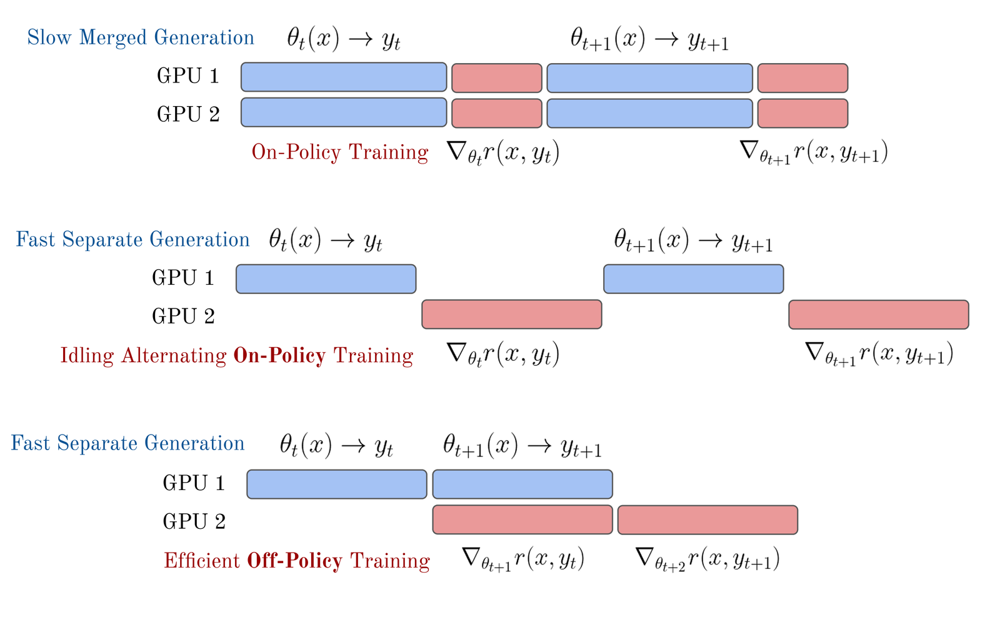
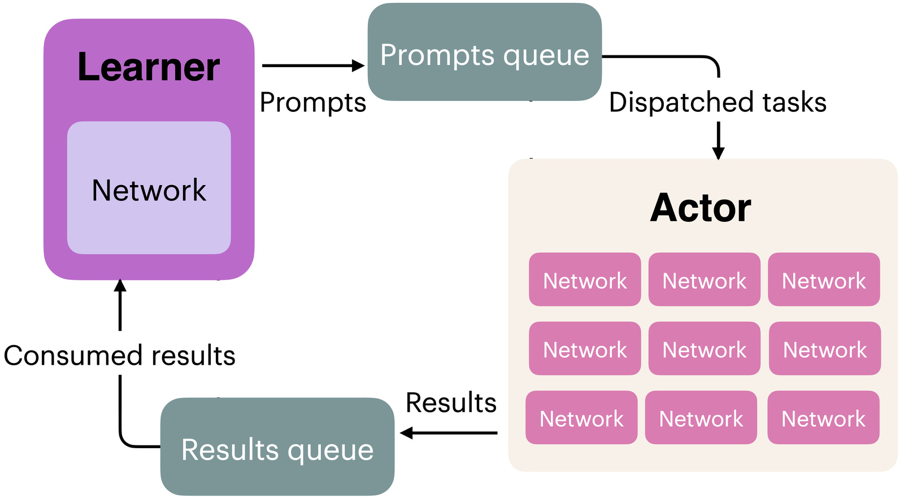

## 6.3 實作（Implementation）

相較於這些演算法最初被發展出來的深度強化學習（Deep RL）文獻，將 RL 用於最佳化語言模型或其他大型 AI 模型時，需要處理許多細小的實作細節。在本節中，我們會重點說明幾個讓各種流行演算法的實作有所差異的關鍵因素。

這類訓練還牽涉許多其他小細節。舉例來說，對語言模型進行 RLHF 時，一個關鍵步驟是生成之後要交給獎勵模型評分的文字。正常情況下，模型應該生成一個序列結束（end-of-sequence, EOS）token 來表示它已完成生成，但常見的做法是對生成長度設定硬性上限，以便有效利用基礎設施。RLHF 的一種失敗模式是模型的回答經常被截斷，導致獎勵模型的評分落到分布之外（out-of-distribution），產生無法預測的分數。解決之道是*只*在出現 `eos_token` 時才執行獎勵模型評分，否則就對生成過長的模型施加懲罰。

流行的 RLHF 開源工具在各演算法的實作細節上差異很大（見 [125] 中的表 10）。此處未涵蓋的一些設計決策包括：

- **價值網路初始化（Value network initialization）**：PPO 與其他類似演算法內部使用的學習型價值網路，可以從相同架構的另一個模型出發，也可以用隨機權重初始化。這對效能可能有很大影響。InstructGPT [3] 建立的標準做法（Tülu 3 在其 RLVR 工作中再度沿用 [6]）是用 RLHF 期間使用的獎勵模型來初始化價值網路。也有人使用 RLHF 訓練之前的檢查點（通常是 SFT 模型）並附加一個隨機初始化的價值頭（value head），或使用完全重新初始化的語言模型（較不常見，因為 RLHF 會需要更久才能收斂，但可行）。
- **獎勵正規化、獎勵白化與（或）優勢白化（Reward normalization, reward whitening, and/or advantage whitening）**：正規化將 RM（或環境）給出的所有數值限制在 0 到 1 之間，有助於學習穩定性。白化（whitening）更進一步，把獎勵或優勢估計轉換為零均值、單位變異數，能提供更強的穩定性提升。
- **不同的 KL 估計器（Different KL estimators）**：面對複雜的語言模型，要精確計算模型之間的 KL 散度可能相當複雜，因此常以多種近似方法取代精確計算 [126]。
- **KL 控制器（KL controllers）**：PPO 及相關演算法的原始實作具有動態控制器，會鎖定特定的 KL 目標值，並根據近期的量測結果調整懲罰強度。大多數現代 RLHF 實作使用靜態 KL 懲罰，但這一點同樣可能有所不同。

關於 RLHF 實作細節的更多資訊，請參閱 [127]。關於這些演算法的進一步資訊，請參閱 [128]。

### 6.3.1 策略梯度基礎（Policy-Gradient Basics）

以下是一個簡單的策略梯度實作，使用優勢（advantage）來估計梯度，為 PPO 與 GRPO 等進階演算法做準備：

```python
pg_loss = -advantages * ratio
```

這裡的 ratio 是新策略模型相對於參考模型的（逐 token）機率比值（通常由對數機率差計算而得）。

為了理解這個式子，最好先了解一批更新中可能出現的各種情況。請記住，我們希望隨著模型在任務上表現越好，損失會*下降*。

情況 1：優勢為正，表示該動作優於該狀態的期望值。我們想要強化這個行為。在這種情況下，由於式中的負號，模型會讓這個行為更有可能發生。為此，它會提高 logratio。正的 logratio，亦即 token 的對數機率總和變大，代表模型更有可能生成這些 token。

情況 2：優勢為負，表示該動作劣於該狀態的期望值。道理非常類似。此時，如果新模型讓該序列變得更有可能，損失就會是正的，因此模型會設法調整策略參數，讓這個補全（completion）變得更不可能。

情況 3：優勢為零，因此不需要任何更新。損失為零，不要改變策略模型。

### 6.3.2 損失聚合的取捨（Loss Aggregation Tradeoffs）

以語言模型實作任何策略梯度演算法時都會面臨一個問題：如何把逐 token 的損失聚合成最終的純量損失？給定樣本 $i$ 在 token $t$ 的逐 token 損失 $\ell_{i,t}$、補全長度 $|a_i|$ 與批次大小 $B$，主要有三種策略：

**策略 1：逐序列正規化（Per-sequence normalization）**（標準 GRPO；部分 PPO 實作也採用）

$$
L = \frac{1}{B}\sum_{i=1}^{B} \frac{1}{|a_i|}\sum_{t=1}^{|a_i|} \ell_{i,t} \tag{68}
$$

每個序列對批次損失的貢獻相同，與長度無關。程式碼如下：

```python
# 策略 1：逐序列正規化
sequence_loss = ((per_token_loss * completion_mask).sum(dim=1) / \
            completion_mask.sum(dim=1)).mean()
```

**策略 2：逐 token 正規化（Per-token normalization）**（DAPO [129]）

$$
L = \frac{\sum_{i=1}^{B}\sum_{t=1}^{|a_i|} \ell_{i,t}}{\sum_{i=1}^{B} |a_i|} \tag{69}
$$

每個 token 的貢獻相同；序列越長，對梯度的影響按比例越大。程式碼如下：

```python
# 策略 2：逐 token 正規化
token_loss = ((per_token_loss * completion_mask).sum() / \
            completion_mask.sum())
```

**策略 3：固定長度正規化（Fixed-length normalization）**（Dr. GRPO [118]）

$$
L = \frac{1}{B}\sum_{i=1}^{B} \frac{1}{L_{\max}}\sum_{t=1}^{|a_i|} \ell_{i,t} \tag{70}
$$

以最大序列長度 $L_{\max}$ 正規化，使各序列之間的逐 token 尺度一致，同時仍讓較長的序列因為包含較多有效 token 而貢獻較多的總梯度。程式碼如下：

```python
# 策略 3：固定長度正規化
fixed_len_loss = ((per_token_loss * completion_mask).sum(dim=1) / \
            L_max).mean()
```

其中 $L_{\max}$ 通常是整個訓練流程期間的全域常數，用來指定生成 token 的最大數量。

請注意，上述程式碼中的 `completion_mask` 是一個由 1 和 0 組成的矩陣，其中提示（prompt）token 會被遮罩掉（設為 0），因為我們不希望模型從預測提示 token 中學習。

#### 6.3.2.1 為什麼這很重要？（Why Does This Matter?）

直覺上，逐序列正規化（策略 1）似乎最好，因為我們在意的是*結果（outcomes）*，而不是個別 token。然而，這會引入基於序列長度的微妙偏誤，依偏誤方向不同，可能導致模型過度思考（overthink），或低估天生就需要使用較多 token 的策略。考慮兩條長度不同、帶有逐 token 損失的序列：

```python
seq_1_losses = [1, 1, 1, 1, 10]  # 5 個 token，平均 = 2.8
seq_2_losses = [1, 1, 1, 1, 1, 1, 1, 1, 1, 10]  # 10 個 token，平均 = 1.9
```

採用**策略 1**（逐序列）：批次損失為 $(2.8 + 1.9)/2 = 2.35$，而且關鍵在於，短序列中的每個 token 收到的梯度都比長序列中的 token 更大。

採用**策略 2**（逐 token）：批次損失為 $(14 + 19)/15 = 2.2$，所有 token 收到的梯度大小相同。

採用**策略 3**（固定長度，$L_{\max} = 10$）：短序列貢獻 1.4，長序列貢獻 1.9，在平衡逐 token 梯度的同時，仍以序列為單位加權。

想更完整地觀察這些策略如何影響梯度，請參考下面的腳本。

```python
from typing import Optional
import torch

def masked_mean(values: torch.Tensor, mask: torch.Tensor, axis: Optional[int] = None) -> torch.Tensor:
    """計算帶遮罩張量的平均值。"""
    if axis is not None:
        return (values * mask).sum(axis=axis) / mask.sum(axis=axis)
    else:
        return (values * mask).sum() / mask.sum()

def masked_sum(
        values: torch.Tensor,
        mask: torch.Tensor,
        axis: Optional[int] = None,
        constant_normalizer: float = 1.0,
    ) -> torch.Tensor:
    """計算帶遮罩張量的總和。以常數進行正規化。"""
    if axis is not None:
        return (values * mask).sum(axis=axis) / constant_normalizer
    else:
        return (values * mask).sum() / constant_normalizer

ratio = torch.tensor([
    [1., 1, 1, 1, 1, 1, 1,],
    [1, 1, 1, 1, 1, 1, 1,],
], requires_grad=True)


advs = torch.tensor([
    [2, 2, 2, 2, 2, 2, 2,],
    [2, 2, 2, 2, 2, 2, 2,],
])

masks = torch.tensor([
    # 生成 1：4 個 token
    [1, 1, 1, 1, 0, 0, 0,],
    # 生成 2：7 個 token
    [1, 1, 1, 1, 1, 1, 1,],
])

max_gen_len = 7

masked_mean_result = masked_mean(ratio * advs, masks, axis=1)
masked_mean_token_level = masked_mean(ratio, masks, axis=None)
masked_sum_result = masked_sum(ratio * advs, masks, axis=1,
constant_normalizer=max_gen_len)

print("masked_mean", masked_mean_result)
print("masked_sum", masked_sum_result)
print("masked_mean_token_level", masked_mean_token_level)

# masked_mean tensor([2., 2.], grad_fn=<DivBackward0>)
# masked_sum tensor([1.1429, 2.0000], grad_fn=<DivBackward0>)
# masked_mean_token_level tensor(1., grad_fn=<DivBackward0>)

masked_mean_result.mean().backward()
print("ratio.grad", ratio.grad)
ratio.grad.zero_()
# ratio.grad tensor([[0.2500, 0.2500, 0.2500, 0.2500, 0.0000, 0.0000, 0.0000],
# [0.1429, 0.1429, 0.1429, 0.1429, 0.1429, 0.1429, 0.1429]])

masked_sum_result.mean().backward()
print("ratio.grad", ratio.grad)
ratio.grad.zero_()
# ratio.grad tensor([[0.1429, 0.1429, 0.1429, 0.1429, 0.0000, 0.0000, 0.0000],
# [0.1429, 0.1429, 0.1429, 0.1429, 0.1429, 0.1429, 0.1429]])

masked_mean_token_level.mean().backward()
print("ratio.grad", ratio.grad)
# ratio.grad tensor([[0.0909, 0.0909, 0.0909, 0.0909, 0.0000, 0.0000, 0.0000],
# [0.0909, 0.0909, 0.0909, 0.0909, 0.0909, 0.0909, 0.0909]])
```

輸出顯示，採用策略 1（`masked_mean`）時，短序列的逐 token 梯度（0.25）比長序列（0.14）更大。策略 2 與 3 則讓各序列之間的逐 token 梯度相等。請注意，若使用梯度累積（gradient accumulation）——即在執行反向傳播步驟之前，先將多個小批次（minibatch）的梯度加總——這些結果可能會大不相同；在這種情況下，較短與較長序列之間的平衡可能會反轉。

實務上，最佳策略取決於特定的訓練設定。在 RLHF 中，通常偏好數值穩定性最好、或損失變異最小的方法。

#### 6.3.2.2 相關議題：MDP 與拉霸機框架（Related: MDP vs. Bandit Framing）

損失聚合的選擇，連結到我們如何框架化 RL 問題這個更深層的區別。**MDP（token 層級）**觀點把每個 token $a_t$ 視為一個動作，狀態 $s_t$ 則是當前的前綴。實務上，當我們以學習到的價值函數 $V(s_t)$ 計算 token 層級的優勢（例如 GAE [112]）並逐 token 施加 KL 懲罰時，用的就是這種框架。搭配學習型價值網路的 PPO 是典型範例 [116]。

相對地，**拉霸機（bandit，序列層級）**觀點把整個補全視為單一動作，對應一個純量獎勵 $R$。在程式碼中，這代表計算一個序列層級的優勢 $A_{\text{seq}}$，並將它廣播到所有 token。RLOO 與 GRPO 式的優勢常用於這種拉霸機式設定 [115] [111] [121]。DPO 與 A-LoL 等直接對齊方法也定義序列層級的目標，儘管它們並非策略梯度估計器 [130]。

請注意，許多 GRPO 實作使用拉霸機式優勢，*同時*在損失中額外加入逐 token 的 KL 項；而許多 PPO/RLOO 實作則在計算優勢之前，就把 KL 折入獎勵之中；兩種慣例在實務上都存在。

以下範例對比了這兩種做法：

```python
# === 拉霸機式（序列層級） ===
# 每個序列一個純量獎勵；優勢廣播到所有 token
reward = torch.tensor([3.0, 1.0])        # (B,) 例如獎勵模型分數
baseline = reward.mean()                 # 簡單基準線（RLOO 使用留一法）
advantage_seq = reward - baseline        # (B,)
advantages = advantage_seq[:, None].expand(-1, seq_len)  # (B, L)
# tensor([[ 1.,  1.,  1.,  1.],    <- 所有 token 的優勢相同
#         [-1., -1., -1., -1.]])

# === MDP 式（token 層級） ===
# 逐 token 獎勵 + 學習到的 V(s_t)；每個 token 有自己的優勢
# （也可以使用逐 token 的 KL 塑形、格式獎勵或其他 token 層級訊號）
advantages = gae(per_token_rewards, values, done_mask, gamma=1.0, lam=0.95)
# tensor([[ 0.2,  0.5,  0.8,  1.5],   <- 隨位置而異
#         [-0.3, -0.5, -0.8, -1.4]])
```

這種框架上的區別，也解釋了為什麼幾乎所有 RLHF 實作都把折扣因子 $\gamma$ 設為 1.0。在標準 RL 中，折扣（$\gamma < 1$）是不可或缺的：它在多步回合（episode）中平衡短期與長期獎勵的最佳化，這對智慧體（agent）長期學到有效行為至關重要。但在 RLHF 設定中，即使採用 token 層級的 MDP 觀點，最佳化的歸納偏置（inductive bias）仍是整體補全的品質——獎勵訊號評分的是整個回應，而非個別 token。對較早的 token 施加折扣，會在毫無原則性依據的情況下任意降低它們的貢獻。隨著代理式（agentic）RL 情境逐漸成熟——模型會採取工具呼叫、程式碼執行與網頁瀏覽等真正的多步驟動作——折扣可能重新變得重要，因為這些情境涉及真正相異、且長期後果各不相同的循序決策。

### 6.3.3 非同步 RL 系統（Asynchronous RL Systems）

策略梯度演算法的預設實作是所謂的**同策略（on-policy）**執行：智慧體（語言模型）採取的動作（生成內容）會先被評分，然後才更新模型。策略梯度的理論推導依賴所有動作都嚴格同策略，也就是模型永遠掌握最新試驗／rollout 的結果。實務上，維持嚴格的同策略執行會大幅拖慢訓練 [131]——而且無論如何，完美的同步在技術上本來就不可能。因此，最近所有語言模型上的實證結果，其實都稍微超出理論證明的範圍。實務上發生的事，是針對「實際行得通的做法」來設計演算法與系統。


*圖 23：依循 Noukhovitch 等人（2024）的做法，比較同步與非同步 RL 訓練中「生成—更新」階段的示意圖。*

常見的解法是讓推論與訓練持續在不同的 GPU 節點上執行，並使用專為高效同時運行兩者而設計的軟體，如圖 23 底部所示。語言模型流行的開源 RL 工具的常見做法，是使用 Ray 之類的分散式行程管理函式庫，在策略梯度學習迴圈與推論迴圈之間傳遞資訊，而推論迴圈使用高效率的推論引擎，例如 vLLM。在這類架構中，負責執行 RL 步驟的 GPU 稱為「learner（學習器）」，負責從語言模型抽樣的 GPU 稱為「actor（行動者）」。讓訓練更加非同步時，面臨的主要挑戰是保持訓練穩定並維持學習訊號。

這些系統的設計與實作，都建立在「接近同策略的資料就足以穩定學習」這個前提之上。此時，生成與更新兩個階段可以輕鬆同步，避免訓練系統的任一部分出現閒置運算，做法就是把模型權重從 learner 傳遞給圖 24 中的 actor。對推理模型而言，問題本身的推論時間極長——每個答案需要 10K 到 100K+ 個 token——使得 rollout 的生成成為遠更嚴重的瓶頸。在較同步的 RL 基礎設施上訓練推理模型時，一個常見的問題是批次中某一個提示的答案可能需要多得多的時間才能生成（無論是因為更多 token 還是更多次工具呼叫），導致大部分被分配的運算資源在它完成之前都處於閒置狀態。針對這種長度不匹配問題的第二種解法稱為序列層級打包（sequence-level packing）：透過巧妙的遮罩把較短的樣本堆疊進同一批次，讓模型能持續進行 rollout，並在批次內的樣本之間更好地分配長度正規化。分散式 RL 基礎設施的完整複雜度超出本書範圍，因為它可能引發許多其他微妙的問題，拖慢訓練或造成不穩定。


*圖 24：一個分散式 RL 系統範例：透過管理兩個佇列，將資料傳遞給 learner 與 actor 的 GPU，兩者可以用 Ray 等分散式計算函式庫進行同步。Olmo Team 2025，授權 CC-BY。*

隨著這些推理模型的興起，人們進一步關注讓訓練與推論迴圈完全異策略（off-policy）化：策略梯度更新的訓練批次，由多個實例生成答案時最近完成的 rollout 填滿 [132] [133]。完全非同步的訓練還能讓 RL 訓練更容易橫跨多個資料中心擴展，因為可以選擇拉長 learner 節點（執行策略梯度步驟）與 actor（負責解題）之間權重同步的時間間隔 [134]。

相關方法也在探索完全異策略的策略梯度演算法 [124]。

### 6.3.4 截斷重要性抽樣（Truncated Importance Sampling）

截斷重要性抽樣（Truncated Importance Sampling, TIS）是現代語言模型非同步 RL 框架中，用來穩定訓練的一項關鍵工具。重要性抽樣（importance sampling）是一種校正手段，用來重新加權從某個分布抽出的樣本，以估計另一個分布下的期望值（如第 (62) 式所介紹）。截斷重要性抽樣 [135] 以 $\min(\rho, C)$（$C$ 為某個常數）為這些權重設定上限，用少量偏差換取策略梯度中有界的變異數。

這是施加在策略梯度上的重要性抽樣校正，但與 PPO 和 CISPO 的雙邊裁剪（將比值約束在 1 附近）不同，TIS 使用單邊上限：比值可以自由降到 1 以下，但會被截在 $C$，以防止極端的向上加權。在 PPO、GRPO、CISPO（及相關演算法）中，比值 $\rho_t^{\text{policy}} = \pi_\theta(a_t \mid s)/\pi_{\theta_{\text{old}}}(a_t \mid s)$ 校正的是同一個 RL 批次內、多個梯度步之間的策略漂移（policy drift）。當我們轉向以前一小節的非同步性為核心概念的現實世界 RL 框架時，還可能出現更大的數值差異來源（同樣需要重要性抽樣的數值校正）。即使抽樣器（sampler）與 learner 共用完全相同的參數 $\theta$，它們的有效 token 分布仍可能不同，因為推論引擎（例如 vLLM）與訓練框架（例如 FSDP）使用不同的核心（kernel）、精度與平行化策略 [136]。因此，把同一個策略在兩個系統上的評估結果加以區分是有用的，記為 $\pi_\theta^{\text{sampler}}$ 與 $\pi_\theta^{\text{learner}}$，並定義對應的比值及其截斷形式：

$$
\rho_t^{\text{learner}} = \frac{\pi_\theta^{\text{learner}}(a_t \mid s, a_{<t})}{\pi_\theta^{\text{sampler}}(a_t \mid s, a_{<t})}, \qquad \bar{\rho}_t^{\text{learner}} = \min(\rho_t^{\text{learner}},\, C). \tag{71}
$$

這兩種校正是互補的，但它們出現在策略梯度實作中的原因不同——一個補償 RL 批次訓練過程中的策略漂移，另一個補償實作引起的分布差異——而且可以同時使用。兩者如何結合，取決於演算法：

#### 6.3.4.1 REINFORCE 搭配 TIS（單一梯度步）（REINFORCE with TIS (Single Gradient Step)）

這裡不存在策略漂移（$\pi_\theta = \pi_{\theta_{\text{old}}}$），所以唯一的不匹配出現在 learner 與 sampler 之間。此時 $\pi_{\theta_{\text{old}}} = \pi_{\text{gen}}$，TIS 直接校正 learner–sampler 之間的差距：

$$
\nabla_\theta J \approx \mathbb{E}_{a \sim \pi_\theta^{\text{sampler}}} \left[ \bar{\rho}_t^{\text{learner}} \cdot A_t \cdot \nabla_\theta \log \pi_\theta^{\text{learner}}(a_t \mid s, a_{<t}) \right]. \tag{72}
$$

#### 6.3.4.2 PPO/GRPO 搭配 TIS（多個梯度步）（PPO/GRPO with TIS (Multiple Gradient Steps)）

現在兩種比值同時起作用。在嚴謹的實作中，策略比值裡的「舊 logprobs」會在 learner 上重新計算（GSPO 論文對此有討論），因此策略比值 $\rho_t^{\text{policy}} = \pi_\theta^{\text{learner}}/\pi_{\theta_{\text{old}}}^{\text{learner}}$ 捕捉純粹的策略漂移，而 $\bar{\rho}_t^{\text{learner}} = \min(\pi_{\theta_{\text{old}}}^{\text{learner}}/\pi_{\theta_{\text{old}}}^{\text{sampler}},\ C)$ 則另外校正生成檢查點上的後端不匹配：

$$
J_{\text{PPO+TIS}}(\theta) = \mathbb{E}\left[ \min\!\left( \rho_t^{\text{policy}} A_t,\ \operatorname{clip}\!\left(\rho_t^{\text{policy}},\, 1-\varepsilon,\, 1+\varepsilon\right) A_t \right) \cdot \bar{\rho}_t^{\text{learner}} \right]. \tag{73}
$$

這裡 $\pi_{\theta_{\text{old}}} \neq \pi_{\text{gen}}$：舊的 logprobs 來自 learner，而不是 sampler。如果某個框架跳過這個重新計算的步驟，直接把 sampler 的 logprobs 當作 $\pi_{\theta_{\text{old}}}$，那麼策略比值本身就已經涵蓋了後端不匹配，不需要額外的 TIS 校正——但此時裁剪操作作用在一個更嘈雜的比值上，這個比值甚至在任何梯度步之前就偏離了 1.0。這就是 Yao 等人 [136] 提出的「你的框架偷偷讓你做了異策略 RL」（your framework secretly brings you off-policy RL）觀察。

實務上，LLM 的 RL 系統會把 TIS 作為策略梯度損失上的逐 token 校正權重來使用：

```python
# 形狀：(B*G, L)
C = 2.0  # TIS 上限

logratio = learner_logprobs - sampler_logprobs
logratio = logratio.clamp(-10.0, 10.0)               # 數值安全性
tis_weight = torch.exp(logratio).clamp(max=C)         # 單邊截斷

# 作為逐 token 策略梯度損失上的固定校正權重
per_token_pg_loss = per_token_pg_loss * tis_weight.detach()
```

這裡的 $[-10, 10]$ clamp 只是取指數前的數值穩定性措施；真正的截斷重要性抽樣步驟是以 $C$ 為上限的單邊截斷。實務上，圍繞這些 logprobs 的簿記工作——儲存生成時的 sampler logprobs、在舊檢查點上重新計算 learner logprobs、以及在梯度步中追蹤當前 logprobs——是分散式 RL 框架中相當可觀的一部分鷹架工程。與 GSPO 不同，這種校正是 token 層級的，因為它處理的是 token 層級的數值不匹配，而非序列層級的獎勵粒度。針對 learner–sampler 比值的 TIS 已被各大開源 RL 框架採用（VeRL、TRL、OpenRLHF、SkyRL、OAT，以及使用 $C = 2$ 的 Open Instruct），而且對於長推理軌跡（第 7 章）越來越重要，因為微小的逐 token 差異會在數千個生成 token 之間不斷累積。

### 6.3.5 範例：PPO（Example: PPO）

PPO 有非常多現成的實作。核心的*損失（loss）*計算如下所示。對穩定效能同樣關鍵的還有*價值（value）*的計算，這部分存在多種選項（包括*價值模型*損失的多種選項）。

請注意，這裡的參考策略（或舊的 logprobs）來自生成內容被抽樣當下的時間點，不一定是參考策略。參考策略只用於 KL 距離約束／懲罰。

```python
# B：批次大小，L：序列長度，G：生成數量
# 將 KL 懲罰施加到獎勵上
rewards = rewards - self.beta * per_token_kl  # 形狀：(B*G, L)

# 取得價值預測
values = value_net(completions)  # 形狀：(B*G, L)

# 以反向迴圈計算回報（LM RLHF 的 gamma 通常為 1.0）
# 對獎勵做遮罩，避免填充 token（可能帶有 KL 懲罰）洩漏進回報
returns = torch.zeros_like(rewards)
running = torch.zeros(rewards.shape[0], device=rewards.device, dtype=rewards.dtype)
for t in reversed(range(rewards.shape[1])):
    # 將填充歸零：只對有效的補全 token 累積獎勵／回報
    running = (rewards[:, t] + self.gamma * running) * completion_mask[:, t]
    returns[:, t] = running

# 計算優勢：A_t = G_t - V(s_t)
advantages = returns - values.detach()  # 形狀：(B*G, L)
# 注意：這裡對價值網路做 detach，以免在計算策略梯度損失時
# 更新價值函數的參數

# 正規化優勢（非必要但較穩定）
advantages = (advantages - advantages.mean()) / (advantages.std() + 1e-8)
```

```python
# 計算新舊策略之間的機率比值
ratio = torch.exp(new_per_token_logps - per_token_logps)  # 形狀：(B*G, L)

# PPO 裁剪目標
eps = self.cliprange  # 例如 0.2
pg_losses1 = -advantages * ratio  # 形狀：(B*G, L)
pg_losses2 = -advantages * torch.clamp(ratio, 1.0 - eps, 1.0 + eps)  # 形狀：(B*G, L)
pg_loss_max = torch.max(pg_losses1, pg_losses2)  # 形狀：(B*G, L)

# 價值函數損失：預測回報
vf_loss = 0.5 * ((returns - values) ** 2)  # 形狀：(B*G, L)

# 結合策略與價值損失
per_token_loss = pg_loss_max + self.vf_coef * vf_loss  # 形狀：(B*G, L)

# 套用補全遮罩並計算最終損失
loss = ((per_token_loss * completion_mask).sum(dim=1) /
completion_mask.sum(dim=1)).mean()
 # 純量

# 計算用於記錄的指標
with torch.no_grad():
    # 計算裁剪比例
    clip_frac = ((pg_losses2 > pg_losses1).float() * completion_mask).sum() / \
completion_mask.sum()

    # 計算近似 KL
    approx_kl = (0.5 * ((new_per_token_logps - per_token_logps)**2) * \
completion_mask).sum() / completion_mask.sum()

    # 計算用於記錄的價值損失
    value_loss = vf_loss.mean()
```

理解 PPO 的核心，在於策略梯度損失如何更新。請聚焦在這三行：

```python
pg_losses1 = -advantages * ratio  # 形狀：(B*G, L)
pg_losses2 = -advantages * torch.clamp(ratio, 1.0 - eps, 1.0 + eps)  # 形狀：(B*G, L)
pg_loss_max = torch.max(pg_losses1, pg_losses2)  # 形狀：(B*G, L)
```

`pg_losses1` 是普通的、以優勢加權的策略梯度損失。`pg_losses2` 套用相同的公式，但把機率比值鉗制在 $[1-\varepsilon, 1+\varepsilon]$ 範圍內，限制策略在單次更新中能改變的幅度。

關鍵洞見在於對兩個損失取 `torch.max`。因為我們最小化的是一個*負的*損失（回想優勢前面的負號），取最大值會選出更悲觀的梯度——即產生較小策略更新的那一個。當優勢為正（好的動作）時，裁剪防止策略過於激進地提高該動作的機率；當優勢為負（壞的動作）時，裁剪防止朝反方向的過度修正。

透過鉗制對數機率比值，PPO 限制了策略偏離「生成訓練資料的那個版本」的距離，在不需要顯式信賴域（trust region）計算的情況下穩定學習。

上面的程式碼也顯示 PPO 在策略之外同時學習一個價值函數，這增加了實作複雜度，但裁剪後的目標才是核心機制。

#### 6.3.5.1 每個樣本一個梯度步時的 PPO/GRPO 簡化（無裁剪）（PPO/GRPO Simplification with One Gradient Step per Sample (No Clipping)）

若超參數「每個樣本的梯度步數」等於 1，PPO（與 GRPO）的實作可以優雅得多。這個值的典型設定通常是 2–4 或更高。在 PPO 或 GRPO 的主要公式中（見第 (51) 式），「參考」策略是先前的參數——也就是生成補全或動作時所用的那組參數。因此，若只取一個梯度步，則 $\pi_\theta = \pi_{\theta_{\text{old}}}$，更新規則簡化如下（記號 $[\,]_\nabla$ 表示停止梯度，stop gradient）：

$$
J(\theta) = \frac{1}{G}\sum_{i=1}^{G} \left( \frac{\pi_\theta(a_i|s)}{\left[\pi_\theta(a_i|s)\right]_\nabla} A_i - \beta \mathcal{D}_{\mathrm{KL}}(\pi_\theta || \pi_{\text{ref}}) \right). \tag{74}
$$

這使得 PPO 或 GRPO 的實作可以省略第二個策略梯度與裁剪邏輯，讓最佳化器遠遠更接近標準的策略梯度。

### 6.3.6 範例：GRPO（Example: GRPO）

DeepSeekMath 論文描述了 GRPO 一些與 PPO 不同的實作細節 [121]，尤其是與深度強化學習（而非語言模型）中 PPO 的標準用法相比。例如，RLHF 最佳化中的 KL 懲罰（回想一下，在沒有獎勵模型、以可驗證獎勵訓練推理模型時，也會使用 KL 懲罰）是直接施加在損失更新中，而不是施加在獎勵函數上。標準 RLHF 的 KL 懲罰施加方式為 $r = r_\theta - \beta \mathcal{D}_{\mathrm{KL}}$，而 GRPO 的實作大致是：

$$
L = L_{\text{policy gradient}} + \beta * \mathcal{D}_{\mathrm{KL}} \tag{75}
$$

不過，實作方式有很多種。傳統上，KL 距離是針對提示 $s$ 的補全中的每一個 token 計算的。在推理訓練中，會從一個提示抽樣多個補全，而一個批次中有多個提示，所以 KL 距離的形狀會是 [B, L, N]，其中 B 是批次大小，L 是序列長度，N 是每個提示的補全數量。

綜合起來，使用第一種損失聚合方式，虛擬碼可以寫成如下。

```python
# B：批次大小，L：序列長度，G：生成數量
# 計算逐群組獎勵 # 形狀：(B,)
mean_grouped_rewards = rewards.view(-1, self.num_generations).mean(dim=1)
std_grouped_rewards = rewards.view(-1, self.num_generations).std(dim=1)


# 對獎勵做正規化以計算優勢
mean_grouped_rewards = mean_grouped_rewards.repeat_interleave(self.num_generations, dim=0)
std_grouped_rewards = std_grouped_rewards.repeat_interleave(self.num_generations, dim=0)
# 形狀：(B*G,)

# 計算優勢
advantages = (rewards - mean_grouped_rewards) / (std_grouped_rewards + 1e-4)
advantages = advantages.unsqueeze(1)
# 形狀：(B*G, 1)

# 計算新舊策略之間的機率比值
ratio = torch.exp(new_per_token_logps - per_token_logps)  # 形狀：(B*G, L)

# PPO 裁剪目標
eps = self.cliprange  # 例如 0.2
pg_losses1 = -advantages * ratio  # 形狀：(B*G, L)
pg_losses2 = -advantages * torch.clamp(ratio, 1.0 - eps, 1.0 + eps)  # 形狀：(B*G, L)
pg_loss_max = torch.max(pg_losses1, pg_losses2)  # 形狀：(B*G, L)

# GRPO 的重點——PPO 傳統上將此施加在獎勵中
# 與 KL 懲罰結合
per_token_loss = pg_loss_max + self.beta * per_token_kl  # 形狀：(B*G, L)

# 套用補全遮罩並計算最終損失
loss = ((per_token_loss * completion_mask).sum(dim=1) /
completion_mask.sum(dim=1)).mean()
 # 純量

# 計算用於記錄的核心指標（KL、獎勵等也會記錄）
with torch.no_grad():
    # 計算裁剪比例
    clip_frac = ((pg_losses2 > pg_losses1).float() * completion_mask).sum() / \
completion_mask.sum()

    # 計算近似 KL
    approx_kl = (0.5 * ((new_per_token_logps - per_token_logps)**2) * \
completion_mask).sum() / completion_mask.sum()
```

關於如何解讀這段程式碼的更多細節，請參閱上面的 PPO 一節。與 PPO 範例的核心差異如下：

- **優勢計算（Advantage computation）**：GRPO 以群組為基準正規化獎勵（對同一提示的多個生成取平均值與標準差），而不是使用學習到的價值函數作為基準線。
- **沒有價值網路（No value network）**：GRPO 完全移除價值模型，省去 `vf_loss` 及其相關複雜度。
- **KL 懲罰的位置（KL penalty placement）**：GRPO 把 KL 懲罰直接加進損失，而不是從獎勵中扣除（這是標準實作，但 KL 的施加方式還存在更多版本）。

#### 6.3.6.1 RLOO 與 GRPO（RLOO vs. GRPO）

RLOO 的優勢更新和 GRPO 非常接近，凸顯出這兩個演算法在概念上的相似性——只要把 PPO 式的裁剪與 KL 懲罰細節分開來看。具體來說，RLOO 的優勢是相對於一個與 GRPO 極為相似的基準線計算的——即該補全的獎勵相對於同一問題其他補全的獎勵。簡明地說，RLOO 的優勢估計如下（擴充自 TRL 的實作）：

```python
# rloo_k --> 每個提示的補全數量
# rlhf_reward --> 起初是所有補全總獎勵的平坦張量。長度 B = N x k
rlhf_reward = rlhf_reward.reshape(rloo_k, -1) #
# 現在形狀為：(k, N)，每一欄 j 包含提示 j 的 k 個獎勵。

baseline = (rlhf_reward.sum(0) - rlhf_reward) / (rloo_k - 1)
# baseline --> 留一法（leave-one-out）基準線獎勵。形狀：(k, N)
#  baseline[i, j] 是提示 j 上所有 i' != i 樣本的平均獎勵。

advantages = rlhf_reward - baseline
# advantages --> 相同形狀：(k, N)

advantages = advantages.flatten() # 與原始張量形狀相同
```

RLOO 其餘的實作細節，同樣遵循實作策略梯度時的其他取捨。

## 6.4 輔助主題（Auxiliary Topics）

要精通策略梯度演算法的應用，還有無數其他考量。此處我們討論成功部署策略梯度 RL 演算法時，一些位於長尾的複雜細節。

### 6.4.1 廣義優勢估計（Generalized Advantage Estimation, GAE）

廣義優勢估計（Generalized Advantage Estimation, GAE）是策略梯度演算法計算優勢的另一種方法 [112]，能更好地平衡偏差與變異數之間的權衡。傳統的單步優勢估計可能引入過多偏差，而使用完整軌跡則常有高變異數的問題。GAE 計算多步優勢估計的指數加權平均，其中超參數 $\lambda$ 控制偏差–變異數的權衡——範圍從單步 TD（$\lambda = 0$）到完整軌跡回報（$\lambda = 1$）；$\lambda = 0.95$ 是 LLM 微調的常見預設值。

優勢估計可以有多種形式，我們可以定義一個 $n$ 步優勢估計器（類似本章開頭的 TD 殘差）如下：

$$
\hat{A}_t^{(n)} = \begin{cases} r_t + \gamma V(s_{t+1}) - V(s_t), & n = 1 \\ r_t + \gamma r_{t+1} + \gamma^2 V(s_{t+2}) - V(s_t), & n = 2 \\ \vdots & \\ r_t + \gamma r_{t+1} + \gamma^2 r_{t+2} + \cdots - V(s_t), & n = \infty \end{cases} \tag{76}
$$

這裡 $n$ 越短，變異數越低但偏差越高，因為我們把更多的學習能力歸於每一條軌跡——它可能會過擬合。GAE 試圖把這個公式推廣為一個加權的多步平均，而不是選定某個特定的 $n$。首先，我們必須定義預測價值的時序差分（temporal difference, TD）殘差：

$$
\delta_t^V = r_t + \gamma V(s_{t+1}) - V(s_t) \tag{77}
$$

為了利用它，我們引入另一個變數 $\lambda$ 作為 GAE 的混合參數。它會折成我們想要估計的未來優勢的指數衰減：

$$
\begin{aligned}
\hat{A}_t^{GAE(\gamma,\lambda)} &= (1-\lambda)(\hat{A}_t^{(1)} + \lambda \hat{A}_t^{(2)} + \lambda^2 \hat{A}_t^{(3)} + \cdots) \\
&= (1-\lambda)(\delta_t^V + \lambda(\delta_t^V + \gamma\delta_{t+1}^V) + \lambda^2(\delta_t^V + \gamma\delta_{t+1}^V + \gamma^2\delta_{t+2}^V) + \cdots) \\
&= (1-\lambda)(\delta_t^V(1 + \lambda + \lambda^2 + \cdots) + \gamma\delta_{t+1}^V(\lambda + \lambda^2 + \cdots) + \cdots) \\
&= (1-\lambda)\left(\delta_t^V \frac{1}{1-\lambda} + \gamma\delta_{t+1}^V \frac{\lambda}{1-\lambda} + \cdots\right) \\
&= \sum_{l=0}^{\infty}(\gamma\lambda)^l \delta_{t+l}^V
\end{aligned} \tag{78}
$$

直覺上，這可以用來以優雅的方式平均多步的優勢估計。範例實作如下：

```python
# LM RLHF 的 GAE（token 層級）
#
# B：批次大小
# L：長度
# 輸入：
#   rewards：  (B, L) 施加 KL 之後的逐 token 獎勵
#   values：   (B, L) 當前的 V_theta(s_t)
#   done_mask：(B, L) 終止 token（EOS 或被懲罰的截斷）處為 1.0，其餘為 0.0
#   gamma：float（通常為 1.0），
#   lam（lambda 的縮寫）：float，位於 [0,1]
#   （終止之後的填充應設 rewards=0、values=0）
B, L = rewards.shape
advantages = torch.zeros_like(rewards)
next_v = torch.zeros(B, device=rewards.device, dtype=rewards.dtype)
gae = torch.zeros(B, device=rewards.device, dtype=rewards.dtype)

for t in reversed(range(L)):
    not_done = 1.0 - done_mask[:, t]
    delta = rewards[:, t] + gamma * not_done * next_v - values[:, t]
    gae = delta + gamma * lam * not_done * gae
    advantages[:, t] = gae
    next_v = values[:, t]

targets = advantages + values      # 價值回歸的 y_t
advantages = advantages.detach()   # 用於策略損失
```

這個反向迴圈累積時序差分（TD）誤差（$\delta_t = r_t + \gamma V(s_{t+1}) - V(s_t)$），它衡量實際結果比價值函數的預測好或壞多少，並以 $(\gamma\lambda)^l$ 進行指數衰減。在終止 token 處，`not_done=0` 防止從後續狀態進行自舉（bootstrapping）並重設 GAE 累積器，因此每個回合的優勢是各自獨立計算的（由於迴圈是反向執行的，終止 token 會在回合邊界乾淨地截斷指數加權的累積——這使得這個實作對打包（packing）友善，能正確處理串接成一條的多個序列）。最終的 `targets` 作為另外訓練的價值函數（在這個 GAE 迴圈之外學習）的回歸目標，而 detach 後的 `advantages` 用來加權策略梯度——之所以 detach，是為了讓策略更新不會把梯度反向傳播進價值網路。在語言模型的 RLHF 中，$\gamma = 1.0$ 很常見，因為回合是短的 token 序列，偏好無折扣的信用分配（credit assignment）（而且往往是所有 token 一起）。

*延伸閱讀請見 [137]。*

### 6.4.2 雙重正則化（Double Regularization）

本章我們已看過兩種正則化。一種以步長約束的形式內建在 PPO 這類演算法中，另一種則是相對於最佳化起點的、基於 KL 散度的距離懲罰。

深度強化學習中許多流行的策略梯度演算法（包括 PPO 及其前身）的誕生，都源自於控制智慧體學習過程的需求。在 RLHF 中——如第 15 章「正則化」與第 3 章「訓練總覽」所深入討論的——本身就內建了一個正則化項，即相對於被微調的原始策略的距離懲罰。從這個觀點來看，PPO（具有內部步長正則化）與 REINFORCE（更簡單，且在特定超參數下 PPO 會退化為它）這類演算法之間的差異，對於微調語言模型來說，遠不如從零開始訓練智慧體時那麼重要。

在 PPO 中，負責限制更新步長上限的目標稱為代理目標（surrogate objective）。要監控 PPO 的正則化對 RLHF 更新的影響程度，可以觀察許多流行實作中的 clip fraction 變數，也就是批次中機率比值落在裁剪區間之外的樣本百分比。這是 PPO 正則器可能生效頻率的有用代理指標，但並非每個這樣的樣本梯度都為零：只有在選中被裁剪的分支時，代理目標才會變平——例如比值高於 $1+\varepsilon$ 的正優勢樣本，或比值低於 $1-\varepsilon$ 的負優勢樣本。

在語言模型的實務中，PPO 與 GRPO 這類演算法通常每批次只執行一個梯度步，這意味著 PPO 原生的正則化從未生效（因為裁剪只可能在策略於批次內大幅改變時發生），而 KL 距離懲罰佔主導地位。不過這並非通則。例如，DAPO 每批次使用 16 個梯度步 [129]，而 Tülu 3 對 8B 與 70B 模型每批次使用 4 次 PPO 更新迭代，但對 405B 模型降為 1 次以維持訓練穩定性 [6]。

### 6.4.3 延伸閱讀（Further Reading）

隨著 RLHF 鞏固了它在現代後訓練（post-training）核心的地位，人們陸續提出其他策略梯度 RL 演算法以及一般性的 RL 演算法來改進訓練流程，但它們尚未在主導最佳實務方面扮演核心角色。延伸閱讀的例子包括：

- **成對近端策略最佳化（Pairwise Proximal Policy Optimization, P3O；Wu 等人，2023）** [138]：直接在 PPO 式的策略更新中使用成對資料，無需學習中介的獎勵模型。
- **軟性自適應策略最佳化（Soft Adaptive Policy Optimization, SAPO）** [139]：以平滑、由溫度控制的閘控（gating）取代 PPO/GRPO 式的硬裁剪，目標是建立連續的信賴域，在降低異策略 token 權重的同時，保留接近同策略的學習訊號。
- 異策略的策略梯度演算法可以實現更進一步的非同步訓練，例如**對比策略梯度（Contrastive Policy Gradient, CoPG）** [140]（直接對齊演算法 IPO 與普通策略梯度的推廣），Cohere 曾將其用於其 Command A 模型 [57]。
- 也有其他為語言模型設計的 REINFORCE 演算法實作，例如 **ReMax** [141]，它實作了一種專門為了因應獎勵模型推論的不確定性來源而設計的基準線正規化。
- 部分基礎模型，例如 Apple Intelligence Foundation Models [142] 或 Kimi k1.5 推理模型 [143]，使用了**鏡像下降策略最佳化（Mirror Descent Policy Optimization, MDPO）** [144] 的變體。這方面的基礎研究仍在持續發展中 [145]，但 Mirror Descent 是一種最佳化方法，而不直接是一種策略梯度演算法。這裡的重點在於，它能以與既有 RL 基礎設施非常相似的方式替換使用。
- **解耦裁剪與動態抽樣策略最佳化（Decoupled Clip and Dynamic sAmpling Policy Optimization, DAPO）**：針對推理語言模型提出對 GRPO 的 4 項修改，以更適應需要長軌跡、且需要提高新的、未被充分利用的 token 機率的場景 [129]。這些修改是：1、使用兩個不同的裁剪超參數 $\varepsilon_{\text{low}}$ 與 $\varepsilon_{\text{high}}$，讓 logratio 正側的裁剪可以踏出更大的步伐以利探索；2、動態抽樣，移除批次中所有獎勵全為 0 或全為 1 的樣本（沒有學習訊號）；3、使用前文「實作：GRPO」中討論的逐 token 損失；以及 4、對過長的樣本施加軟性懲罰，以避免從被截斷的答案中學習。
- **基於價值的增強近端策略最佳化（Value-based Augmented Proximal Policy Optimization, VAPO）** [146]：結合 DAPO 的多項最佳化（包括更高的裁剪上限、token 層級策略梯度與不同的長度正規化）與 Value-Calibrated PPO [147] 的洞見，預先訓練價值函數並使用長度自適應的 GAE，展示了基於價值的方法相對於 GRPO 的潛力。

## 6.5 建議實驗（Suggested Experiments）

隨附的實作程式碼位於 `code/policy_gradients/`，是為小型、可觀察的 RL 訓練而設計。預設設定檔會在來自 `reasoning-gym` 的 `spell_backward` 程序性任務上訓練 `Qwen/Qwen3-1.7B`；這是很好的第一個練習，因為失敗與部分進展都很容易檢視。

1. **用 GRPO 執行單字反轉任務。**

   ```bash
   cd code/
   uv run python -m policy_gradients.train --config policy_gradients/configs/grpo.yaml
   ```

   追蹤 `avg_correctness`、`avg_format` 與 `avg_binary`。第一個值得問的問題是每個提示群組是否包含對比：如果抽樣出的補全全對或全錯，群組相對（group-relative）更新幾乎沒有學習訊號。

2. **比較群組相對與單一樣本估計器。** 執行對應的起始設定檔：

   ```bash
   cd code/
   uv run python -m policy_gradients.train --config policy_gradients/configs/reinforce.yaml
   uv run python -m policy_gradients.train --config policy_gradients/configs/rloo.yaml
   uv run python -m policy_gradients.train --config policy_gradients/configs/grpo.yaml
   ```

   比較正確性訊號改善的速度，以及損失的雜訊程度。相較於只看公式，RLOO 與 GRPO 應該能讓提示內基準線（within-prompt baseline）的角色具體得多。

3. **掃描對比旋鈕。** 複製 `policy_gradients/configs/grpo.yaml`，並改變 `num_rollouts`、`temperature`、`data.size` 與 `format_weight`。較小的 `num_rollouts` 會降低群組對比；溫度太低可能使樣本塌縮（collapse）；溫度太高則會產生太多格式錯誤的答案。這是理解為什麼 RLVR 配方常在動最佳化器之前，先在抽樣設定上投入大量心力的最簡單方式。

4. **從玩具獎勵邁向數學。** 對於 GSM8K 式的實驗，先從 `code/reward_models/train_orm.py` 與 `code/rejection_sampling/` 的範例著手，再新增新的線上 RL 環境。一個不錯的貢獻方向是：一個小型的 `reasoning-gym` 或 GSM8K 策略梯度設定檔，能在 sub-1B 的 Qwen 模型上執行，並回報相同的群組對比診斷指標。
