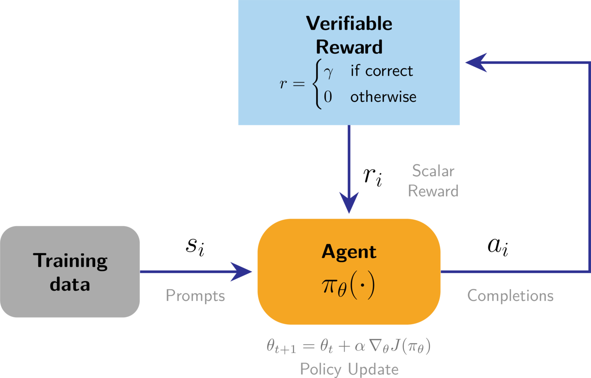

# 第 7 章　推理與推論時擴展（Reasoning and Inference-Time Scaling）

> 譯自 Nathan Lambert, *Reinforcement Learning from Human Feedback*（rlhfbook.com），2026-07-01 版，原文第 94–104 頁。

推理模型（reasoning models）與推論時擴展（inference-time scaling）讓語言模型的效能在 2024 年底、貫穿 2025 年、乃至未來，都實現了巨大的躍進。推論時擴展指的是在生成過程中使用更多運算來提升模型效能的能力，例如產生更長的推理鏈（reasoning chains）或取樣多個回應。被訓練成在回答前進行大量思考的語言模型，能極為出色地利用這項特性。這些模型以大量的可驗證獎勵強化學習（Reinforcement Learning with Verifiable Rewards, RLVR）[6] 訓練而成，但仍然使用大量的 RLHF。在本章中，我們回顧引領 AI 社群徹底改觀、重新認識 RL 在語言模型中潛力的歷程，回顧 RLVR 的基本原理，重點介紹關鍵研究，並指出將在未來幾年定義這個領域的爭論。

## 7.1 RLVR 的角色（The Role of RLVR）

首先，在 2016 年的神經資訊處理系統（Neural Information Processing Systems, NeurIPS）會議上，Yann LeCun 首次提出他如今廣為人知的蛋糕比喻，用來說明現代機器學習系統中學習發生的位置：

> 如果智慧是一塊蛋糕，蛋糕的主體是非監督式學習（unsupervised learning），蛋糕上的糖霜是監督式學習（supervised learning），而蛋糕上的櫻桃則是強化學習（RL）。

隨著現代語言模型與後訓練（post-training）技術堆疊近期的變化，這個類比如今大致上已然成真。RLHF 是它的前奏，而主要應用於數學、程式碼與科學主題的推理模型 RL，則是它的印證。在這個類比中：

- 在海量網際網路資料上進行的自監督式學習（self-supervised learning）構成了蛋糕的絕大部分（尤其是以 FLOPs 計算的運算量來看）；
- 後訓練的開端——針對指令的監督式微調（supervised fine-tuning, SFT）——將模型調校到一個較窄的分布；以及
- 最後，「純粹的」強化學習（RL）是頂端的那顆櫻桃。用來打造新一代「推理（reasoning）」或「思考（thinking）」模型的大規模強化學習，就是這塊收尾的拼圖（同時也借助了 RLHF 的幫助——RLHF 並不被視為古典 RL，我們稍後會說明）。

這一小部分的推理訓練隨著**思考模型（thinking models）**的出現而興起。這類模型結合了本書所討論的各種後訓練技術來對齊偏好，並在可驗證領域（verifiable domains）上進行 RL 訓練，從而大幅提升推理、程式撰寫與數學解題等能力。

這些模型的訓練方法——可驗證獎勵強化學習（Reinforcement Learning with Verifiable Rewards, RLVR）[6]——的流程與 RLHF 非常相似，但它讓獎勵模型（reward model）變成可選項，改用一個評分函數：答案正確時回傳正值獎勵，否則回傳 0。

舉例來說，想想為 RLHF 與 RLVR 評分回應有多麼不同。在 RLHF 中，獎勵模型必須評估主觀的品質：

> **提示（Prompt）**：請解釋經濟學中機會成本（opportunity cost）的概念。
>
> **回應（Response）**：機會成本是你在做決策時所放棄的次佳選項的價值。例如，如果你花一小時讀書而不是去工作，機會成本就是你原本可以賺到的工資……

為這個回應評分，需要判斷清晰度、準確性、完整性與有用性——這些品質全都需要習得的偏好，而且不存在一個明確的正確答案。

相較之下，RLVR 使用會回傳明確分數的驗證函數（verification functions）。以數學為例：

> **提示（Prompt）**：所有小於 20 的質數之和是多少？
>
> **回應（Response）**：小於 20 的質數為 2、3、5、7、11、13、17 與 19。將它們相加：$2 + 3 = 5$，接著 $5 + 5 = 10$，接著 $10 + 7 = 17$，接著 $17 + 11 = 28$，接著 $28 + 13 = 41$，接著 $41 + 17 = 58$，最後 $58 + 19 = 77$。答案是 $\boxed{77}$。
>
> **驗證（Verification）**：`extracted_answer == 77` $\rightarrow$ 獎勵 = 1

`\boxed{}` 標記是從數學排版慣例中借來的做法，它讓答案抽取變得非常直接——用一個簡單的正規表示式（regular expression）就能從回應中抽出最終答案，無論模型是如何得出這個答案的。請注意，也存在其他答案抽取方法，例如僅使用「答案是：」（"The answer is:"）這樣的片語（如上例所示）、`<answer>` 之類的特殊 token，或 `####` 之類的分隔符號。

對於程式碼生成，驗證通常採取單元測試（unit tests）的形式：

> **提示（Prompt）**：請寫一個 Python 函數 `fib(n)`，回傳第 n 個費波那契數（Fibonacci number），其中 fib(0) = 0 且 fib(1) = 1。
>
> **回應（Response）**：
>
> ```python
> def fib(n):
>     if n < 2:
>         return n
>     return fib(n - 1) + fib(n - 2)
> ```
>
> **驗證（單元測試）（Verification (unit tests)）**：
>
> ```python
> assert fib(0) == 0    # 基本情況（base case）
> assert fib(1) == 1    # 基本情況（base case）
> assert fib(10) == 55  # 較大的值（larger value）
> ```
>
> （所有測試通過 $\rightarrow$ 獎勵 = 1）

單元測試是程式碼天然的驗證函數：它們以已知的輸入—輸出配對來執行模型的解答。一種常見的評分方式是進行簡單的閘控（gating）：若所有斷言（assertions）都通過，獎勵為 1；只要有任何一個失敗，獎勵為 0。其他設定則採用與通過測試數成正比的部分給分。對於這兩個例子而言，都不需要習得的獎勵模型，而且大多數設定也確實不使用（因為模型在這些領域對過度最佳化 over-optimization 具有穩健性），不過也可以透過獎勵的線性組合來納入一個獎勵模型。

RLVR 背後的想法在 RL 文獻中並不新穎——根據答案是否正確來進行梯度更新，這個核心概念幾乎就是強化學習的教科書定義。將其應用於語言模型時的創新之處，主要在於如何在維持被微調模型強大且通用的能力的同時進行應用。在此之中，語言建模文獻裡也有許多相關的想法，讓模型從關於答案正確性的回饋中學習。

最初，在我參與、創造出「可驗證獎勵 RL（RLVR）」一詞的那項工作中 [6]，這個方法原本要被命名為「標準答案獎勵 RL」（RL with Ground Truth rewards, RLGT）。然而 RLVR 與單純從標準答案（ground truth）學習有著微妙的差異。在數學等領域中，存在單一的標準答案可用來驗證解答，如同前面所見。在其他領域，例如程式碼生成或精確的指令遵循（instruction following），答案可以透過檢查函數（例如單元測試）來驗證——即使存在多個正確解答，而非只有單一的標準答案。RLVR 進展的核心，在於擁有種類多樣且有深度的可驗證問題，即便確切的解答無法事先得知。


*圖 25：以 RL 回饋迴圈形式呈現的 RLVR。這裡以驗證函數取代了獎勵模型。*

最早成功部署這類訓練的模型是 OpenAI 的 o1 [53] 與開放權重（open-weight）模型 DeepSeek R1 [15]。此後不久，整個 AI 產業都將這種訓練流程與模型風格列為優先事項。這裡的核心變化，與其說是這種 RL 設定本身是全新的，不如說是訓練階段的重新配置與不同行為優先順序的調整。推理模型帶來了一個「擴展 RL 訓練成為理所當然」的時代。

至於這些模型展現出何種行為，請看以下例子：比較 DeepSeek V3 0325 與他們的推理模型 DeepSeek R1，對查詢 `Write me a short poem about a goldfish`（幫我寫一首關於金魚的短詩）的回應。DeepSeek V3 非常直截了當：

> **回應（Response）**：金魚之夢（Goldfish Dreams）
>
> 在清澈渾圓的玻璃缸裡，
> 一尾小金魚無聲地游弋。
> 鱗片閃耀如陽光的親吻，
> 牠悠然漂蕩在水中的幸福裡。
>
> 魚鰭一撥，光影一閃，
> 在光線中追逐著泡泡。
> 牠是否夢想著遼闊的海洋？
> 還是小小世界已然足夠——那是牠的驕傲？

而 DeepSeek R1 的體驗則不同。它會先生成大量的思考 token 來構思回應，然後才回覆使用者。答案呈現如下：

> **回應（Response）**：`<thinking>` 好的，使用者想要一首關於金魚的短詩。先來腦力激盪一些與金魚相關的意象。金魚通常養在魚缸裡，對吧？所以也許可以從場景開始。「鎏金之缸（gilded bowl）」或「水晶球（crystal globe）」這類詞應該可行。
>
> 接著，想想金魚的動作。牠們游得很流暢，所以會想到「疾游（dart）」、「滑行（glide）」或「迴旋（swirl）」這類詞。也許可以把牠們的魚鰭形容成「絲綢般的（silken）」，以強調纖細感。
>
> 然後，考慮金魚周遭的環境。陽光穿過水面會產生粼粼波光。「陽光起舞（sunbeams dance）」或「漣漪迴旋（ripples spin）」這類詞或許能捕捉那種感覺。加入城堡或鵝卵石之類的元素會增添俏皮感。
>
> 主題呢？也許是金魚的小小世界與牠對自由的感知之間的對比。魚缸如同一個宇宙，微小卻完整。以一種神祕感或靜默的凝視作結，可以增加深度。需要保持簡潔，也許四段、帶押韻。讓我檢查一下節奏與流暢度。避免陳腔濫調，但要平易近人。好，來把它組合起來。`</thinking>`
>
> 液態玻璃中的鎏金之夢（Gilded Dreams in Liquid Glass）
>
> 鎏金之缸，水晶之球，
> 微小的潮汐在寂靜中流淌——
> 一抹橙色的閃光，一襲輕聲的羅衣，
> 你疾游過陽光照亮的靛藍。
>
> 你的世界很小，卻也無邊無際——
> 每顆鵝卵石、每座城堡、每株舒展的水草。
> 水面將天空折成蔚藍，
> 漣漪旋轉著你的液態世界。
>
> 你滑行過我們永遠無從知曉的神話，
> 一位靜默的君王，隱身於薄霧。
> 夢，是否隨泡泡漂向遠方？
> 還是化作紫水晶中的記憶？
>
> 我們看著你描摹你無盡的圓——
> 一滴淚中的宇宙。

`<thinking>` 標籤中的 token 就是模型的推理。對於更複雜的問題，推理階段可能需要數千個 token 才會產出答案。因此，長上下文（long-context）語言模型是進階推理行為的先決條件，但那不是本章的焦點。

關於*這種訓練如何運作*的核心直覺是：對於一個給定的模型，我們重複以下循環：

1. 對多個問題取樣多個答案，
2. 朝著正確的答案進行梯度更新，然後
3. 重複這個過程，反覆使用同樣的資料。

值得注意的是，這個極其簡單的方法（在資料分布經過細心設計、訓練基礎設施穩定的前提下）能讓模型透過一遍又一遍地重訪相同的問題來學習。更了不起的是，模型在這些訓練問題上的進步，能夠泛化到它從未見過的問題與（部分）領域！

這個簡單的方法讓模型得以在行為空間（behavior space）中進行輕量的搜尋，而 RL 演算法則提高那些與正確答案相關的行為出現的可能性。

## 7.2 新推理模型的起源（The Origins of New Reasoning Models）

在此我們詳述導致 2025 年推理模型爆發的高層次趨勢。

### 7.2.1 為什麼 RL 現在行得通了？（Why Does RL Work Now?）

儘管有許許多多「RL 還行不通」的評論 [148]，以及詳述 RL 深層可重現性問題的論文 [149]，這個領域仍然克服了這些障礙，找到了高影響力的應用。其中一些已在本書中介紹，例如 ChatGPT 的 RLHF 與 DeepSeek R1 的 RLVR，但還有許多其他應用，包括改善晶片設計 [150]、精通電玩遊戲 [151]、自動駕駛 [152] 等等。以 RL 為核心的語言模型訓練起飛，顯示這個研究領域在許多根本問題上取得了進展，包括：

- **RL 的穩定性是可以解決的**：自 RL 誕生以來，限制其普及的因素一直是穩定性。這體現在兩個方面。首先，學習本身可能反覆無常、不總是有效。其次，眾所皆知，這種訓練比標準語言模型訓練更脆弱，更容易出現損失尖峰（loss spikes）、崩潰等問題。如今無數新模型的發布都在預訓練基礎模型之上使用這種帶有可驗證獎勵的 RL 訓練風格，學術界也已大量採納。RL 的技術進入門檻正處於歷史最低點。
- **開源版本早已「存在」**：許多用於以 RLVR 及相關技術訓練語言模型的工具早已存在。例子包括 TRL [47]、Open Instruct [6]、veRL [153] 與 OpenRLHF [154]，其中許多都建立在 RLHF 與後訓練發展歷程中較早期的最佳化成果之上。工具的可及性正在催生規模龐大且不斷加速的研究。

多方資料顯示，用於推理的 RL 訓練大約要到 2024 年之後推出的領先模型上才變得可行，這表示模型必須先具備一定水準的底層能力，推理訓練才有可能成功。

### 7.2.2 RL 訓練與推論時擴展（RL Training vs. Inference-Time Scaling）

以強化學習訓練來引出推理行為及可驗證領域上的效能，與推論時擴展的概念密切相關。推論時擴展，又稱測試時擴展（test-time scaling），是指在推論階段使用更多運算能力，以便在下游任務上表現更好的一大類方法。在 DeepSeek R1 與 OpenAI o1 發布之前，推論時擴展的方法就已被研究——而這兩者的發布大幅推升了各界對 RL 訓練的投資熱潮。例子包括價值引導取樣（value-guided sampling）[155]，或搭配答案抽取的重複隨機取樣 [156]。除此之外，推論時擴展還可以用來改進思維鏈（chain-of-thought）推理解題以外的更多 AI 訓練方法，例如讓獎勵模型深入考量各個選項 [84] [157]。

RL 訓練是通往「推論時擴展定律（inference-time scaling laws）被實際運用」的一條捷徑，但長期而言，我們將擁有更多方法來引出我們所需的推論時權衡，以達到最佳效能。以 RL 大量訓練模型，通常能讓模型在每個回應中生成更多 token，且這種增加與下游效能的提升高度相關（雖然序列長度增加是預設的行為，但也有研究明確探討*不*依賴這種推論時擴展來提升效能）。這與早期 RLHF 系統中所見的長度偏差（length-bias）[10] 有著本質上的不同——在那些系統中，人類偏好訓練的副作用是拉長回應的平均長度，以換取偏好排名上的微幅提升。

除了核心的 RL 訓練模型之外，還有許多方法正被探索，以持續推進推理與推論時運算的極限。由於這些方法演進迅速，大多超出本書的範圍，但它們包括：透過指令微調將較大 RL 訓練模型的推理行為蒸餾（distill）到較小模型 [158]、組合更多推論呼叫 [159] 等等。這裡的重點在於下游效能與生成 token 數量增加之間的相關性——否則那只是浪費能源。

### 7.2.3 RLVR 的未來（超越推理）（The Future (Beyond Reasoning) of RLVR）

在許多領域中，這些新形態的 RLVR 因為聚焦於效能而非行為，而與開發者的目標更加一致。標準的微調 API 通常使用參數高效微調方法，例如 LoRA（Low-Rank Adaptation，一種只訓練少量附加矩陣而非全部模型權重的參數高效方法，也稱為參數高效微調 parameter-efficient fine-tuning, PEFT），搭配針對指令的監督式微調。開發者傳入提示（prompts）與完成文本（completions），模型透過更新參數去匹配這些完成文本，從而提高你的資料中的特徵在模型生成內容中出現的頻率。

RLVR 則聚焦於匹配答案。給定查詢與正確答案，RLVR 幫助模型學會產出正確答案。標準指令微調通常只對資料進行 1 到 2 個 epoch 的損失更新，而 RLVR 之所以獨樹一格，正是因為它會在同樣少量的資料點上進行數百甚至數千個 epoch，讓模型有時間學習新的行為。這可以視為：把基礎模型版本中偶爾才會奏效的正向行為，經過 RLVR 強化為穩健的行為。

**語言模型 RL 訓練的適用範圍持續擴大**：從根本的科學層面來看，o1 與 R1 帶來的最大啟示是——我們擁有了更多方法，可以把語言模型訓練出潛在有價值的行為。研究者與工程師可用的門路越多，我們就越應該對 AI 的整體發展軌跡感到樂觀。

## 7.3 理解推理訓練方法（Understanding Reasoning Training Methods）

對推理的投資，促成了「如何訓練模型遵循人類指令」這門技藝的一次重大演進。這些訓練配方仍然使用前面章節討論過的常見組件（如第 3 章對 DeepSeek R1 配方的概述所述），包括指令微調（instruction fine-tuning）、基於人類回饋的強化學習，以及可驗證獎勵強化學習（RLVR）。核心的變化在於使用多得多的 RLVR，並以不同的順序應用其他訓練技術——傳統上，對推理模型而言，核心的訓練步驟要嘛是一次大規模的 RL 訓練，要嘛是在另一個已經歷大量 RLVR 訓練的模型的*輸出*上進行大規模指令微調（稱為蒸餾 distillation）。

### 7.3.1 OpenAI o1 與 DeepSeek R1 之前的推理研究（Reasoning Research Before OpenAI o1 or DeepSeek R1）

在推理模型起飛之前，學界已投入大量心力研究如何訓練語言模型在可驗證領域上表現更好。下列這些工作的主要差異在於：它們的方法論未能擴展到 DeepSeek R1 及後續模型所使用的規模，或者它們產出的模型犧牲了整體效能，以換取更高的數學或程式撰寫能力。這裡納入其背後的想法與動機，是為了描繪出推理模型如何在整個領域版圖中誕生的更完整圖像。

在可驗證領域上訓練語言模型的最早嘗試，包括自學推理器（self-taught reasoner, STaR）系列工作 [160] [161] 與 TRICE [162]，兩者都在 2022 至 2023 年間使用標準答案獎勵訊號來鼓勵模型進行思維鏈推理。STaR 實質上是對策略梯度（policy gradient）演算法的近似，但在實務上以不同方式過濾樣本，並使用交叉熵（cross-entropy）度量而非對數機率（log-probability）；Quiet-STaR 則在此基礎上擴展，其想法與近期的推理模型非常相近——讓模型在嘗試回答可驗證問題之前先生成 token（這有助於訓練效果）。TRICE [162] 也透過生成推理軌跡（traces），再以一種受馬可夫鏈蒙地卡羅（Markov chain Monte Carlo）啟發的客製化期望最大化（expectation maximization）演算法進行最佳化，來改善推理。VinePPO [163] 接續這些工作，採用了更貼近現代推理模型的設定。VinePPO 使用以 PPO 為基礎的演算法，以數學題正確與否作為二元獎勵，在 GSM8K 與 MATH 上訓練。其他在 OpenAI o1 與 DeepSeek R1 之前的工作，則使用程式碼執行作為訓練的回饋訊號 [164], [165]，或使用定理證明的驗證（在該文中稱為「驗證器回饋強化學習」Reinforcement Learning from Verifier Feedback, RLVF）[166]。Tülu 3 在這些方法的基礎上更進一步，使用一個簡單的 PPO 訓練器來獎勵答案正確的完成文本——最重要的是，同時維持模型在廣泛評測套件上的整體效能。Tülu 3 與現代推理訓練技術的二元獎勵，可以與 STaR 的迭代式方法或 Quiet-STaR 的對數概似（log-likelihood）獎勵形成對比。

### 7.3.2 早期推理模型（Early Reasoning Models）

表 4 彙整了 DeepSeek R1 之後具奠基性的推理研究報告，其中部分還伴隨開放資料與模型權重一同發布。

表 4：2025 年——即以 RLHF 進行大規模推論時擴展的第一年——值得注意的推理模型技術報告摘要。

| 日期 | 名稱 | 摘要（TLDR） | 開放權重 | 開放資料 |
|------|------|------|------|------|
| 2025-01-22 | DeepSeek R1 [15] | 以 RL 為基礎的 DeepSeek 升級版，在數學與程式碼推理上大幅進步 | 是 | 否 |
| 2025-01-22 | Kimi 1.5 [143] | 在中／英文資料上擴展 PPO/GRPO；AIME 數學表現強勁 | 否 | 否 |
| 2025-03-31 | Open-Reasoner-Zero [167] | 對基礎模型 RL 的完全開放復現 | 是 | 是 |
| 2025-04-10 | Seed-Thinking 1.5 [62] | ByteDance 的 RL 流程，具備動態 CoT 閘控 | 是 | 否 |
| 2025-04-30 | Phi-4 Reasoning [168] | 14B 模型；精心設計的 SFT→RL；擅長 STEM 推理 | 是 | 否 |
| 2025-05-02 | Llama-Nemotron [169] | 多種尺寸的「推理開關（reasoning-toggle）」模型 | 是 | 是 |
| 2025-05-12 | INTELLECT-2 [134] | 首個公開記錄的全球去中心化 RL 訓練 | 是 | 是 |
| 2025-05-12 | Xiaomi MiMo [61] | 從預訓練到後訓練的端到端推理流程 | 是 | 否 |
| 2025-05-14 | Qwen 3 [60] | 將類似 R1 的配方應用於新模型 | 是 | 否 |
| 2025-05-21 | Hunyuan-TurboS [170] | Mamba-Transformer MoE，自適應長／短 CoT | 否 | 否 |
| 2025-05-28 | Skywork OR-1 [171] | 避免熵崩塌（entropy collapse）的 RL 配方；在 AIME 上勝過 DeepSeek | 是 | 是 |
| 2025-06-04 | Xiaomi MiMo VL [172] | 將推理流程端到端調整為納入多模態任務 | 是 | 否 |
| 2025-06-04 | OpenThoughts [173] | 從 QwQ-32B 蒸餾出的 120 萬筆範例公開指令資料集 | 是 | 是 |
| 2025-06-10 | Magistral [174] | 在 Mistral 3 上的純 RL；多語言 CoT；開源釋出小模型 | 是 | 否 |
| 2025-06-16 | MiniMax-M1 [123] | 開放權重 456B MoE 混合式／Lightning Attention 推理模型；1M 上下文；以 CISPO 進行 RL；釋出 40K/80K 思考預算（thinking-budget）檢查點 | 是 | 否 |
| 2025-07-10 | Kimi K2 [175] | 1T MoE（32B 啟用），採用 MuonClip（QK-clip）確保穩定性；15.5T token 預訓練且無損失尖峰；多階段後訓練，結合代理式（agentic）資料合成與聯合 RL；釋出基礎與後訓練檢查點。 | 是 | 否 |
| 2025-07-28 | GLM-4.5 [176] | 開放權重 355B-A32B MoE「ARC」模型，具思考／非思考模式；23T token 多階段訓練，後訓練採專家迭代（expert iteration）與 RL；釋出 GLM-4.5 與 GLM-4.5-Air（MIT 授權）。 | 是 | 否 |
| 2025-08-20 | Nemotron Nano 2 [177] | 針對長「思考軌跡（thinking traces）」的混合 Mamba-Transformer；20T token 的 FP8 預訓練後進行壓縮／蒸餾；明確釋出多個檢查點及「大部分」預訓練／後訓練資料集。 | 是 | 是（大部分） |
| 2025-09-09 | K2-Think [178] | 參數高效的數學推理系統：一個 32B 開放權重模型，附測試時擴展配方；（依釋出資料）定位為完全開放，含訓練資料／程式碼。 | 是 | 是 |
| 2025-09-23 | LongCat-Flash-Thinking [179] | 560B MoE 推理模型；報告明確說明從長 CoT 冷啟動（cold start）到大規模 RL 的分階段配方；開源釋出。 | 是 | 否 |
| 2025-10-21 | Ring-1T [180] | 以 RL 擴展為焦點的兆級參數「思考模型」；報告闡述在 1T 規模下擴展 RL 的瓶頸與解方，並釋出開放模型。 | 是 | 否 |
| 2025-11-20 | Olmo 3 Think [18] | 完全開放的「模型流（model flow）」釋出：報告完整的生命週期（各階段、檢查點與資料點），並將 Olmo 3 Think 32B 定位為旗艦級開放思考模型。 | 是 | 是 |
| 2025-12-02 | DeepSeek V3.2 [181] | 開放權重 MoE 的前沿推進，其報告聚焦注意力效率的變革、RL 框架升級，以及針對代理式／推理效能的資料合成。 | 是 | 否 |
| 2025-12-05 | K2-V2 [182] | 從零開始訓練的 70B 稠密「360 度開放（360-open）」模型；採三檔強度（3-effort）純 SFT 後訓練以實現可控思考。 | 是 | 是 |
| 2025-12-15 | Nemotron 3 Nano [183] | 30B-A3B MoE 混合 Mamba-Transformer；以 25T token 預訓練，包含 SFT 與大規模 RL；明確表示同時釋出權重、配方／程式碼與大部分訓練資料。 | 是 | 是（大部分） |
| 2025-12-16 | MiMo-V2-Flash [184] | 為速度最佳化的 309B MoE（15B 啟用）：混合 SWA/GA 注意力（5:1、128-token 視窗）加輕量 MTP；27T token 的 FP8 預訓練；後訓練採 MOPD 與大規模代理式 RL，強化推理／程式撰寫。 | 是 | 否 |

### 7.3.3 訓練推理模型的常見實務（Common Practices in Training Reasoning Models）

在本節中，我們詳述在訓練推理模型時，用於安排訓練階段順序與調整資料以最大化效能的常見方法。

請注意，這些論文可能使用了某項列出的技術卻未提及，而它們的同儕則有提及；因此這些例子只是已知實作的一個子集，應作為參考，而非對最佳配方的最終定論。

- **離線難度過濾（Offline difficulty filtering）**：RLVR 的一個核心直覺是，模型只能從存在梯度的範例中學習。如果 RLVR 的起始模型對某個問題的解題率是 100% 或 0%，那麼針對該提示的不同完成文本之間就不會有梯度（也就是說，對策略梯度演算法而言，所有策略看起來都一樣）。許多模型在開始大規模 RL 之前會使用難度過濾，將訓練問題限縮在起始模型解題率僅為 20–80% 的那些題目。收集這種資料的方式是：對訓練集中的每個提示取樣 N 個（例如 16 個）完成文本，並驗證其中正確的比例。Seed-Thinking 1.5、Open Reasoner Zero、Phi 4、INTELLECT-2、MiMo RL、Skywork OR-1 等模型都使用了此方法的各種變體。
- **逐批次線上過濾（Per-batch online filtering）**（或貫穿訓練全程的難度課程 difficulty curriculums）：在以離線過濾找出合適訓練問題之外，另一個重要問題是：在學習過程中，問題應該以什麼順序呈現給模型？為了解決這個問題，許多模型會對批次（batch）中的問題進行線上過濾、使用預先建構的課程／資料排程器（data schedulers）、將較難的問題留到訓練後期，或採用其他改善長期穩定性的做法。Kimi 1.5、Magistral、Llama-Nemotron、INTELLECT-2、MiMo-RL、Hunyuan-TurboS 等模型使用了相關的想法。
- **移除 KL 懲罰（Remove KL penalty）**：隨著推理模型的 RL 訓練長度（無論以何種指標計算——總 GPU 小時數、FLOPS 或 RL 步數）相較於 RLHF 訓練大幅增加，加上獎勵函數變得較不容易被過度最佳化，許多模型移除了 KL 懲罰——該懲罰原本用於約束 RL 學到的策略必須與訓練起點的基礎模型保持相似。移除後，模型在訓練過程中得以進一步探索。RAGEN [185]、Magistral、OpenReasonerZero、Skywork OR-1 等模型採用了這個做法。
- **放寬策略梯度裁剪（Relaxed policy-gradient clipping）**：GRPO 演算法的新變體（例如 DAPO [129]）提出對 GRPO（或 PPO）所用的雙邊裁剪目標函數進行修改，以促進更好的探索。研究也顯示，當獎勵不完美時，裁剪可能造成虛假的學習訊號 [186]。這種在不同梯度方向使用不同範圍的雙邊裁剪，被 RAGEN、Magistral、INTELLECT-2 等模型採用。
- **離策略資料（或完全非同步更新）（Off-policy data (or fully asynchronous updates)）**：隨著問題變難，用 RL 解題所需的完成文本長度急遽增加（尤其是回應長度的*變異數*——經常出現長度極長的離群值），RL 訓練中的運算資源可能因此閒置。為了解決這個問題，訓練正朝著非同步更新，或改變問題編排進批次的方式來提升整體吞吐量的方向發展。Seed-Thinking 1.5、INTELLECT-2 等模型使用了從部分到完全非同步的（離策略 off-policy）資料。
- **額外的格式獎勵（Additional format rewards）**：為了讓推理過程可預測，許多模型會加入小額獎勵，確保模型在回答前遵循正確的格式，例如 `<think>...</think>`。DeepSeek R1、OpenReasonerZero、Magistral、Skywork OR-1 等模型使用了這個做法。
- **語言一致性獎勵（Language consistency rewards）**：與格式獎勵類似，一些多語言推理模型使用語言一致性獎勵，優先鼓勵在推理過程中不切換語言的模型（以帶來更好、更可預測的使用者體驗）。DeepSeek R1、Magistral 等模型屬於此類。
- **長度懲罰（Length penalties）**：許多模型在 RL 訓練期間使用各種形式的長度懲罰，以隨時間穩定學習過程，或緩解在困難問題上的過度思考（overthinking）。例子包括 Kimi 1.5 逐步延長目標長度以對抗過度思考（同時在難度課程中維持高訓練準確率），或 INTELLECT-2 全程施加小幅的長度懲罰。逐步延長訓練序列長度可以緩解過度思考：先迫使模型在思考預算較有限的情況下學會有效推理，然後再過渡到更長的訓練，讓模型能在更複雜的問題上有效率地運用這些行為。其他模型則使用超長過濾（overlong filtering）及其他相關實作來提升吞吐量。
- **損失正規化（Loss normalization）**：關於原始 GRPO 演算法的逐群組（per-group）正規化項可能引入長度或難度偏差，已有一些討論（見策略梯度章節或 [118]）。因此，一些模型（例如 Magistral 或 MiMo）選擇在批次層級而非群組層級對損失或優勢（advantages）進行正規化。
- **平行測試時運算擴展（Parallel test-time compute scaling）**：結合多個平行、獨立取樣的推演（rollouts）所產生的答案，相較於只使用單一推演的答案，可以帶來顯著的改善。最簡單樸素的平行測試時運算擴展形式（DeepSeek-R1、Phi-4 等模型採用的做法），是把多數推演回傳的答案當作最終答案。更進階的技術是使用一個經過訓練的評分模型，從平行推演的答案中挑選最佳答案。截至 2026 年，這項技術尚未在公開、有文件記錄的推理模型配方中普及，但它曾在 Claude 4 的發布公告中被提及 [187]，並在 DeepSeek-GRM [157] 中被使用。

在這些常見技術之外，關於推理訓練如何在不犧牲附帶能力的前提下打造出有用的模型，也有許多常見的發現：

- **純文字推理訓練可提升多模態效能（Text-only reasoning boosts multimodal performance）**：Magistral、MiMo-VL 等發現，先訓練一個多模態模型，然後在多模態訓練之後進行純文字的推理訓練，可以*提升*最終模型的多模態效能。
- **透過系統提示切換推理（或長度控制）（Toggleable reasoning with system prompt (or length control)）**：Llama-Nemotron、Nemotron Nano、Qwen 3、SmolLM 3 等使用特定的系統提示（system prompts）（可能搭配長度受控的 RL 訓練 [188]），讓使用者可以開關思考長度。其他開放模型，例如 OpenAI 的 GPT-OSS 與 LLM360 的 K2-V2 [182]，則採用在系統提示中設定低—中—高推理強度（reasoning effort）的做法，但這類行為的訓練方法目前還沒有那麼完善的文件記錄。

## 7.4 展望未來（Looking Ahead）

推理模型的版圖正以近年 AI 研究中任何領域都未曾有過的速度演進，本章列出的一些常見實務，終將不可避免地被新技術取代。

目前已有數項工作正在進行，試圖系統性地理解推理訓練為何有效。Olmo 3 Think [18] 是對推理模型完整訓練生命週期最全面的開放文件記錄，為研究社群提供了每個階段的檢查點與資料以供研究，並以一場在 220 顆 GPU 上長達近 4 週的訓練作結。同樣地，關於理解 RL 用於推理的擴展特性的研究 [17]，也開始將運算、資料與效能之間的關係形式化——這些關係過去只存在於實務工作者的直覺之中。

可以確定的是，強化學習已經從蛋糕比喻中的「頂端櫻桃」，畢業成為前沿模型訓練中承重的核心組件。本章圍繞 RLVR 概念的各項小技術——難度過濾、格式獎勵等等——並非最終答案，但它們代表了這個領域目前對「如何從語言模型中引出推理」的最佳理解。下一代的方法很可能看起來會不一樣，但它們將建立在此處奠定的基礎之上。
