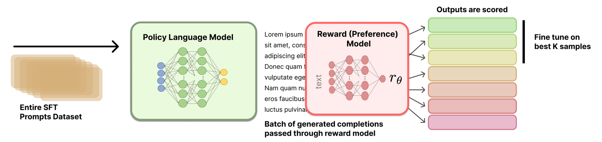

# 第 9 章　拒絕採樣（Rejection Sampling）

> 譯自 Nathan Lambert, *Reinforcement Learning from Human Feedback*（rlhfbook.com），2026-07-01 版，原文第 117–123 頁。

拒絕採樣（Rejection Sampling, RS）是偏好微調（preference fine-tuning）中使用最廣泛、卻也最缺乏文獻記載的方法之一。許多重要的 RLHF 論文都將它作為訓練管線的核心組成部分，但至今仍不存在一個標準（canonical）的實作，也沒有人解釋過它為什麼如此有效。拒絕採樣可以應用在訓練管線的多個節點——指令微調之後、基於 RL 的最佳化之後、甚至 RLVR 之後——這使它成為一個用途廣泛但難以歸類的工具。加上文獻記載不足的特性，這正是它被安排在核心最佳化方法末尾介紹的原因。

拒絕採樣的運作方式是：先蒐集新的候選補全（completion），根據一個已訓練好的獎勵模型（reward model）加以篩選，然後只用其中最好的補全來微調原始模型（使用與指令微調相同的損失函數）。

這個名稱源自計算統計學（computational statistics）[209]：當人們想從一個複雜的分布中採樣、卻沒有直接的方法時，可以改從一個較容易建模的分布中採樣，並使用一個啟發式規則（heuristic）來檢查樣本是否可以接受。對應到語言模型上，目標分布是「對提示（prompt）的高品質補全」，篩選器是獎勵模型，而採樣分布則是當前的模型。

WebGPT [4]、Anthropic 的 Helpful and Harmless 代理人 [5]、OpenAI 著名的過程獎勵模型（process reward models）論文 [50]、Llama 2 Chat 模型 [49]，以及其他開創性研究，全都使用了這個基準方法；較近期的研究則將它直接形式化——例如將其應用於多模態對齊的 RAFT [210]，以及 Statistical Rejection Sampling Optimization（RSO）[211]，後者從原理層面概述了拒絕採樣與其他偏好學習目標之間的關係。

*在本章中，我們一律以 $x$ 表示提示、以 $y$ 表示補全。這種記號在語言模型文獻中很常見——這些方法操作的是完整的「提示–補全」對，而非個別 token。*

## 9.1 訓練流程逐步解析（Training Process, Step by Step）

拒絕採樣整體上遵循幾個階段。

0. **選擇提示與獎勵模型（Prompt and reward model selection）**：首先，你必須選定要訓練的提示集，並考量它與訓練其他階段的相對關係。最簡單的方法是重複使用第一個 SFT/IFT 階段中的所有提示，但這可能造成一定程度的過度擬合（overfitting）。在進行拒絕採樣之前，你也必須已經訓練好一個獎勵模型（詳見第 5 章）。
1. **從起始檢查點生成補全（Generate completions from the starting checkpoint）**：接著，必須用想要最佳化的模型，對選定的提示生成補全。這可能涉及調整許多設定，例如採樣溫度（temperature）、top-p、最大序列長度、每個提示的補全數量等。
2. **用獎勵模型選出最佳補全（Select top completions with a reward model）**：所有補全都由獎勵模型進行排序。這個階段也可能包含去重（deduplication），使每個提示只保留一個補全；不過許多這類設計決策最終都取決於實證上的消融實驗（ablation studies）。
3. **對最佳補全進行 SFT（SFT on top completions）**：最後一步，是以選出的補全對起始檢查點進行指令微調，完成整個拒絕採樣流程。

拒絕採樣流程的視覺化總覽如下方圖 28 所示。


*圖 28：拒絕採樣總覽。*

至於實際該使用哪些提示、如何挑選獎勵模型、拒絕採樣該安排在什麼順序等細節，文獻中並沒有完善的記載。本章提供這些方法的概述，並把進一步的實驗留給讀者。

### 9.1.1 生成補全（Generating Completions）

為了對每個提示生成多個候選補全，我們先將 $M$ 個提示的集合定義為一個向量：

$$
X = [x_1, x_2, ..., x_M] \tag{110}
$$

這些提示可以有許多來源，但最常見的是來自指令訓練集。

對每個提示 $x_i$，我們生成 $N$ 個補全。我們可以把它表示成一個矩陣：

$$
Y = \begin{bmatrix}
y_{1,1} & y_{1,2} & \cdots & y_{1,N} \\
y_{2,1} & y_{2,2} & \cdots & y_{2,N} \\
\vdots & \vdots & \ddots & \vdots \\
y_{M,1} & y_{M,2} & \cdots & y_{M,N}
\end{bmatrix} \tag{111}
$$

其中 $y_{i,j}$ 表示第 $i$ 個提示的第 $j$ 個補全。每一列（row）$i$ 對應單一提示 $x_i$，包含它的 $N$ 個候選補全；每一行（column）$j$ 則對應所有提示中第 $j$ 次採樣得到的補全。

### 9.1.2 為補全評分（Scoring Completions）

現在，我們把所有這些「提示–補全」對送進獎勵模型，得到一個獎勵矩陣。我們把獎勵表示成矩陣 $R$：

$$
R = \begin{bmatrix}
r_{1,1} & r_{1,2} & \cdots & r_{1,N} \\
r_{2,1} & r_{2,2} & \cdots & r_{2,N} \\
\vdots & \vdots & \ddots & \vdots \\
r_{M,1} & r_{M,2} & \cdots & r_{M,N}
\end{bmatrix} \tag{112}
$$

每個獎勵 $r_{i,j}$ 是把補全 $y_{i,j}$ 與其對應的提示 $x_i$ 一起送進獎勵模型 $\mathcal{R}$ 計算而得：

$$
r_{i,j} = \mathcal{R}(y_{i,j} \mid x_i) \tag{113}
$$

要選出用於訓練的最佳補全，有多種方法。

為了將「根據獎勵矩陣選出最佳補全」這個過程形式化，我們可以定義一個作用在獎勵矩陣 $R$ 上的選取函數（selection function）$S$。

#### 9.1.2.1 每個提示取最佳（Top Per Prompt）

第一種可能的選取函數，是對每個提示取獎勵的最大值。

$$
S(R) = \left[\arg\max_{j} r_{1,j},\ \arg\max_{j} r_{2,j},\ ...,\ \arg\max_{j} r_{M,j}\right] \tag{114}
$$

這個函數 $S$ 回傳一個索引向量，其中每個索引對應 $R$ 中每一列獎勵最大值所在的行。接著我們就能用這些索引選出我們要的補全：

$$
Y_{chosen} = [y_{1,S(R)_1},\ y_{2,S(R)_2},\ ...,\ y_{M,S(R)_M}] \tag{115}
$$

#### 9.1.2.2 整體最佳配對（Top Overall Pairs）

另一種做法是從整個集合中選出前 $K$ 個「提示–補全」對。首先，我們把獎勵矩陣 $R$ 攤平（flatten）成單一向量：

$$
R_{flat} = [r_{1,1}, r_{1,2}, ..., r_{1,N}, r_{2,1}, r_{2,2}, ..., r_{2,N}, ..., r_{M,1}, r_{M,2}, ..., r_{M,N}] \tag{116}
$$

這個 $R_{flat}$ 向量的長度為 $M \times N$，其中 $M$ 是提示的數量，$N$ 是每個提示的補全數量。

現在，我們可以定義一個選取函數 $S_K$，選出 $R_{flat}$ 中 K 個最大值的索引：

$$
S_K(R_{flat}) = \text{argsort}(R_{flat})[-K:] \tag{117}
$$

其中 argsort 回傳能將陣列以遞增順序排序的索引，而我們取最後 $K$ 個索引，即得到 $K$ 個最大值。

要取得選出的補全，我們需要把這些攤平後的索引映射回原本的補全矩陣 $Y$。要還原對應的「提示–補全」對，可以把從零起算（zero-indexed）的攤平索引 $k$ 映射到 $(i, j)$：$i = \lfloor k/N \rfloor + 1$ 且 $j = (k \bmod N) + 1$。

#### 9.1.2.3 選取範例（Selection Example）

考慮以下情境：我們有五個提示和四個補全。我們將展示兩種根據獎勵選取補全的方式。

$$
R = \begin{bmatrix}
0.7 & 0.3 & 0.5 & 0.2 \\
0.4 & 0.8 & 0.6 & 0.5 \\
0.9 & 0.3 & 0.4 & 0.7 \\
0.2 & 0.5 & 0.8 & 0.6 \\
0.5 & 0.4 & 0.3 & 0.6
\end{bmatrix} \tag{118}
$$

首先是**每個提示取最佳（per prompt）**。直觀上，我們可以將獎勵矩陣標示如下：

$$
R = \begin{bmatrix}
\mathbf{0.7} & 0.3 & 0.5 & 0.2 \\
0.4 & \mathbf{0.8} & 0.6 & 0.5 \\
\mathbf{0.9} & 0.3 & 0.4 & 0.7 \\
0.2 & 0.5 & \mathbf{0.8} & 0.6 \\
0.5 & 0.4 & 0.3 & \mathbf{0.6}
\end{bmatrix} \tag{119}
$$

使用 argmax 方法，我們為每個提示選出最佳補全：

$$
S(R) = \left[\arg\max_{j} r_{i,j} \ \text{for} \ i \in [1,5]\right] \tag{120}
$$

$$
S(R) = [1, 2, 1, 3, 4] \tag{121}
$$

這表示我們會選出：

- 提示 1：補全 1（獎勵 0.7）
- 提示 2：補全 2（獎勵 0.8）
- 提示 3：補全 1（獎勵 0.9）
- 提示 4：補全 3（獎勵 0.8）
- 提示 5：補全 4（獎勵 0.6）

接著是**整體最佳（best overall）**。我們把整體前五名的補全配對標示出來。

$$
R = \begin{bmatrix}
\mathbf{0.7} & 0.3 & 0.5 & 0.2 \\
0.4 & \mathbf{0.8} & 0.6 & 0.5 \\
\mathbf{0.9} & 0.3 & 0.4 & \mathbf{0.7} \\
0.2 & 0.5 & \mathbf{0.8} & 0.6 \\
0.5 & 0.4 & 0.3 & 0.6
\end{bmatrix} \tag{122}
$$

首先，我們把獎勵矩陣攤平：

$$
R_{flat} = [0.7, 0.3, 0.5, 0.2, 0.4, 0.8, 0.6, 0.5, 0.9, 0.3, 0.4, 0.7, 0.2, 0.5, 0.8, 0.6, 0.5, 0.4, 0.3, 0.6] \tag{123}
$$

接著，我們選出五個最大值的索引：

$$
S_5(R_{flat}) = [8, 5, 14, 0, 11] \tag{124}
$$

把這些索引映射回原本的矩陣：

- 索引 8 → 提示 3、補全 1（獎勵 0.9）
- 索引 5 → 提示 2、補全 2（獎勵 0.8）
- 索引 14 → 提示 4、補全 3（獎勵 0.8）
- 索引 0 → 提示 1、補全 1（獎勵 0.7）
- 索引 11 → 提示 3、補全 4（獎勵 0.7）

#### 9.1.2.4 實作範例（Implementation Example）

以下程式碼片段展示了這些選取方法可以如何實作。

```python
import numpy as np

x = np.random.randint(10, size=10)
print(f"{x=}")
sorted_indices = np.argsort(x)
x_sorted = x[sorted_indices]
print(f"{x_sorted=}")

# first way to recover the original array
i_rev = np.zeros(10, dtype=int)
i_rev[sorted_indices] = np.arange(10)
np.allclose(x, x_sorted[i_rev])

# second way to recover the original array
np.allclose(x, x_sorted[np.argsort(sorted_indices)])
```

### 9.1.3 微調（Fine-Tuning）

有了選出的補全之後，接著就對模型的當前版本執行標準的指令微調。更多細節可參閱指令微調的章節。

## 9.2 實作細節（Implementation Details）

執行這種訓練的核心超參數都相當直觀：

- **採樣參數（Sampling parameters）**：拒絕採樣直接取決於從模型取得的補全。拒絕採樣的常見設定包括大於零的溫度（例如介於 0.7 到 1.0 之間），並搭配對 top-p 或 top-k 採樣等參數的其他調整。
- **每個提示的補全數量（Completions per prompt）**：成功的拒絕採樣實作，通常對每個提示採 10 到 30 個或更多的補全。補全數量太少會使訓練產生偏差（biased）且/或帶有雜訊（noisy）。
- **指令微調細節（Instruction tuning details）**：關於拒絕採樣中指令微調階段的訓練細節，尚未有明確的公開資訊。它們很可能使用與最初指令微調階段略有不同的設定。
- **異質模型生成（Heterogeneous model generations）**：某些拒絕採樣的實作，會納入來自多個模型的生成結果，而不僅僅來自即將被訓練的當前模型。這方面的最佳實務尚未確立。
- **獎勵模型訓練（Reward model training）**：所使用的獎勵模型會對最終結果產生重大影響。關於獎勵模型訓練的更多資源，請參閱相關章節。

在進行批次的獎勵模型推論時，可以將 token 化後的補全依長度排序，讓每個批次的長度相近。這能免去在大量填充（padding）token 上執行推論的需要，以少量的實作複雜度換取吞吐量的提升。

## 9.3 相關方法：Best-of-N 採樣（Related: Best-of-N Sampling）

Best-of-N（BoN）採樣是拒絕採樣的近親：它遵循同樣「生成並評分」的程序，但你**不**用選出的補全去微調模型。相反地，BoN 是在推論時（inference time）針對一個固定的提示（或一組提示）計算可能的最佳補全；相關技術經常用於聊天模型的「Pro」級服務層——為了回答你的查詢而投入額外的運算量。

Best-of-N 採樣經常被拿來作為 RLHF 訓練方法的比較基準。務必記得，BoN *並不會*修改底層模型，它是一種採樣技術。因此，在某些情境下，將 BoN 採樣與 PPO 等線上訓練方法做比較仍然是有效的。例如，你仍然可以在執行 BoN 採樣時，衡量它相對於任何其他策略（policy）的 KL 距離。

在這裡，我們將說明：當對單一提示使用簡單的 BoN 採樣時，前面展示的兩種選取準則是等價的。

令 $R$ 為我們單一提示搭配 $N$ 個補全的獎勵向量：

$$
R = [r_1, r_2, ..., r_N] \tag{125}
$$

其中 $r_j$ 表示第 j 個補全的獎勵。

使用 argmax 方法，我們為該提示選出最佳補全：

$$
S(R) = \arg\max_{j \in [1,N]} r_j \tag{126}
$$

而使用 top-K 方法並取 $K = 1$，就會化約成同一種方法——這是常見的做法。

## 9.4 建議實驗（Suggested Experiments）

`code/rejection_sampling/` 中的配套實作會執行一個完整的 GSM8K 拒絕採樣管線：生成 rollout、用獎勵模型評分、選出訓練子集、微調，並以精確匹配（exact-match）準確率進行評估。四個設定檔被安排成互相配對的實驗組／對照組，讓讀者可以檢驗獎勵模型是否真的有幫助。

1. **先建立一次 rollout 快取。**

```
cd code/
uv run python -m rejection_sampling.preprocess \
    --config rejection_sampling/configs/top_per_prompt.yaml
```

這會為共用的 GSM8K 切片生成補全並評分。只要生成與評分的設定保持不變，後續的訓練設定檔都會重複使用這份快取。

2. **將獎勵選取與隨機對照組做比較。**

```
cd code/
uv run python -m rejection_sampling.train \
    --config rejection_sampling/configs/top_per_prompt.yaml
uv run python -m rejection_sampling.train \
    --config rejection_sampling/configs/random_per_prompt.yaml
uv run python -m rejection_sampling.train \
    --config rejection_sampling/configs/top_k_overall.yaml
uv run python -m rejection_sampling.train \
    --config rejection_sampling/configs/random_k_overall.yaml
```

   以配對的方式解讀結果：`top_per_prompt` 對比 `random_per_prompt`，以及 `top_k_overall` 對比 `random_k_overall`。如果由獎勵選取的那組跑不贏它的隨機基準，就表示獎勵模型或採樣出的補全在該資料切片上並未提供有用的訊號。

3. **調整獎勵模型可以挑選的空間大小。** 複製一份設定檔，修改 `num_completions_per_prompt`、`temperature`、`top_p` 與 `selection.top_k`。更多的補全可以提高「可得的最佳樣本」的品質，但前提是獎勵模型有能力區分好答案與壞答案。

4. **嘗試較小的策略模型。** 將 `model_name` 設為一個較小的相容指令模型，降低 `max_train_samples`，然後重新執行同樣的配對實驗。這能讓實驗成本更低，並凸顯出拒絕採樣究竟是在拯救較弱的生成結果，還是只是在一群本來就不錯的結果中做挑選。
