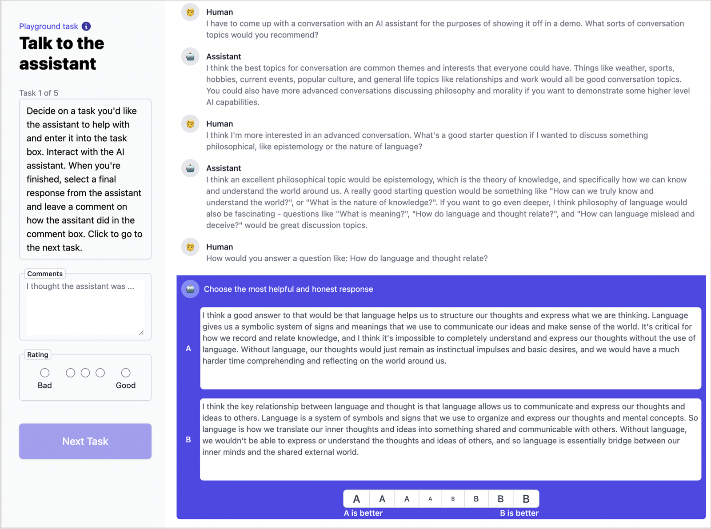
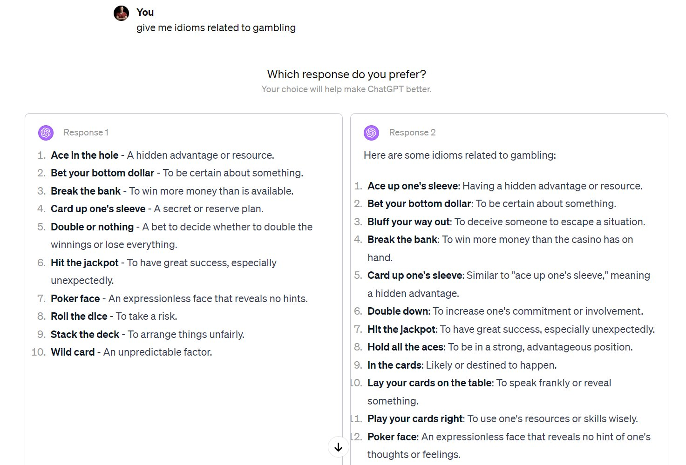
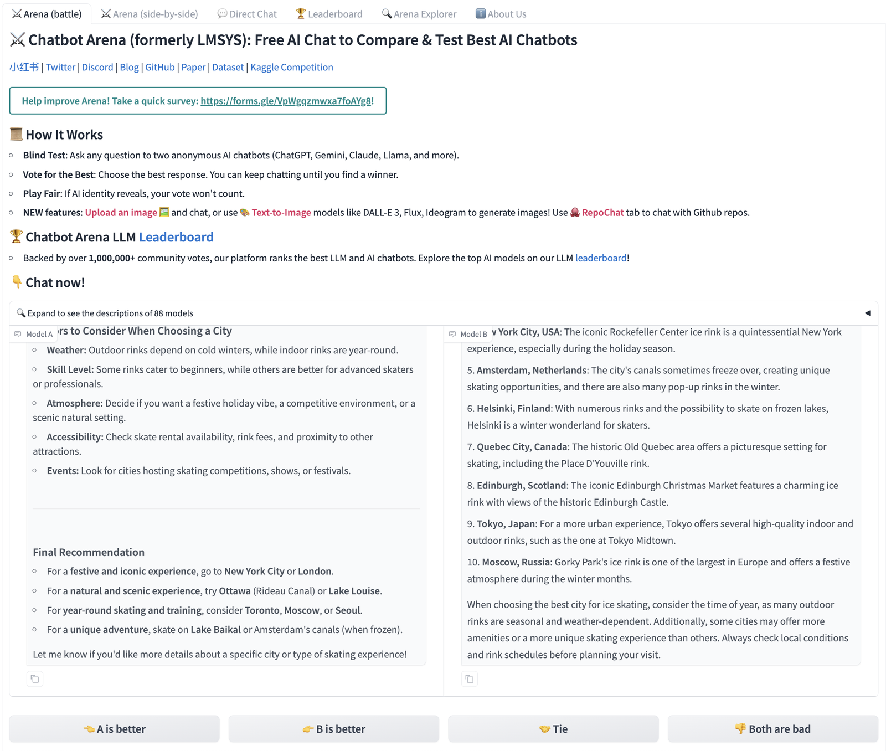
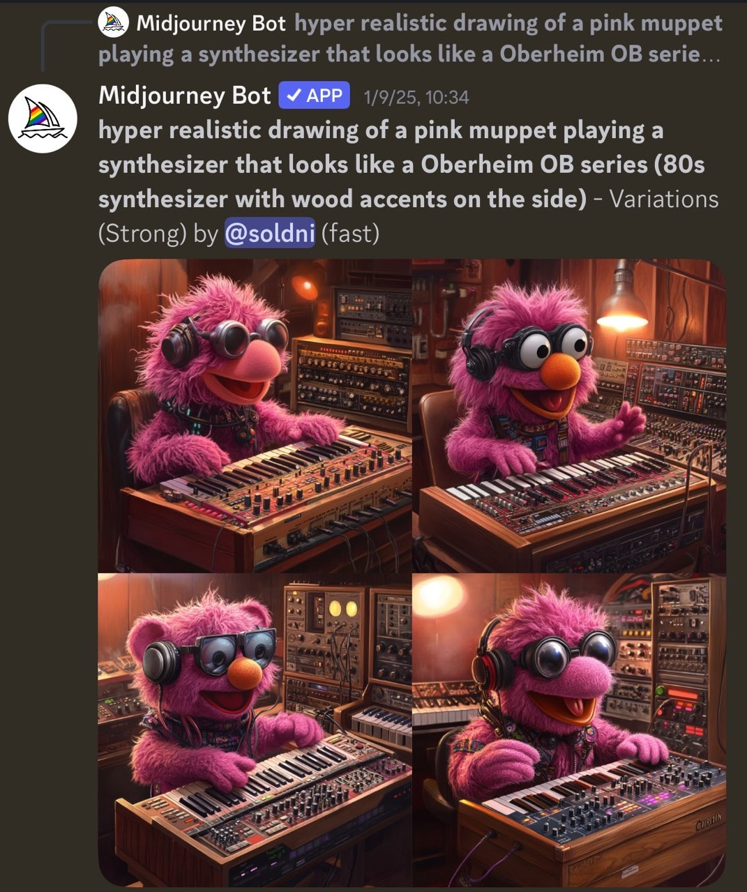
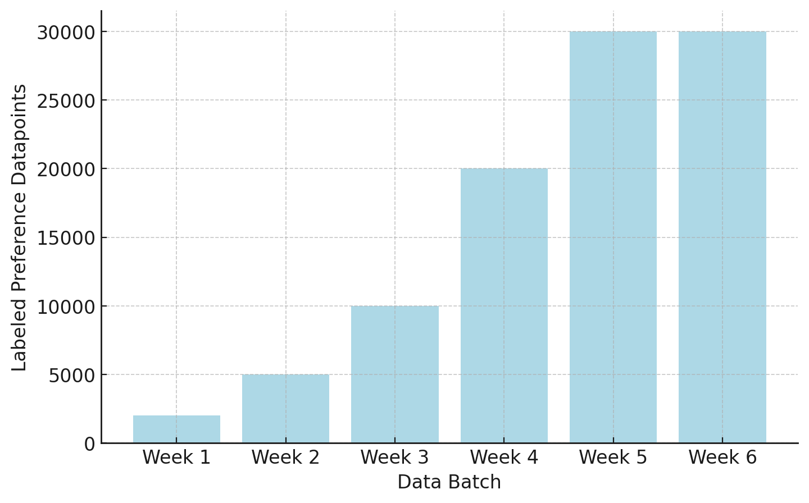

# 第 11 章　偏好資料（Preference Data）

> 譯自 Nathan Lambert, *Reinforcement Learning from Human Feedback*（rlhfbook.com），2026-07-01 版，原文第 130–142 頁。

偏好資料是偏好微調（preference fine-tuning）與人類回饋強化學習的引擎。我們試圖用 RLHF 解決的核心問題，是我們無法精確地為 AI 模型的輸出建立人類獎勵與偏好的模型——也就是說，無法寫出定義清楚、可供最佳化的損失函數——因此偏好資料就成了我們用來調校模型的代理訊號（proxy signal）。正是這些資料讓我們得以貼合我們想要的行為，並避開某些我們厭惡的失效模式。這種資料是如此豐富的訊號來源，以至於很難完全取代這種最佳化風格。在偏好微調的範疇內，人們已提出許多蒐集與運用這類資料的方法；而既然人類偏好無法被寫成一個明確的獎勵函數，未來還會出現更多方法，讓「蒐集帶標註的偏好資料」這件事持續位居 RLHF 及相關技術的核心。時至今日，圍繞偏好資料存在兩大挑戰，並貫穿本章：1）蒐集作業的複雜度與成本；2）偏好資料必須從「正在被訓練的模型」的生成結果上蒐集（稱為「on-policy」）。

在本章中，我們將詳述資料格式化方式的技術決策，以及蒐集這些資料的組織實務。

## 11.1 為什麼我們需要偏好資料（Why We Need Preference Data）

RLHF 之所以需要偏好資料，是因為想在單一獎勵函數中直接捕捉複雜的人類價值，實際上是不可能的——如前一章第 10 章所討論的，心理學、經濟學與哲學領域的大量脈絡都顯示，要精確地為人類偏好建模，是一個永遠無法徹底解決的問題。蒐集這類資料來訓練獎勵模型，是 RLHF 背後最初的構想之一 [38]，並在現代語言模型崛起的整個過程中持續被廣泛使用。關於*這類資料為何如此有效*，其中一個核心直覺是：無論對人類還是對監督資料蒐集的 AI 模型而言，針對一個提示詞去分辨答案的好壞，都遠比自己生成一個好答案容易得多。本章聚焦於取得偏好資料的*操作機制（mechanics）*，而最佳實務則取決於所要解決的具體問題。

## 11.2 蒐集偏好資料（Collecting Preference Data）

要充分發揮人類資料的價值，需要對模型進行迭代訓練、花費數十萬（甚至數百萬）美元、撰寫極為詳盡的資料標註指引、透過居中仲介蒐集工作的資料代工企業（data foundry）來落實想法（或是自行聘用足夠數量的標註者（annotator）），還有其他種種不斷疊加的挑戰。這不是一個可以輕率看待的流程。在所有關於 RLHF 的公開知識中，如何把這類資料蒐集好，也是整個流程中最不透明的環節之一。截至 2026 年，還沒有任何開放模型完整公開其人類偏好資料以及蒐集這些資料所用的方法（近年為模型釋出的最大規模人類偏好資料集，是 NVIDIA Nemotron 團隊的 HelpSteer 系列工作，包括 HelpSteer2-Preference 與 HelpSteer3-Preference [109], [257]）。基於這些原因，許多新團隊或新專案在著手 RLHF 時會略過人類資料，改用 AI 回饋資料、現成的獎勵模型，或其他方法來繞過從零開始蒐集資料的需求。

偏好資料蒐集流程中一個重要的假設是：對你的訓練流程而言，最好的資料是相對於訓練流程中前一個（或多個）檢查點（checkpoint）「同策略（on-policy）」的資料。回想一下，在後訓練（post-training）中，我們從一個基礎模型出發，接著執行一組訓練*階段（stages）*，產生一系列*檢查點*。在這種情況下，偏好資料可以在一個已經歷監督式微調的檢查點上蒐集，而這些偏好資料將用於 RLHF 訓練的下一個階段。

這裡的 on-policy 一詞借自強化學習文獻；在強化學習中，on-policy 是一個技術術語，指某次梯度更新所用的資料來自最新版本的策略。在偏好資料中，on-policy 的用法稍微寬鬆一些，指資料蒐集自當前的模型家族。不同模型的生成結果各有不同的模式，這使得來自關係密切模型的偏好資料，在最佳化的關鍵區域中更為穩健。研究顯示，使用這種 on-policy 資料，而非其他從 HuggingFace 等平台上匯集眾多熱門模型補全結果的常見資料集，對於有效的 RLHF 訓練格外重要 [89]。

on-policy 資料的必要性並沒有完善的文獻記載，但許多知名的技術報告——例如早期版本的 Claude 或 Llama 2——都展示了以 RLHF 貫穿多個訓練階段對最終效能的助益，這正好與此相呼應。同樣的不確定性也適用於熱門的 AI 回饋資料領域——最新的 AI 模型所使用的人類與 AI 偏好資料的確切配比並不為外界所知。已知這些資料來源是提升效能的寶貴途徑，但需要對流程進行細緻的調校，才能從資料管線中萃取出這種潛在效能。

一個細微但重要的觀點是：偏好資料中被*選中（chosen）*的答案，往往不是一個放諸四海皆*正確*的答案。它只是相對於同時呈現的其他選項而言更好的答案（例如更清楚、更安全、更有幫助，或錯誤較少）。可能出現這樣的情況：針對某個提示詞所比較的每一個補全結果全都正確、或全都錯誤，而模型仍然可以從標註良好的資料中學習。

### 11.2.1 標註介面（Interfaces）

蒐集偏好資料的關鍵之一，是人與模型互動所使用的介面；但這與其說是科學，不如說是一門藝術，因為介面的細微變化如何影響使用者與模型的互動，至今仍缺乏充分研究。一個關於使用者體驗如何改變模型「氣質印象（vibe）」的例子是*速度*：隨著推理模型（reasoning models）的興起，如果模型回覆得太快，使用者反而可能認為它比較不聰明（儘管使用者整體上顯然希望更快得到答案）。

下方展示了一個介面範例，來自 Anthropic 早期為打造 Claude 所做的奠基性 RLHF 工作 [5]。在下方的圖 30 中，資料標註員與模型進行一段對話，並必須在兩個可能的回答之間選出偏好，位於底部以紫色標示。此外，標註員還可以對這段對話附上更多備註，或對整體對話品質給出總評分（可能橫跨多項任務，如左上角所示）。

*圖 30：最早期的偏好資料蒐集介面之一，出自 Anthropic 的研究。Bai et al. 2022。圖中的對話本身是一段示意性的玩具對話，內容恰好在討論「什麼是適合資料蒐集的好範例對話」。授權 CC-BY。*

這第一個範例是*純訓練資料（training-data only）*介面，其目標是在蒐集對話的同時取得豐富的中繼資料。如今這些模型已廣為流行，各種應用程式會在日常使用過程中直接向使用者開放蒐集偏好的介面，就像其他科技產品會在一小部分正式流量中對新功能進行 A/B 測試一樣。至於這些偏好資料是被直接用於訓練未來的模型，還是僅僅用來評估各模型之間的相對表現，則因應用而異。這種形式的互動範例如下方圖 31 所示，來自較早期版本的 ChatGPT。

*圖 31：偏好資料蒐集介面範例，當時我收到了來自兩個不同 ChatGPT 測試版模型的補全結果。兩個補全的內容其實非常接近，這顯示了蒐集偏好資料可能充滿雜訊，要做到恰到好處並不容易。*

這種風格的介面在業界被廣泛使用，例如用於在相同格式下對模型進行*評估*。一個熱門的公開管道是 Arena（前身為 ChatBotArena）[258]，讓大眾能以這種方式與模型互動，其中還提供了模型之間「平手（tie）」的選項：

*圖 32：偏好資料蒐集介面範例，取自知名 Arena 基準測試的早期版本。*

對於實際上線運行的模型，最常見的技巧之一是蒐集「某個特定回覆是正面還是負面」的回饋。下方展示了 Ai2 playground 的範例，帶有讚（thumbs up）與倒讚（thumbs down）的指示按鈕：

*圖 33：帶有向上或向下箭頭的偏好資料蒐集介面範例，來自 Allen Institute of AI 的研究展示。*

在語言以外的領域，同樣的核心原則依然適用，儘管這些領域不是本書的重點。Midjourney 的每一次生成（以及大多數熱門的圖像生成器）都會向使用者展示多個候選結果。這些公司隨後便利用「哪個結果被選中」的資料，以 RLHF 微調它們的模型。Midjourney 的介面如下所示：

*圖 34：文字生成圖像模型的使用者介面範例。*

### 11.2.2 排序 vs. 評分（Rankings vs. Ratings）

關於如何蒐集偏好資料，最重大的決策是：資料應該採用排序（rankings）——即模型補全結果之間的相對順序——還是評分（ratings）——即對每段文字各自給出的分數。常見做法是用排序來訓練，但評分也經常作為中繼資料使用，且／或在相關文獻中已有探討。

蒐集評分的一種簡單方式，是以 1 到 5 分為*單一*補全結果打分數：

- **5** —— 優異：正確、清楚，且格外有幫助
- **4** —— 良好：正確、清楚且有用
- **3** —— 尚可：可以接受，但沒有特別之處
- **2** —— 不佳：部分正確，但令人困惑或不完整
- **1** —— 非常差：錯誤或毫無幫助

當同一個提示詞有多個補全結果時，一種製作偏好資料的簡單方法是選出評分最高的補全，再隨機搭配一個分數較低的補全（UltraFeedback 及其衍生工作即採用此法 [28]）。

然而，蒐集偏好最常見的技巧，是使用 Likert 量表（Likert scale）進行相對排序 [259]，也就是請使用者在一組補全結果中選出他們偏好的回覆。舉例來說，一個 5 點 Likert 量表如下所示（請注意：沒錯，Likert 量表和評分一樣，是用單一整數來記錄排序結果，因此兩種偏好資料蒐集方式的核心差異，在於資料的結構方式）：

**表 5：兩個回覆 A 與 B 之間的 5 點 Likert 量表範例。**

| A≫B | A>B | 平手 | B>A | B≫A |
|:---:|:---:|:---:|:---:|:---:|
| 1 | 2 | 3 | 4 | 5 |

某些早期針對語言模型的 RLHF 工作使用 8 點 Likert 量表，以刻劃兩個回覆之間的偏好程度 [5]。偶數點數的量表排除了平手的可能性：

**表 6：兩個回覆 A 與 B 之間的 8 點 Likert 量表範例。**

| A≫≫B | | | A>B | B>A | | | B≫≫A |
|:---:|:---:|:---:|:---:|:---:|:---:|:---:|:---:|
| 1 | 2 | 3 | 4 | 5 | 6 | 7 | 8 |

在這個案例 [5] 中，如同其他工作一樣，這些資訊最終仍被化約為二元訊號，用於獎勵模型的訓練。

### 11.2.3 多輪資料（Multiturn Data）

在實務上，關於如何解析與蒐集多輪（multi-turn）資料——也就是包含多個相關提示詞的對話——經常引發核心問題。在真實世界的互動中，一筆偏好資料通常只針對「最後一個」提示詞蒐集，但也有一些情境會對每一個回覆都給出偏好。當每個回覆都被給予偏好時，對話傳統上會沿著「被選中」的答案繼續進行。在訓練時，常見做法是把對話中每一輪的訓練資料都當成一個「單一提示詞」納入，讓模型從補全該提示詞中學習。這可以有效地把較長的對話展開成許多訓練提示詞，但必須謹慎處理，以免使訓練資料產生偏差。目前仍有許多研究問題不斷浮現，圍繞著資料蒐集中難以控制的變因——其中包括一個受 John Schulman 啟發的問題：為生成結果標註偏好的人，是否應該就是撰寫該提示詞的人（以避免諂媚（sycophancy））。如果提示詞的撰寫者無法標註偏好資料，多輪蒐集實際上就不太可行，因為對話需要即時延續——有時對偏好資料而言，提示詞的策劃（curation）與回覆的比較是兩個不同的問題（也因為維護模型即時端點需要額外工作）。在訓練時，對話中所有先前的輪次都會被遮蔽、不計入損失，如指令微調一章所討論的。

### 11.2.4 結構化偏好資料（Structured Preference Data）

在 RLHF 與後訓練的許多應用中，偏好資料可以憑藉資料本身固有的結構*自動*產生——也就是說，這些領域使得正確性或偏好的自動檢查成為可能。舉例來說，在數學推理領域，被選中的回覆可以是正確答案，被拒絕的回覆可以是錯誤答案。另一個例子是精確指令遵循（precise instruction following），例如評測基準 IFEval [260]，其提示詞形如：

> **提示詞**：幫我寫一首關於金魚的短詩。**每個句子都要以字母 g 開頭。**

這段查詢的第二部分稱為約束條件（constraint），而偏好資料可以這樣建構：在「被選中」欄位放入一個遵循該約束的範例。建構這種偏好資料——它會被歸類為*合成（synthetic）*偏好資料——的做法是對同一個模型（或多個模型）提示兩次：一次包含約束條件，一次不含。

例如，帶著約束條件對 GPT-4.5-Preview 提問，會得到以下結果。

> **提示詞**：Write me a short poem about a goldfish. Start each sentence with the letter g.（幫我寫一首關於金魚的短詩。每個句子都要以字母 g 開頭。）
>
> **回覆**：Golden swimmer, circling slow, Gleaming scales in water's glow. Gentle fins dance softly by, Gazing out with quiet eye. Glass-bound world, a simple sphere, Gliding calmly, free of fear. Graceful turns in endless roam, Goldfish finds a crystal home.
>
> *（中譯：金色的泳者緩緩繞行，晶亮的鱗片在水光中閃爍。柔軟的魚鰭輕輕舞動，靜靜的眼眸向外凝望。玻璃圍成的世界，一個簡單的球體，牠從容滑行，無所畏懼。優雅地迴旋、無盡地遨遊，金魚尋得一座水晶之家。）*

而不含約束條件時（結果顯示，這也是品質較低的輸出）：

> **提示詞**：Write me a short poem about a goldfish.（幫我寫一首關於金魚的短詩。）
>
> **回覆**：In circles bright, the goldfish glides, A spark of sun that gently rides Through waters clear, in endless spins— A golden whisper, scales like fins.
>
> Its world confined, yet vast within, Each bubble breathed, a tale begins. In silent waves, content to roam, The goldfish dreams its bowl as home.
>
> *（中譯：金魚在明亮的圓圈中滑行，宛如一縷陽光的火花，輕輕乘行於清澈的水中，無盡地旋轉——一聲金色的呢喃，鱗片如鰭。牠的世界雖受侷限，內裡卻遼闊無垠，每一顆吐出的氣泡，都是一個故事的開端。在寂靜的水波中安然遨遊，金魚把魚缸夢想成家。）*

關鍵在於，偏好資料所用的提示詞必須包含該約束條件。在學術研究之外的領域，基於上述這類歸納偏差（inductive bias）的偏好資料應用遠多得多（相對於本章主要聚焦、以品質為基礎的偏好而言）。這類資料已被證明能讓偏好微調在相關評測上帶來實質的效能提升，例如指令遵循、數學等 [6]。

#### 11.2.4.1 替代方案（Alternatives）

還有多種其他蒐集有用 RLHF 回饋資料的方式，只是尚未被同等深入地探索。例子包括使用帶有方向性標籤的單筆資料點（例如上方圖 33 所示的 Ai2 playground），直接搭配為單向訊號設計的演算法，如 Kahneman-Tversky 最佳化（Kahneman-Tversky Optimization, KTO）[261]。也有人針對不同類型的回饋訊號提出其他演算法，例如細粒度回饋（fine-grained feedback，如詞元層級的回饋）[262]，或自然語言回饋（natural language feedback，例如由標註者親自撰寫回覆）[263]，以更複雜的資料蒐集設定為代價，換取更豐富的學習訊號。

### 11.2.5 資料來源與合約（Sourcing and Contracts）

取得人類偏好資料是一個繁複且昂貴的過程。以下描述的是在這個領域快速演進之際取得偏好資料的實際經驗。隨著時間推移，這些流程將變得遠為自動化且更有效率（尤其是 AI 回饋在流程中占比日益提高之後）。

第一步是尋找提供資料的供應商（或使用自己的標註者）。就像在 AI 熱潮的高峰期取得尖端 Nvidia GPU 一樣，取得資料供應商的管道同樣是一場「看你認識誰」的遊戲——因為有能力供應資料的業者是供給有限的。如果你在 AI 生態系中具有聲望，最好的資料公司會希望把你納入客戶名單，以提升公眾形象並著眼於長期成長機會。前幾批資料也經常提供折扣，好讓訓練團隊「上鉤」。

如果你是這個領域的新進者，你可能很難迅速取得所需的資料。眾所周知，資料供應商會優先服務預算龐大的訂單，以及擁有影響力品牌或未來營收潛力可觀的新客戶。從商業角度來看，這在許多方面是很自然的，因為資料代工公司在組織人力進行有效資料標註方面，本身就供給有限。

一個反覆出現的不幸模式是：若客戶不以違約為由威脅採取法律或財務行動，資料公司往往無法按合約交付資料。還有一些公司為了公關宣傳，把從未合作過的公司列為客戶，被踢爆時則聲稱「不知道怎麼會這樣」。整個過程中存在著大量潛在的官僚或行政障礙。舉例來說，合約中的預設條款往往在細則（fine print）中禁止將取得後的產出物開源。

合約敲定之後，資料買方與資料供應商會就所購任務的標註指引達成共識。這些是內容繁複的文件，包含大量細節、邊角案例（corner cases）與資料的優先順序。一個廣為人知的資料標註指引範例，是 OpenAI 為 InstructGPT 釋出的那份 [3]。

視所需資料的領域而定，資料可供標註或策劃的時程各不相同。數學推理或程式撰寫等高需求領域，必須提前數週敲定排程。當你正在為下一個模型蒐集資料集，卻發現晚一點蒐集可能更理想時，單純延後資料蒐集並不總是行得通——Scale AI 等公司管理其人力的方式，就像 AI 研究實驗室管理叢集上運算密集的工作一樣（提前數週或數月規劃各項資源將分配到何處）。

一切談妥之後，實際的蒐集過程對後訓練團隊而言是高風險、高壓力的時刻。所有的訓練基礎設施、評估工具，以及如何運用資料並做出後續決策的計畫，都必須事先到位。如果資料無法輕易嵌入現有的 RLHF 資料管線，就得花很長時間才能取得資料夥伴所需的資訊，以便在過程*進行中*嘗試改進蒐集方式。蒐集無法無縫整合進訓練管線的資料，往往會過時、淪為資源的浪費。

資料以每週分批的方式交付，且愈到合約後期交付量愈大。舉例來說，一份典型的偏好資料合約可能橫跨 6 週的交付期。前幾週用於進一步校準，而後幾週才是團隊最指望能改進模型的時候。

*圖 35：向供應商取得人類偏好資料的多批次週期概覽。爬坡期（ramp up period）讓目標與方法得以逐步收斂，以產出盡可能好的資料。預期較早批次的資料中，會有較大比例因品質問題而必須捨棄。這只是一份較小型資料合約（約 50 萬美元）的時程範例，規模大得多的資料合約可能差異甚鉅。*

目標是在第 4 或第 5 週時，資料已能明顯改進模型。一些前沿模型曾提及這一點，例如 Llama 2 資料蒐集中的 14 個階段 [49]，但事情並不總是一帆風順。舉例來說，一個首次嘗試使用人類偏好資料的團隊，可能還不具備足以在評測上取得實質提升的 RLHF 準備度（RLHF preparedness）。等到最後幾週來臨，他們被迫繼續蒐集由自己都沒有信心的模型端點所生成的偏好資料。

當資料全數到位後，仍有充裕的時間可以學習並改進模型。透過這些供應商取得資料，最好被視為一個朝著既定目標邁進的持續過程。它需要迭代式的實驗、大量的投入與專注。花在這些資料集上的數百萬美元，很可能有相當部分被「浪費」掉、未被用於最終模型，但那只是做這門生意的必要成本。並沒有多少組織具備充分運用這類人類資料所需的餘裕與專業。

請注意，本節所述*並不*等同於購買人類撰寫指令資料的經驗；後者的流程時間壓力較小。早期的後訓練流程是圍繞著這樣的設計建立的：訓練的第一階段高度仰賴針對一組提示詞、由人類精心撰寫的答案。這一階段的資料不受 on-policy 限制的約束，原因有多重：指令資料是直接用在基礎模型之上，因此 on-policy 概念並不真正適用；指令微調的損失函數也不需要偏好微調那種對比式資料。今日，人類資料的另一個主要焦點在於為後訓練生成提示詞——這些提示詞決定了模型訓練主題的分布——或是針對模型效能前沿的高難度任務。這些資料的權衡取捨，將在第 12 章「合成資料」中進一步討論。

## 11.3 偏誤：資料蒐集中需要留意的事（Bias: Things to Watch Out For in Data Collection）

偏好資料固然不可或缺，但眾所周知，它也容易受到許多細微偏誤（bias）的影響，使其蒐集過程易於出錯。這些偏誤極為常見——例如前綴偏誤（prefix bias，即補全結果的開頭不成比例地主導了偏好判斷）[264]——以至於它們很容易被傳遞到最終模型 [265]（尤其我們深知模型的好壞取決於其資料）。這些問題往往相當隱微，而各種干預手段的成效差異極大。其中許多偏誤，例如諂媚（sycophancy，即過度附和使用者宣稱的信念或奉承使用者，即使這會降低真實性）[266]，反映的是人類自身的問題，而這些問題通常落在人們想得到、會提供給標註合作夥伴或標註員的標註準則之外。其他偏誤，例如冗長偏誤（verbosity）[10] [267] 或格式化習慣 [268]，出於類似的原因而產生，但在訓練中較容易偵測與緩解。能否緩解資料中這些細微的偏誤，正是「好的」與「卓越的」偏好資料之間的分野，也因此是「好的」與「卓越的」RLHF 訓練之間的分野。

## 11.4 RLHF 偏好資料的開放問題（Open Questions in RLHF Preference Data）

驅動 RLHF 的資料，往往是由多方利害關係人共同策劃的，混合了有償聘僱與消費者使用兩種來源。這些資料——代表著在單一實例中對兩段文字的偏好——是透過極其有限的互動，去捕捉一個廣泛而多樣的函數。鑑於資料的數量相對於它開始要表徵的複雜度而言極為稀疏，關於其策劃過程與影響，應該有更多問題被公開分享與討論。

目前，最熱門的大型語言模型所用的資料集，正由專業的標註工作團隊產生。這引出了許多問題：是誰在創造這些資料？他們的職場脈絡又如何形塑這些資料？

儘管 RLHF 作為核心方法在整個領域已臻成熟，關於如何讓其實務與其初衷保持一致，仍存在許多核心的開放問題。以下列舉數項：

- **資料蒐集情境（Data collection contexts）**：在專業工作環境中蒐集的偏好資料，能否如實反映設計實驗的研究者的意圖，或適切地遷移到下游使用者身上？這與志願工作者相比如何？情境如何形塑偏好？這些資料如何影響下游模型？使用者介面的影響如何在資料中被量測？反覆標註偏好資料會如何改變一個人自身的偏好？被指示遵循一套既定偏好的專業群眾工作者（crowd-workers），究竟是遵循指示，還是遵循他們與生俱來的價值觀？
- **回饋的類型（Type of feedback）**：RLHF 預設的運作方式——成對偏好（pairwise preferences）——是否以其預期的形式捕捉了偏好？在同樣的資料上，RLHF 中的比較能否用預設的比較方式與進階的多軸回饋機制 [262] 分別進行？哪些類型的比較才能反映人類在文字中傳達偏好的方式？
- **母體人口特徵（Population demographics）**：是誰在完成這些資料？是否維持了多元的母體組成？多樣性的缺乏會如何以可量測的方式影響模型？要適切代表一個特定母體，最少需要多少人？偏好標註者之間意見不一致的案例該如何處理——視為雜訊來源，還是視為訊號？
- **偏好真的體現在模型中了嗎？（Are the Preferences Expressed in the Models?）**：隨著 RLHF 及相關方法日趨成熟，其動機——讓模型對齊抽象的人類偏好概念——已逐漸偏離其實際用途——讓模型對使用者更有效用。由於產業界 RLHF 工作的封閉性質，有一個無法量測的回饋迴路：檢驗模型的行為是否符合資料蒐集過程中提供給標註者的規格說明。我們可用來稽核這件事的工具十分有限，例如 OpenAI 的模型規範（Model Spec）[269] 詳述了*他們希望自家模型做什麼*，但我們並不確切知道這如何轉化為實際的資料蒐集。
