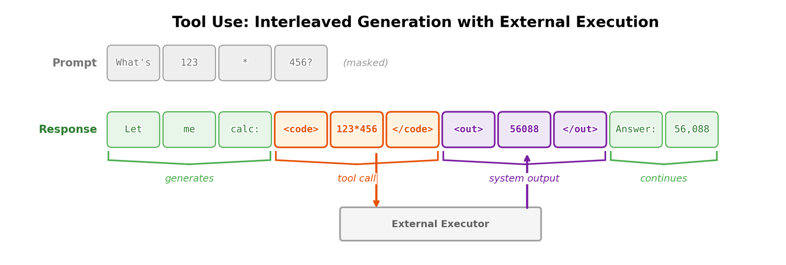
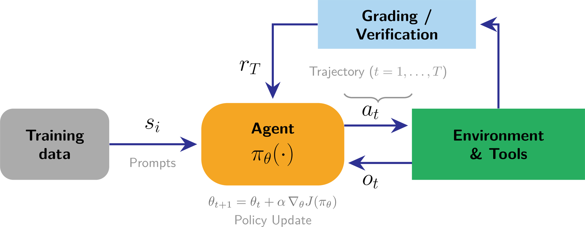

# 第 13 章　工具使用與函式呼叫（Tool Use and Function Calling）

> 譯自 Nathan Lambert, *Reinforcement Learning from Human Feedback*（rlhfbook.com），2026-07-01 版，原文第 159–167 頁。

讓語言模型使用工具，是擴充其能力的自然途徑，特別是在資訊存在於外部工具中的高精度任務，或是需要與複雜網路系統互動的代理（agent）場景。工具使用（tool-use）是語言模型需要透過訓練習得的技能，而 RLHF 以及本書介紹的所有其他方法都能加以精進。試想使用者提出這樣的問題：

> **User**：今天的總統是誰？

沒有工具的語言模型會因為預訓練資料的知識截止日期（knowledge cutoff）而難以回答這個問題，但只需一次搜尋查詢就能輕易取得這項資訊。再看另一個例子：

> **User**：把我下載資料夾裡所有的 arXiv 論文移到我的 ~/research/ 目錄，並以檔名標示論文的日期。

這是一項單靠模型權重根本無從著手的任務——工具的使用讓語言模型得以處理範圍遠為廣泛的任務。

在深入探討之前，先釐清幾個經常被混用的相關術語會很有幫助：

- **工具使用（tool use）**：模型輸出一個結構化的請求（工具名稱與引數）；由編排器（orchestrator）執行該工具；結果被附加到上下文中；模型接著繼續生成。
- **函式呼叫（function calling）**：一種工具使用的形式，其中引數必須符合一組函式的宣告式結構描述（schema，通常是 JSON Schema），使得剖析與驗證得以可靠進行。
- **程式碼執行（code execution）**：工具使用的一種特例，其中的「工具」是程式碼直譯器（例如 Python）；結果以工具輸出的形式回傳。

## 13.1 工具使用概觀（Tool-Use Overview）

AI 模型透過輸出特殊詞元（token）來觸發特定端點（endpoint），藉此使用任何外部工具。這些工具可以是高度特定的功能，例如回傳特定地點天氣的函式，也可以是作為複雜行為基礎建構元件的程式碼直譯器或搜尋引擎。我們的第一個例子展示了語言模型需要更即時的資訊，來彌補其權重基於過往資料訓練而固定不變的本質；但也有像程式碼執行這樣的工具，讓語言模型能夠繞過其機率式、生成式的天性，回傳精確的答案。想想這個任務：印出圓周率的近似值到小數點後 50 位（而不是憑記憶背誦並冒著幻覺的風險）。具備工具的語言模型可以這樣做：

```
<code>
from decimal import Decimal, getcontext
getcontext().prec = 60

def compute_pi():
    # Chudnovsky algorithm for computing pi
    C = 426880 * Decimal(10005).sqrt()
    K, M, X, L, S = 0, 1, 1, 13591409, Decimal(13591409)
    for i in range(1, 100):
        M = M * (K**3 - 16*K) // ((i)**3)
        K += 12
        L += 545140134
        X *= -262537412640768000
        S += Decimal(M * L) / X
    return C / S

print(str(compute_pi())[:52])
</code>

<output>
3.14159265358979323846264338327950288419716939937510
</output>
```

本章將概述現代語言模型中工具使用的起源、其基本原理與格式，以及當前領先模型在善用工具上的取捨。

「工具使用」一詞的確切起源並不清楚，但這個概念的源頭遠早於 RLHF 蓬勃發展的後 ChatGPT 時代。早在 2015 年左右，就有人嘗試建構早於現代語言模型的系統，例如神經程式設計直譯器（Neural Programmer-Interpreters, NPI）[329]——「一種能學習表徵並執行程式的循環且具組合性的類神經網路」。隨著語言模型日益普及，許多子領域開始整合外部能力以提升效能。為了取得權重之外的資訊，許多研究採用檢索增強生成（retrieval augmented generation, RAG）[330] 或網頁瀏覽 [4]。不久之後，其他研究者也開始探索讓語言模型與程式 [331] 或工具 [332] 整合。

隨著領域逐漸成熟，除了底層語言建模能力的大幅提升之外，這些模型也獲得了更複雜的能力。例如 Toolformer 可以使用「一個計算機、一個問答系統、兩個不同的搜尋引擎、一個翻譯系統與一個行事曆」[333]。不久後，Gorilla 被訓練來使用 1645 個 API（來自 PyTorch Hub、TensorFlow Hub v2 與 Hugging Face），其評測基準 APIBench 成為知名的柏克萊函式呼叫排行榜（Berkeley Function Calling Leaderboard）的基礎 [334]。自這些早期模型以來，可呼叫動作的多樣性已大幅成長。

如今，工具使用模型已與日常的語言模型互動深度交織。模型上下文協定（Model Context Protocol, MCP）作為一種將語言模型連接到外部資料來源（或工具）的通用格式應運而生 [335]。隨著模型更強、格式更佳，工具使用語言模型被應用於許多情境，包括 Microsoft Office 或 Google Workspace 等熱門應用程式內的生產力副駕（copilot）、科學領域 [336]、醫療領域 [337]、程式編寫代理（coding agent）[338]（如 Claude Code 或 Cursor）、與資料庫的整合，以及許多其他自主工作流程。

評估工具使用模型涉及多個面向：工具名稱與引數正確性的精確匹配（exact-match）指標、結構描述有效性，以及在模擬環境中端到端的任務完成度。跨多次嘗試的可靠性也很重要——$\tau$-bench 提出了 $\text{pass}^k$ 指標（有別於 pass@k），用來衡量代理是否能「穩定地」成功，而非僅是「偶爾」成功 [339]。ToolLLM 及其 ToolBench 資料集提供了一個大規模框架，用於在超過 16,000 個真實世界 API 上訓練與評估工具使用 [340]；而柏克萊函式呼叫排行榜（Berkeley Function Calling Leaderboard, BFCL）至今仍是比較各模型函式呼叫準確度的熱門基準 [334]。

## 13.2 在生成過程中交織工具呼叫（Interweaving Tool Calls in Generation）

函式呼叫的訓練資料看起來與其他後訓練（post-training）資料非常相似，只多了一項：一個告知模型有哪些工具可用的系統提示（system prompt）。以下是一個格式化後的範例資料點，包含系統提示與以 JSON 格式提供的可用工具：

```
<system>
You are a function-calling AI model. You are provided with function signatures within
<functions></functions> XML tags. You may call one or more functions to assist with the
user query. Don't make assumptions about what values to plug into functions.
</system>

<functions>
[
  {
    "name": "search_movies",
    "description": "Search for movies by title and return matching results with IDs.",
    "parameters": {
      "type": "object",
      "properties": {
        "query": {
          "type": "string",
          "description": "The search string for the movie title."
        }
      },
      "required": ["query"]
    }
  },
  {
    "name": "get_movie_details",
    "description": "Fetch detailed information about a movie including cast, runtime,
and synopsis.",
    "parameters": {
      "type": "object",
      "properties": {
        "movie_id": {
          "type": "string",
          "description": "The unique identifier for the movie."
        }
      },
      "required": ["movie_id"]
    }
  },
  {
    "name": "get_showtimes",
    "description": "Get movie showtimes for a given location and date.",
    "parameters": {
      "type": "object",
      "properties": {
        "movie_id": {
          "type": "string",
          "description": "The unique identifier for the movie."
        },
        "zip_code": {
          "type": "string",
          "description": "ZIP code for theater location."
        },
        "date": {
          "type": "string",
          "description": "Date for showtimes in YYYY-MM-DD format."
        }
      },
      "required": ["movie_id", "zip_code"]
    }
  }
]
</functions>

<user>
...
</user>
```

雖然語言模型正在生成一段補全（completion），但若它遵循此範例，它會生成 `search_movies("Star Wars")` 這些詞元來搜尋《星際大戰》。這通常會被編碼在特殊的格式化詞元之中，接著插入序列的下一批詞元將包含工具的輸出。藉此，模型能學會完成比許多單純的獨立模型更具挑戰性的任務。

一種流行的工具使用形式是程式碼執行（code-execution），讓模型能夠對複雜的邏輯或數學問題取得精確答案。舉例來說，語言模型執行過程中的程式碼執行，可以發生在推理模型（reasoning model）的思考詞元（thinking tokens）之中。與函式呼叫一樣，先有標記要執行的程式碼的標籤（由模型生成），然後是另一個獨立的輸出標籤。

```
<|user|>
What is the 50th Fibonacci number? (Use the standard F_0=0, F_1=1 indexing.)</s>
<|assistant|>
<think>
Okay, I will compute the 50th Fibonacci number with a simple loop, then return the
result.

<code>
def fib(n):
    a, b = 0, 1
    for _ in range(n):
        a, b = b, a + b
    return a

fib(50)
</code>

<output>
12586269025
</output>
</think>
<answer>
The 50th Fibonacci number is 12 586 269 025.
</answer>
```

底層實際發生的事情是：語言模型將工具的輸入與輸出，和標準的自迴歸（autoregressive）生成詞元交錯在一起。使這一切成為可能的編排迴圈（orchestration loop）看起來大致如下：

```
messages = [...]
while True:
    response = model(messages, tools=tools)
    if not response.tool_calls:
        return response.text

    for call in response.tool_calls:
        result = execute_tool(call.name, call.args)
        messages.append({"role": "tool", "tool_call_id": call.id, "content": result})
```



*圖 39：工具使用將模型生成與外部執行交錯進行：模型持續生成詞元，直到它發出一個工具呼叫（橘色），外部系統執行該工具並將輸出（紫色）注入序列，然後模型繼續生成。模型可以在單次生成中發出多個工具呼叫。在訓練時，工具呼叫與輸出的詞元通常會從損失函數中被遮蔽（masked）。*

工具使用的訓練，重點在於讓模型能在這種不同的詞元流之下表現得可預測——知道何時該發出工具呼叫、如何正確格式化引數，以及如何將結果納入其回應之中。開放模型必須被訓練成能與使用者可能隨插即用的各式工具搭配運作。

## 13.3 多步驟工具推理（Multistep Tool Reasoning）

OpenAI 的 o3 模型代表了多步驟工具使用與語言模型整合方式的一次重大躍進。這種行為與社群中更早期的研究趨勢息息相關。例如，ReAct [341] 展示了如何將動作與推理交錯融入單一的模型生成之中：

> 在本論文中，我們探索使用大型語言模型以交錯方式同時生成推理軌跡（reasoning traces）與任務特定的動作，使兩者之間產生更大的綜效：推理軌跡幫助模型歸納、追蹤與更新行動計畫並處理例外狀況，而動作則讓它得以介接外部來源（例如知識庫或環境）並蒐集額外資訊。

隨著工具使用能力的定型與推理模型的起飛，多輪（multi-turn）工具使用已成長為一個令人興奮的研究領域 [185]。以 RL 訓練這些多步驟行為，相較於逐樣本（per-sample）的 RLHF 迴圈，更像是傳統的強化學習：代理會與環境及其工具互動完整個軌跡（trajectory），之後才會獲得任何獎勵，如圖 40 所示。



*圖 40：多步驟工具使用的強化學習。從訓練資料中抽取一個提示，代理（策略 $\pi_\theta$）沿著一條軌跡與環境及其工具互動，交替執行動作 $a_t$ 與接收觀測 $o_t$。完成的軌跡在最後被評分或驗證，產生單一的獎勵 $r_T$，用以驅動策略更新。與逐樣本的 RLHF 迴圈不同，獎勵僅在多步驟推演（rollout）結束後才出現——更接近傳統 RL。*

## 13.4 模型上下文協定（Model Context Protocol, MCP）

模型上下文協定（Model Context Protocol, MCP）是一個開放標準，用於將語言模型連接到外部資料來源與資訊系統 [335]。在資料層，MCP 使用 JSON-RPC 2.0，並為其基本元件（primitives）提供探索（discovery）與執行（execution）方法。MCP 不要求針對每個外部系統採用特定的工具呼叫格式，而是讓模型能透過一個標準化協定存取豐富的上下文資訊。

MCP 是在本章工具使用內容之上的一個簡單延伸——它是應用程式以可預測的 JSON 結構描述，將上下文（資料 + 動作）傳遞給語言模型的方式。模型互動的 MCP 伺服器具有幾個核心基本元件：資源（resources，唯讀的資料區塊）、提示（prompts，模板化的訊息／工作流程），以及工具（tools，模型可呼叫的函式）。據此，MCP 架構可以概括為：

- MCP 伺服器（server）包裝一個特定的資料來源或能力。
- MCP 用戶端（client，例如 Claude Desktop、IDE 外掛）聚合一個或多個伺服器。
- 主機（host，例如 Claude 或 ChatGPT 應用程式）提供使用者／LLM 介面；更換模型供應商或後端工具，只需要替換中間的用戶端。

MCP 讓工具使用模型的開發者能夠使用同一套基礎設施，將他們的伺服器或用戶端接上不同的模型；同時，模型也擁有一個可預測的格式，可用來整合外部元件。這些因素加在一起，為真實世界領域中的工具使用模型打造出一個可預測得多的開發環境。

MCP 伺服器透過一個標準化的 JSON 結構描述向用戶端公開工具：

```
{
  "name": "get_weather",
  "description": "Get current weather for a location",
  "inputSchema": {
    "type": "object",
    "properties": {
      "location": {
        "type": "string",
        "description": "City name or coordinates"
      }
    },
    "required": ["location"]
  }
}
```

實作這個工具的一個最小 Python MCP 伺服器如下：

```
from mcp.server import Server
from mcp.types import Tool, TextContent

server = Server("weather-server")

@server.list_tools()
async def list_tools():
    return [Tool(
        name="get_weather",
        description="Get current weather",
        inputSchema={
            "type": "object",
            "properties": {"location": {"type": "string"}},
            "required": ["location"]
        }
    )]

@server.call_tool()
async def call_tool(name: str, arguments: dict):
    if name == "get_weather":
        weather = fetch_weather(arguments["location"])
        return [TextContent(type="text", text=weather)]
```

## 13.5 實作細節（Implementation Details）

實作工具使用模型時，有多項關於格式化與遮蔽（masking）的決策：

- **Python 與 JSON 格式之別（Python vs. JSON formatting）**：在本章中，我們同時收錄了以 JSON 資料結構與以 Python 程式碼格式化工具使用的範例。模型通常會傾向選定一種結構，而業界不同供應商則各自使用不同的格式。
- **遮蔽工具輸出（Masking tool outputs）**：訓練工具使用模型時的一個重要細節是，工具輸出中的詞元會從模型的訓練損失中被遮蔽。這確保模型不會去學習預測「處理工具呼叫的系統」所產生的輸出（因為這些結果並不是模型生成的詞元）。
- **工具呼叫的多輪格式化（Multi-turn formatting for tool invocations）**：實作工具呼叫模型時，常見的做法是為資料載入格式加入更多結構。後訓練資料集的標準做法，是一個由使用者與助手（且通常還有一則系統訊息）交替組成的訊息列表。工具使用的整體結構相同，但模型的輪次（turn）會依照每次工具呼叫，被切分成多個內容子區段。範例如下。

```
messages = [
{
"content": "You are a function calling AI model. You are provided with function
signatures within <functions></functions> XML tags. You may call one or more functions
to assist with the user query. Don't make assumptions about what values to plug into
functions.",
"function_calls": null,
"functions": "[{\"name\": \"live_giveaways_by_type\", \"description\": \"Retrieve live
giveaways from the GamerPower API based on the specified type.\", \"parameters\":
{\"type\": {\"description\": \"The type of giveaways to retrieve (e.g., game, loot,
beta).\", \"type\": \"str\", \"default\": \"game\"}}}]",
"role": "system"
},
{
"content": "Where can I find live giveaways for beta access and games?",
"function_calls": null,
"functions": null,
"role": "user"
},
{
"content": null,
"function_calls":
"live_giveaways_by_type(type='beta')\nlive_giveaways_by_type(type='game')",
"functions": null,
"role": "assistant"
}
]
```

- **詞元化與訊息格式細節（Tokenization and message format details）**：OpenAI messages 格式中的工具呼叫，通常會經過聊天模板（chat template，即控制送入模型的訊息格式的程式碼）進行詞元化，將結構化的 JSON 表示轉換為原始的詞元流。這個過程因模型架構而異——有些使用特殊詞元來標定工具呼叫的邊界，有些則在詞元流本身之中維持結構化的格式。聊天模板遊樂場（chat template playgrounds）提供了互動式環境，可用來探索不同模型如何將訊息格式轉換成詞元流。
- **推理詞元的連續性（Reasoning token continuity）**：隨著推理模型的興起——它們在給出答案前有一段獨立的「推理」詞元流——在迴圈中搭配工具使用時，這些詞元的處理方式存在不同的實作。有些模型會在單一輪次內的多次工具呼叫步驟之間保留推理詞元，在多次工具呼叫之間維持上下文。然而，這些詞元在輪次之間通常會被清除，以降低服務成本（但並非總是如此——這是一項設計決策）。
- **各家供應商的 API 格式（API formatting across providers）**（截至 2026 年 5 月）：不同供應商使用概念上相似但技術上有所差異的格式。OpenAI 的 Chat Completions API 使用帶有唯一 ID 的 `tool_calls` 陣列，而較新的 Responses API 則以 `function_call` 項目表示呼叫，並以 `call_id` 為鍵、透過 `function_call_output` 項目回傳結果。Anthropic 以 `input_schema` 定義工具，並以 `tool_use` 與 `tool_result` 內容區塊（content blocks）表示呼叫與結果。Gemini 提供函式呼叫模式，例如 `AUTO`、`ANY`、`NONE`，以及在支援的 Gemini 與 Vertex AI 組態中的 `VALIDATED`。
- **結構描述遵循與約束解碼（Schema conformance and constrained decoding）**：生產系統通常使用約束解碼（constrained decoding）或「嚴格模式」（strict mode）選項來強制輸出有效的 JSON 與正確的引數型別，減少因格式錯誤輸出而導致的重試。一些封閉模型供應商會額外進行專門的後訓練，讓結構化 JSON 輸出更可靠；而對開放模型而言，這通常是在 vLLM 等系統中以推論階段的旗標（inference flag）來處理。
- **工具輸出的上下文消耗（Tool output context consumption）**：工具輸出可能迅速消耗模型的上下文視窗（context window），特別是會回傳大量結果的搜尋或檢索工具。系統必須決定如何對工具輸出進行截斷、摘要或分頁，以在保留模型後續所需資訊的同時，讓上下文維持在可控範圍內。

把這些連回後訓練：工具使用的訓練資料從何而來？又採用什麼目標函數？由人類撰寫的工具軌跡收集成本高昂，因此大多數現代工具使用語料都是合成或自舉（bootstrapped）而來——如 Toolformer 式的自我標註 [333]，或如 ToolBench 中的大規模生成 [340]。就訓練目標而言，在工具軌跡上進行監督式微調（supervised fine-tuning, SFT）能教會模型基本的格式化與工具選擇。這能自舉出該行為，通常也足以奠定這項技能的基礎。對軌跡進行偏好最佳化（preference optimization，例如 DPO）可以改善「何時該呼叫工具、何時該直接回答」的決策。對於具有多步驟工具使用的代理式（agentic）任務，帶有環境回饋（任務成功、約束滿足）的 RL 成為自然的目標函數——模型從「其工具增強的行動是否真正解決了問題」之中學習。
